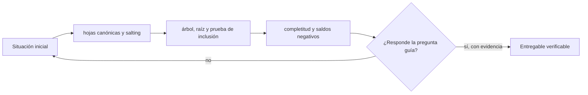

# Clase 63 · Del saldo del cliente a una prueba Merkle

> **Clase independiente 63 de 66** · **Nivel:** Profesional · **Fuente base:** especificaciones de Certificate Transparency/Merkle trees, marcos de encargos de aseguramiento y publicaciones regulatorias sobre proof of reserves
>
> [⬅️ Clase anterior](../30-contabilidad-conciliacion/clase-62-conciliacion-y-gestion-de-diferencias.md) · [📚 Índice de las 66 clases](../README.md) · [🗂️ Mapa del tema](README.md) · [➡️ Clase siguiente](../31-proof-reserves-solvencia/clase-64-del-snapshot-a-una-conclusion-profesional.md)

## Punto de partida

**Pregunta guía:** ¿Cómo demuestra un cliente que su saldo fue incluido sin publicar todos los saldos?

**Caso que abre la clase:** Un operador omite cuentas o introduce pasivos negativos antes de calcular la raíz.

Cinco balances se canonizan, se convierten en hojas y forman una raíz Merkle reproducible. Un segundo equipo omite, duplica o altera registros para descubrir que una prueba de inclusión protege integridad del conjunto comprometido, pero no demuestra integridad de la población.

## Fundamentos que sostienen la respuesta

1. **hojas canónicas y salting.** En esta clase delimita qué objeto o relación estamos observando antes de sacar conclusiones. Localízalo explícitamente en «Un operador omite cuentas o introduce pasivos negativos antes de calcular la raíz.» y anota qué dato faltaría para refutar tu lectura.
2. **árbol, raíz y prueba de inclusión.** En esta clase explica el mecanismo que conecta la situación inicial con el cambio observable. Localízalo explícitamente en «Un operador omite cuentas o introduce pasivos negativos antes de calcular la raíz.» y anota qué dato faltaría para refutar tu lectura.
3. **completitud y saldos negativos.** En esta clase permite contrastar el resultado y formular el límite de la evidencia. Localízalo explícitamente en «Un operador omite cuentas o introduce pasivos negativos antes de calcular la raíz.» y anota qué dato faltaría para refutar tu lectura.

### Del balance del cliente a la raíz

El laboratorio canoniza cada hoja como cliente, activo, saldo y nonce, y la resume con SHA-256. Los hashes se combinan hasta obtener una raíz. Si cambia un solo saldo, cambia la raíz. El cliente recibe su hoja y los hashes hermanos necesarios para recalcular el camino; así verifica inclusión sin descargar toda la lista. El nonce reduce ataques triviales por diccionario contra identificadores y saldos predecibles, pero debe gestionarse de forma segura.

La inclusión responde “este registro formó parte del árbol comprometido”. No responde “todos los clientes fueron incluidos”, “el saldo es correcto”, “no existen pasivos fuera del sistema” ni “la entidad no pidió prestados los activos durante la foto”. La integridad de la población es la afirmación difícil de Proof of Liabilities. Se revisan interfaces entre productos, cuentas suspendidas, saldos negativos, derivados, garantías, préstamos y entidades relacionadas. Permitir saldos negativos puede reducir artificialmente el total; por eso el laboratorio los rechaza.

### Probar activos sin inflarlos

Para activos on-chain se inventarían direcciones y se demuestra control con una firma ligada al encargo o con una transacción controlada. Ver un saldo no prueba control. La evidencia fija red, activo, contrato, altura y hora. También revisa que la wallet no esté comprometida, pignorada o compartida con otra entidad. Activos en otro exchange son una reclamación contra tercero y necesitan confirmación independiente; no son equivalentes a activos autocustodiados.

La comparación se hace por activo. Un excedente de token ilíquido no cubre automáticamente un déficit de BTC. Si se presenta un ratio agregado en moneda fiat, se documentan fuente de precio, instante, liquidez y haircuts. Las stablecoins requieren identificar emisor, red y contrato, y considerar facultades de congelación o rescate.

## Trabajo práctico

**Método propio:** laboratorio de construcción y sabotaje controlado.

**Actividad:** Construir balances, Merkle tree, root y pruebas individuales.

Trabaja en entorno local, regtest, signet o testnet según corresponda. Conserva entradas, comandos, salidas y bloque o instante de corte. Una captura aislada no demuestra reproducibilidad.

## Gráfico pedagógico

Recorre el gráfico en voz alta: identifica supuestos, transformaciones y el punto exacto donde aparece evidencia.

## Demostración de aprendizaje

**Entregable:** Raíz reproducible y verificación documentada de una inclusión y una exclusión.

**Comprobación formativa:** ¿Qué prueba una ruta Merkle válida y qué dato adicional necesitarías para afirmar que ningún cliente fue omitido?

Para aprobar debes conectar el hecho observado con el concepto correcto, descartar al menos una interpretación alternativa y redactar una conclusión cuyo alcance no exceda la prueba.

## Errores que esta clase corrige

- Tratar **hojas canónicas y salting** como una etiqueta suficiente, sin identificar actores, dato y frontera.
- Usar **árbol, raíz y prueba de inclusión** como explicación aunque el caso no aporte la evidencia necesaria.
- Dar por respondido «¿Cómo demuestra un cliente que su saldo fue incluido sin publicar todos los saldos?» sin contrastar **completitud y saldos negativos**.

Vuelve al caso inicial, elige el error más peligroso y describe una comprobación concreta que lo detectaría.

## Fuentes para comprobar y ampliar

- [RFC 6962: Certificate Transparency y árboles Merkle](https://www.rfc-editor.org/rfc/rfc6962)
- [IAASB: International Framework for Assurance Engagements](https://www.iaasb.org/publications/international-framework-assurance-engagements-2)
- [IAASB: ISRS 4400 (Revised), procedimientos acordados](https://www.iaasb.org/publications/international-standard-related-services-isrs-4400-revised)
- [PCAOB: Proof of Reserve Reports and Crypto Exchanges](https://pcaobus.org/news-events/news-releases/news-release-detail/office-of-the-investor-advocate-issues-investor-advisory-on-proof-of-reserve-reports)
- [IOSCO Final Report on Crypto and Digital Asset Markets](https://www.iosco.org/library/pubdocs/pdf/IOSCOPD747.pdf)

Consulta además la [bibliografía razonada](../../docs/bibliografia.md), que declara procedencia y uso.

## Cierre de la clase

Responde otra vez la pregunta guía sin mirar notas. Si tu respuesta no menciona evidencia, supuesto y límite, todavía describe el tema pero no lo domina. Continúa solo cuando otra persona pueda reproducir tu entregable.
