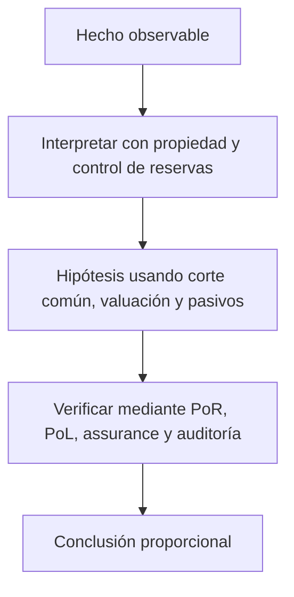

# Clase 64 · Del snapshot a una conclusión profesional

> **Clase independiente 64 de 66** · **Nivel:** Profesional · **Fuente base:** especificaciones de Certificate Transparency/Merkle trees, marcos de encargos de aseguramiento y publicaciones regulatorias sobre proof of reserves
>
> [⬅️ Clase anterior](../31-proof-reserves-solvencia/clase-63-del-saldo-del-cliente-a-una-prueba-merkle.md) · [📚 Índice de las 66 clases](../README.md) · [🗂️ Mapa del tema](README.md) · [➡️ Clase siguiente](../32-forensics-auditoria-gobernanza/clase-65-forensics-con-evidencia-reproducible.md)

## Punto de partida

**Pregunta guía:** ¿Qué falta para pasar de controlar wallets a concluir solvencia?

**Caso que abre la clase:** Las wallets cubren balances publicados, pero existen deudas fuera del conjunto.

Pasivos comprometidos, wallets atribuidas y confirmaciones de terceros se comparan bajo un corte común. Préstamos omitidos y transferencias temporales obligan a distinguir existencia, control, integridad, solvencia y auditoría financiera completa.

## Trabajo práctico

**Método propio:** comité de aseguramiento con evidencia contradictoria.

**Actividad:** Comparar activos y pasivos por activo y documentar limitaciones.

Trabaja en entorno local, regtest, signet o testnet según corresponda. Conserva entradas, comandos, salidas y bloque o instante de corte. Una captura aislada no demuestra reproducibilidad.

## Fundamentos que sostienen la respuesta

1. **propiedad y control de reservas.** En esta clase delimita qué objeto o relación estamos observando antes de sacar conclusiones. Localízalo explícitamente en «Las wallets cubren balances publicados, pero existen deudas fuera del conjunto.» y anota qué dato faltaría para refutar tu lectura.
2. **corte común, valuación y pasivos.** En esta clase explica el mecanismo que conecta la situación inicial con el cambio observable. Localízalo explícitamente en «Las wallets cubren balances publicados, pero existen deudas fuera del conjunto.» y anota qué dato faltaría para refutar tu lectura.
3. **PoR, PoL, assurance y auditoría.** En esta clase permite contrastar el resultado y formular el límite de la evidencia. Localízalo explícitamente en «Las wallets cubren balances publicados, pero existen deudas fuera del conjunto.» y anota qué dato faltaría para refutar tu lectura.

### Por qué PoR no es auditoría financiera completa

Una auditoría de estados financieros evalúa múltiples afirmaciones: existencia, integridad, derechos y obligaciones, valuación, corte, clasificación y presentación, además del contexto de controles y materialidad. Un snapshot de PoR puede apoyar existencia de ciertos activos y compromiso de ciertos pasivos. Normalmente no cubre ingresos, gastos, capital, pasivos comerciales, litigios, préstamos, partes relacionadas, continuidad operacional ni hechos posteriores.

Incluso un informe emitido por un profesional debe leerse por su nombre y alcance: auditoría, revisión, atestiguación o procedimientos acordados producen conclusiones distintas. “Empresa auditada” no describe qué fue auditado. El lector busca fecha, entidad legal, criterios, población, excepciones, responsabilidad de la administración y limitaciones.

Un programa continuo mejora el snapshot con raíces periódicas, monitoreo de wallets, conciliación diaria, pruebas sorpresivas, rotación del verificador y canal para que cada cliente compruebe inclusión. Aun así, no elimina riesgos operativos, legales o de gobernanza. La conclusión profesional correcta es proporcional: “para este corte, bajo estas fuentes y procedimientos, los activos verificados cubren los pasivos incluidos”, nunca “el exchange es seguro”.

### Qué puede concluir un encargo

Existencia de activos, control de claves, integridad de pasivos, derechos, valuación y corte son afirmaciones diferentes. Una firma demuestra control de una clave en un instante, no propiedad libre de gravámenes. Una raíz compromete una población entregada, no garantiza que esté completa. Un ratio agregado depende además de precios, liquidez y haircuts. Por eso una conclusión válida nombra entidad, fecha, fuentes, procedimientos y excepciones.

La solvencia incorpora obligaciones fuera del ledger, préstamos, litigios, capital y continuidad. Una auditoría financiera trabaja con estados completos, materialidad, controles y hechos posteriores; un procedimiento acordado informa resultados sin expresar la misma opinión. El lenguaje profesional impide que marketing convierta una comprobación parcial en «empresa auditada».

## Gráfico pedagógico

Recorre el gráfico en voz alta: identifica supuestos, transformaciones y el punto exacto donde aparece evidencia.

## Errores que esta clase corrige

- Tratar **propiedad y control de reservas** como una etiqueta suficiente, sin identificar actores, dato y frontera.
- Usar **corte común, valuación y pasivos** como explicación aunque el caso no aporte la evidencia necesaria.
- Dar por respondido «¿Qué falta para pasar de controlar wallets a concluir solvencia?» sin contrastar **PoR, PoL, assurance y auditoría**.

Vuelve al caso inicial, elige el error más peligroso y describe una comprobación concreta que lo detectaría.

## Demostración de aprendizaje

**Entregable:** Conclusión acotada que no confunda snapshot con auditoría financiera.

**Comprobación formativa:** Redacta una conclusión cuyo alcance no exceda los activos, pasivos, entidad y fecha realmente examinados.

Para aprobar debes conectar el hecho observado con el concepto correcto, descartar al menos una interpretación alternativa y redactar una conclusión cuyo alcance no exceda la prueba.

## Fuentes para comprobar y ampliar

- [RFC 6962: Certificate Transparency y árboles Merkle](https://www.rfc-editor.org/rfc/rfc6962)
- [IAASB: International Framework for Assurance Engagements](https://www.iaasb.org/publications/international-framework-assurance-engagements-2)
- [IAASB: ISRS 4400 (Revised), procedimientos acordados](https://www.iaasb.org/publications/international-standard-related-services-isrs-4400-revised)
- [PCAOB: Proof of Reserve Reports and Crypto Exchanges](https://pcaobus.org/news-events/news-releases/news-release-detail/office-of-the-investor-advocate-issues-investor-advisory-on-proof-of-reserve-reports)
- [IOSCO Final Report on Crypto and Digital Asset Markets](https://www.iosco.org/library/pubdocs/pdf/IOSCOPD747.pdf)

Consulta además la [bibliografía razonada](../../docs/bibliografia.md), que declara procedencia y uso.

## Cierre de la clase

Responde otra vez la pregunta guía sin mirar notas. Si tu respuesta no menciona evidencia, supuesto y límite, todavía describe el tema pero no lo domina. Continúa solo cuando otra persona pueda reproducir tu entregable.
