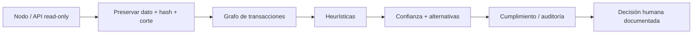

# Blockchain forensics, auditoría y gobernanza · Clases 65–66

> **Nivel:** Profesional · ⏱️ **Duración estimada:** 210 min · **Fuente:** guías FATF/GAFI, estándares de evidencia digital NIST y principios de control interno COSO
>
> [⬅️ Currículo](../README.md) · [🌱 Empieza aquí](../../docs/empieza-aqui.md) · [📖 Glosario](../../docs/glosario.md) · [📚 Bibliografía](../../docs/bibliografia.md)
> 🧭 ⬅️ **Anterior:** [Clases 63–64 · Proof of Reserves y solvencia](../31-proof-reserves-solvencia/README.md) · [📚 Índice](../README.md) · ➡️ **Siguiente:** [🎓 Caso final de empresa custodial](../../capstone/README.md)

<!-- plan-clases:inicio -->
## 🧭 Plan de clases

### Clase 65 · Forensics con evidencia reproducible

**Pregunta guía:** ¿Cómo investigamos flujos sin convertir heurísticas en acusaciones?

**Enfoque pedagógico:** expediente forense con revisión ciega.

Un equipo reconstruye flujos y otro revisa sin conocer su conclusión. La cadena de custodia y las hipótesis alternativas reducen confirmación y sobreatribución.

**Núcleo conceptual:**

- grafos y trazabilidad.
- procedencia y cadena de custodia.
- privacidad y falsa atribución.

**Caso de trabajo:** Una dirección recibe fondos desde un cluster etiquetado, pero la relación es indirecta.

**Actividad:** Reconstruir un camino y puntuar la fuerza de cada inferencia.

**Comprobación formativa:** ¿Qué parte del hallazgo es observable directamente y cuál depende de una heurística?

**Evidencia de aprendizaje:** Expediente con hashes, timestamps, fuentes y lenguaje probabilístico.

### Clase 66 · Auditoría, cumplimiento y gobierno custodial

**Pregunta guía:** ¿Quién autoriza, ejecuta, registra, concilia e investiga cada movimiento?

**Enfoque pedagógico:** simulacro de comité de control.

Autorización, ejecución, registro, conciliación e investigación se reparten entre roles. Una excepción obliga a comprobar independencia y escalamiento real.

**Núcleo conceptual:**

- segregación de funciones.
- gobierno de wallets y excepciones.
- auditoría, compliance y respuesta.

**Caso de trabajo:** La misma persona crea una dirección, aprueba el retiro y resuelve la alerta.

**Actividad:** Diseñar RACI, controles preventivos/detectivos y escalamiento.

**Comprobación formativa:** Identifica un conflicto de funciones y diseña un control preventivo y otro detectivo.

**Evidencia de aprendizaje:** Programa de auditoría con objetivo, procedimiento, muestra, evidencia y conclusión.
<!-- plan-clases:fin -->

---

## 🎯 Objetivos

- Construir y leer grafos de transacciones sin convertir heurísticas en hechos.
- Preservar procedencia, integridad, corte y cadena de custodia de la evidencia.
- Evaluar límites de privacidad y riesgo de falsa atribución.
- Diseñar gobernanza de custodia, auditoría y cumplimiento con segregación de funciones.

## 📚 Resultados de aprendizaje

Podrás producir un expediente reproducible, separar hecho/indicador/inferencia/hipótesis, escalar señales a cumplimiento y defender una conclusión ante revisión independiente.

## 🧩 Esquema visual

## 📖 Conceptos

- **Grafo de transacciones:** nodos y aristas que representan direcciones, entidades tentativas, transacciones o flujos.
- **Heurística:** regla útil pero falible; produce una inferencia, no una certeza.
- **Falsa atribución:** asociación errónea entre actividad y persona o entidad.
- **Cadena de custodia:** registro de adquisición, transformación, acceso e integridad de evidencia.
- **Gobernanza de custodia:** asignación de autoridad, límites, supervisión, recuperación y respuesta a incidentes.

## 🔬 Profundización

### Del dato al grafo

Una investigación comienza con una pregunta y un alcance legal, no con una dirección “sospechosa”. Se preservan fuente, versión de herramienta, parámetros, altura de bloque, hash del bloque, hora, zona temporal y hash del archivo adquirido. Una API pública read-only es útil para triage, pero sus etiquetas y transformaciones no son evidencia primaria automática. Para conclusiones relevantes se contrasta con nodo, fuente adicional o export autenticado.

En Bitcoin, el grafo puede representar transacciones y UTXO; heurísticas como entradas comunes o cambio probable tienen excepciones, especialmente con CoinJoin, servicios compartidos y nuevas formas de construcción de transacciones. En Ethereum, una transferencia aparente puede involucrar llamadas internas, proxies, bridges y eventos de tokens. “From” no siempre describe al beneficiario económico. Los grafos simplifican y toda simplificación debe quedar documentada.

### Hecho, indicador, inferencia e hipótesis

“La transacción `tx-002` transfirió 20 unidades entre dos direcciones del dataset” es un hecho dentro de la fuente. “La dirección presenta fan-out” es un indicador calculado. “Podría ser una wallet de dispersión” es inferencia. “Pertenece a la persona X” es una hipótesis hasta contar con evidencia externa legítima. El informe conserva estas categorías para que un revisor sepa dónde termina la observación.

La falsa atribución tiene consecuencias reales: congelación de fondos, reportes regulatorios, daño reputacional o decisiones judiciales. Una etiqueta de proveedor puede provenir de crowdsourcing o estar desactualizada. Se registra origen, fecha, confianza, corroboración y explicaciones alternativas. El análisis no publica datos personales innecesarios y aplica retención limitada. La transparencia de una cadena no elimina expectativas de privacidad ni las obligaciones de protección de datos.

### Auditoría y cumplimiento

Forensics reconstruye eventos y relaciones; auditoría evalúa afirmaciones frente a criterios; compliance decide y opera controles bajo obligaciones aplicables. Se alimentan entre sí, pero no son intercambiables. Una alerta no prueba delito; un procedimiento KYC no demuestra control de reservas; un informe PoR no evalúa el programa AML completo.

La gobernanza de custodia define consejo o comité responsable, política de riesgos, inventario de wallets, límites por nivel, cuórum, segregación entre solicitud/aprobación/firma/conciliación, revisión de terceros, gestión de cambios y respuesta a incidentes. Se prueban recuperación y continuidad con simulacros. Los logs de MPC o HSM se integran con los IDs del ledger y txids, de modo que una retirada pueda reconstruirse sin revelar material secreto.

Un control profesional tiene propietario, frecuencia, entrada, procedimiento, evidencia, criterio de excepción y escalamiento. “Revisar wallets periódicamente” no es verificable. “Tesorería concilia diariamente a las 00:00 UTC por activo y red; Operaciones resuelve diferencias mayores a 24 horas; Riesgo aprueba ajustes” sí lo es. La independencia importa: quien administra la wallet no debe certificar en solitario su propio saldo.

### Cierre responsable

El informe presenta metodología, alcance, hallazgos, limitaciones y anexos reproducibles. Incluye resultados negativos: direcciones revisadas sin vínculo, ventanas donde la API falló o hipótesis descartadas. No se rellena la incertidumbre con narrativa. Si la evidencia admite varias explicaciones, se enumeran y se solicita la fuente necesaria para distinguirlas.

## 🧪 Laboratorio guiado

Ejecuta `pnpm lab:forensics`. Construye un grafo desde transacciones sintéticas, lista vecindades y confirma que el resultado deja la atribución vacía. La práctica siguiente exige registrar una atribución solo con fuente y confianza. Para extensión, reproduce una transacción en Bitcoin regtest/signet o Ethereum local y preserva txid, bloque y salida read-only.

## 📝 Reto verificable

Redacta un hallazgo sobre `bc1qbeta` con cuatro párrafos rotulados: hecho, indicador, inferencia y limitación. Se aprueba si no identifica una persona, incluye dos explicaciones alternativas y especifica qué evidencia adicional cambiaría la conclusión.

## ⚠️ Errores frecuentes

| Error | Corrección |
|---|---|
| Tratar una etiqueta como hecho | Registrar proveedor, fecha, confianza y corroboración |
| Confundir flujo bruto con saldo o beneficio | Seguir UTXO/estado, cambio, comisiones y corte |
| Ejecutar una decisión automática desde una heurística | Revisión humana proporcional al impacto |
| Guardar evidencia sin procedencia | Hash, fuente, altura, herramienta y transformaciones |

## 🛡️ Seguridad y ética

- Aplica la separación hecho/indicador/inferencia/hipótesis al
  [caso Orionx](../../docs/casos-reales/orionx-descalce-custodia.md). Una querella es una
  fuente procesal relevante, no una sentencia ni autorización para publicar identidades.

No hagas deanonymization de personas sin finalidad legítima y autorización. Minimiza datos, controla acceso y conserva una pista de decisiones. Los laboratorios solo usan identidades y fondos ficticios.

## 🔗 Referencias

- [NIST SP 800-86, Integrating Forensic Techniques into Incident Response](https://csrc.nist.gov/pubs/sp/800/86/final)
- [FATF Guidance for a Risk-Based Approach to Virtual Assets](https://www.fatf-gafi.org/en/publications/Fatfrecommendations/Guidance-rba-virtual-assets-2021.html)
- [COSO Internal Control Framework](https://www.coso.org/internal-control)
- [Bitcoin Core documentation](https://bitcoincore.org/en/doc/)

## ✅ Criterio de dominio

Puedes sostener una conclusión con evidencia reproducible, cuantificar su incertidumbre y diseñar quién revisa, decide y responde.

## 🧭 Navegación

⬅️ [Clases 63–64 · Proof of Reserves y solvencia](../31-proof-reserves-solvencia/README.md) · [📚 Índice del currículo](../README.md) · ➡️ [🎓 Caso final de empresa custodial](../../capstone/README.md)
