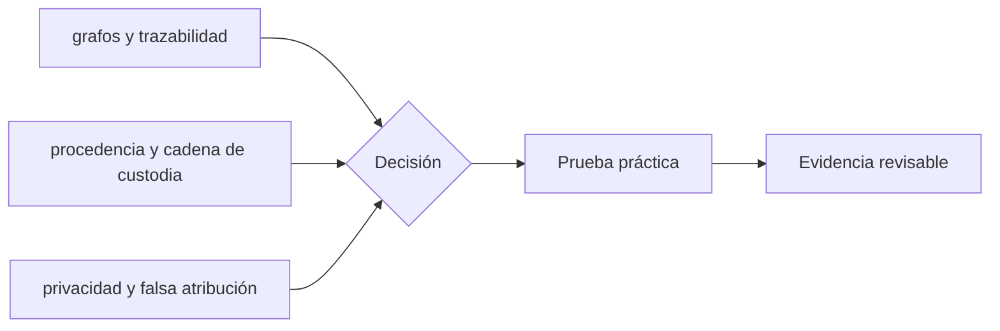

# Clase 65 · Forensics con evidencia reproducible

> **Clase independiente 65 de 66** · **Nivel:** Profesional · **Fuente base:** guías FATF/GAFI, estándares de evidencia digital NIST y principios de control interno COSO
>
> [⬅️ Clase anterior](../31-proof-reserves-solvencia/clase-64-del-snapshot-a-una-conclusion-profesional.md) · [📚 Índice de las 66 clases](../README.md) · [🗂️ Mapa del tema](README.md) · [➡️ Clase siguiente](../32-forensics-auditoria-gobernanza/clase-66-auditoria-cumplimiento-y-gobierno-custodial.md)

## Punto de partida

**Pregunta guía:** ¿Cómo investigamos flujos sin convertir heurísticas en acusaciones?

**Caso que abre la clase:** Una dirección recibe fondos desde un cluster etiquetado, pero la relación es indirecta.

Un equipo reconstruye flujos y otro revisa sin conocer su conclusión. La cadena de custodia y las hipótesis alternativas reducen confirmación y sobreatribución.

## Gráfico pedagógico

Recorre el gráfico en voz alta: identifica supuestos, transformaciones y el punto exacto donde aparece evidencia.

## Trabajo práctico

**Método propio:** expediente forense con revisión ciega.

**Actividad:** Reconstruir un camino y puntuar la fuerza de cada inferencia.

Trabaja en entorno local, regtest, signet o testnet según corresponda. Conserva entradas, comandos, salidas y bloque o instante de corte. Una captura aislada no demuestra reproducibilidad.

## Fundamentos que sostienen la respuesta

1. **grafos y trazabilidad.** En esta clase delimita qué objeto o relación estamos observando antes de sacar conclusiones. Localízalo explícitamente en «Una dirección recibe fondos desde un cluster etiquetado, pero la relación es indirecta.» y anota qué dato faltaría para refutar tu lectura.
2. **procedencia y cadena de custodia.** En esta clase explica el mecanismo que conecta la situación inicial con el cambio observable. Localízalo explícitamente en «Una dirección recibe fondos desde un cluster etiquetado, pero la relación es indirecta.» y anota qué dato faltaría para refutar tu lectura.
3. **privacidad y falsa atribución.** En esta clase permite contrastar el resultado y formular el límite de la evidencia. Localízalo explícitamente en «Una dirección recibe fondos desde un cluster etiquetado, pero la relación es indirecta.» y anota qué dato faltaría para refutar tu lectura.

### Del dato al grafo

Una investigación comienza con una pregunta y un alcance legal, no con una dirección “sospechosa”. Se preservan fuente, versión de herramienta, parámetros, altura de bloque, hash del bloque, hora, zona temporal y hash del archivo adquirido. Una API pública read-only es útil para triage, pero sus etiquetas y transformaciones no son evidencia primaria automática. Para conclusiones relevantes se contrasta con nodo, fuente adicional o export autenticado.

En Bitcoin, el grafo puede representar transacciones y UTXO; heurísticas como entradas comunes o cambio probable tienen excepciones, especialmente con CoinJoin, servicios compartidos y nuevas formas de construcción de transacciones. En Ethereum, una transferencia aparente puede involucrar llamadas internas, proxies, bridges y eventos de tokens. “From” no siempre describe al beneficiario económico. Los grafos simplifican y toda simplificación debe quedar documentada.

### Hecho, indicador, inferencia e hipótesis

“La transacción `tx-002` transfirió 20 unidades entre dos direcciones del dataset” es un hecho dentro de la fuente. “La dirección presenta fan-out” es un indicador calculado. “Podría ser una wallet de dispersión” es inferencia. “Pertenece a la persona X” es una hipótesis hasta contar con evidencia externa legítima. El informe conserva estas categorías para que un revisor sepa dónde termina la observación.

La falsa atribución tiene consecuencias reales: congelación de fondos, reportes regulatorios, daño reputacional o decisiones judiciales. Una etiqueta de proveedor puede provenir de crowdsourcing o estar desactualizada. Se registra origen, fecha, confianza, corroboración y explicaciones alternativas. El análisis no publica datos personales innecesarios y aplica retención limitada. La transparencia de una cadena no elimina expectativas de privacidad ni las obligaciones de protección de datos.

### Cierre responsable

El informe presenta metodología, alcance, hallazgos, limitaciones y anexos reproducibles. Incluye resultados negativos: direcciones revisadas sin vínculo, ventanas donde la API falló o hipótesis descartadas. No se rellena la incertidumbre con narrativa. Si la evidencia admite varias explicaciones, se enumeran y se solicita la fuente necesaria para distinguirlas.

## Demostración de aprendizaje

**Entregable:** Expediente con hashes, timestamps, fuentes y lenguaje probabilístico.

**Comprobación formativa:** ¿Qué parte del hallazgo es observable directamente y cuál depende de una heurística?

Para aprobar debes conectar el hecho observado con el concepto correcto, descartar al menos una interpretación alternativa y redactar una conclusión cuyo alcance no exceda la prueba.

## Errores que esta clase corrige

- Tratar **grafos y trazabilidad** como una etiqueta suficiente, sin identificar actores, dato y frontera.
- Usar **procedencia y cadena de custodia** como explicación aunque el caso no aporte la evidencia necesaria.
- Dar por respondido «¿Cómo investigamos flujos sin convertir heurísticas en acusaciones?» sin contrastar **privacidad y falsa atribución**.

Vuelve al caso inicial, elige el error más peligroso y describe una comprobación concreta que lo detectaría.

## Límite ético y legal de esta clase

Preservar y analizar no autoriza a acceder, explotar, suplantar, perseguir fondos ni publicar identidades. El expediente registra dónde termina la observación y empieza una decisión que requiere otra autoridad.

Aplica la guía transversal [¿Y si cruzas la línea?](../../docs/y-si-cruzas-la-linea-blockchain.md) antes de proponer una intervención.

## Fuentes para comprobar y ampliar

- [NIST SP 800-86, Integrating Forensic Techniques into Incident Response](https://csrc.nist.gov/pubs/sp/800/86/final)
- [FATF Guidance for a Risk-Based Approach to Virtual Assets](https://www.fatf-gafi.org/en/publications/Fatfrecommendations/Guidance-rba-virtual-assets.html)
- [COSO Internal Control Framework](https://www.coso.org/internal-control)
- [Bitcoin Core documentation](https://bitcoincore.org/en/doc/)

Consulta además la [bibliografía razonada](../../docs/bibliografia.md), que declara procedencia y uso.

## Cierre de la clase

Responde otra vez la pregunta guía sin mirar notas. Si tu respuesta no menciona evidencia, supuesto y límite, todavía describe el tema pero no lo domina. Continúa solo cuando otra persona pueda reproducir tu entregable.
