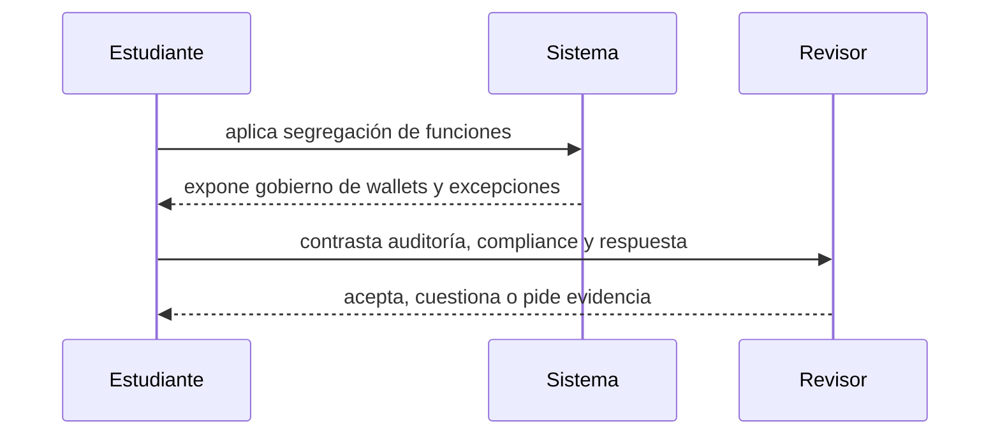

# Clase 66 · Auditoría, cumplimiento y gobierno custodial

> **Clase independiente 66 de 66** · **Nivel:** Profesional · **Fuente base:** guías FATF/GAFI, estándares de evidencia digital NIST y principios de control interno COSO
>
> [⬅️ Clase anterior](../32-forensics-auditoria-gobernanza/clase-65-forensics-con-evidencia-reproducible.md) · [📚 Índice de las 66 clases](../README.md) · [🗂️ Mapa del tema](README.md) · [➡️ Clase siguiente](../../capstone/README.md)

## Punto de partida

**Pregunta guía:** ¿Quién autoriza, ejecuta, registra, concilia e investiga cada movimiento?

**Caso que abre la clase:** La misma persona crea una dirección, aprueba el retiro y resuelve la alerta.

Autorización, ejecución, registro, conciliación e investigación se reparten entre roles. Una excepción obliga a comprobar independencia y escalamiento real.

## Fundamentos que sostienen la respuesta

1. **segregación de funciones.** En esta clase delimita qué objeto o relación estamos observando antes de sacar conclusiones. Localízalo explícitamente en «La misma persona crea una dirección, aprueba el retiro y resuelve la alerta.» y anota qué dato faltaría para refutar tu lectura.
2. **gobierno de wallets y excepciones.** En esta clase explica el mecanismo que conecta la situación inicial con el cambio observable. Localízalo explícitamente en «La misma persona crea una dirección, aprueba el retiro y resuelve la alerta.» y anota qué dato faltaría para refutar tu lectura.
3. **auditoría, compliance y respuesta.** En esta clase permite contrastar el resultado y formular el límite de la evidencia. Localízalo explícitamente en «La misma persona crea una dirección, aprueba el retiro y resuelve la alerta.» y anota qué dato faltaría para refutar tu lectura.

### Auditoría y cumplimiento

Forensics reconstruye eventos y relaciones; auditoría evalúa afirmaciones frente a criterios; compliance decide y opera controles bajo obligaciones aplicables. Se alimentan entre sí, pero no son intercambiables. Una alerta no prueba delito; un procedimiento KYC no demuestra control de reservas; un informe PoR no evalúa el programa AML completo.

La gobernanza de custodia define consejo o comité responsable, política de riesgos, inventario de wallets, límites por nivel, cuórum, segregación entre solicitud/aprobación/firma/conciliación, revisión de terceros, gestión de cambios y respuesta a incidentes. Se prueban recuperación y continuidad con simulacros. Los logs de MPC o HSM se integran con los IDs del ledger y txids, de modo que una retirada pueda reconstruirse sin revelar material secreto.

Un control profesional tiene propietario, frecuencia, entrada, procedimiento, evidencia, criterio de excepción y escalamiento. “Revisar wallets periódicamente” no es verificable. “Tesorería concilia diariamente a las 00:00 UTC por activo y red; Operaciones resuelve diferencias mayores a 24 horas; Riesgo aprueba ajustes” sí lo es. La independencia importa: quien administra la wallet no debe certificar en solitario su propio saldo.

### Gobierno que deja evidencia

Custodia segura separa preparación, aprobación, firma, registro, conciliación e investigación. Ningún rol debería poder crear una orden, autorizarla, mover fondos y cerrar la excepción sin revisión independiente. Los controles preventivos incluyen límites, cuórum y allowlists; los detectivos incluyen conciliación, alertas y revisión de logs; los correctivos incluyen pausa, rotación y recuperación probada.

La gobernanza define quién cambia políticas, cómo se aprueba una emergencia y cuándo se informa a clientes, auditoría o autoridad. Cumplimiento no reemplaza seguridad y una alerta forense no prueba culpabilidad. El comité recibe evidencia con procedencia, escucha hipótesis alternativas y registra decisión, responsable, plazo y riesgo aceptado. Ese rastro permite auditar el control cuando ya pasó la presión del incidente.

## Gráfico pedagógico

Recorre el gráfico en voz alta: identifica supuestos, transformaciones y el punto exacto donde aparece evidencia.

## Demostración de aprendizaje

**Entregable:** Programa de auditoría con objetivo, procedimiento, muestra, evidencia y conclusión.

**Comprobación formativa:** Identifica un conflicto de funciones y diseña un control preventivo y otro detectivo.

Para aprobar debes conectar el hecho observado con el concepto correcto, descartar al menos una interpretación alternativa y redactar una conclusión cuyo alcance no exceda la prueba.

## Trabajo práctico

**Método propio:** simulacro de comité de control.

**Actividad:** Diseñar RACI, controles preventivos/detectivos y escalamiento.

Trabaja en entorno local, regtest, signet o testnet según corresponda. Conserva entradas, comandos, salidas y bloque o instante de corte. Una captura aislada no demuestra reproducibilidad.

## Errores que esta clase corrige

- Tratar **segregación de funciones** como una etiqueta suficiente, sin identificar actores, dato y frontera.
- Usar **gobierno de wallets y excepciones** como explicación aunque el caso no aporte la evidencia necesaria.
- Dar por respondido «¿Quién autoriza, ejecuta, registra, concilia e investiga cada movimiento?» sin contrastar **auditoría, compliance y respuesta**.

Vuelve al caso inicial, elige el error más peligroso y describe una comprobación concreta que lo detectaría.

## Límite ético y legal de esta clase

La gobernanza asigna quién puede contener, comunicar, reportar o solicitar una medida. El acceso técnico del investigador no sustituye esa autoridad.

Aplica la guía transversal [¿Y si cruzas la línea?](../../docs/y-si-cruzas-la-linea-blockchain.md) antes de proponer una intervención.

## Fuentes para comprobar y ampliar

- [NIST SP 800-86, Integrating Forensic Techniques into Incident Response](https://csrc.nist.gov/pubs/sp/800/86/final)
- [FATF Guidance for a Risk-Based Approach to Virtual Assets](https://www.fatf-gafi.org/en/publications/Fatfrecommendations/Guidance-rba-virtual-assets.html)
- [COSO Internal Control Framework](https://www.coso.org/internal-control)
- [Bitcoin Core documentation](https://bitcoincore.org/en/doc/)

Consulta además la [bibliografía razonada](../../docs/bibliografia.md), que declara procedencia y uso.

## Cierre de la clase

Responde otra vez la pregunta guía sin mirar notas. Si tu respuesta no menciona evidencia, supuesto y límite, todavía describe el tema pero no lo domina. Continúa solo cuando otra persona pueda reproducir tu entregable.
