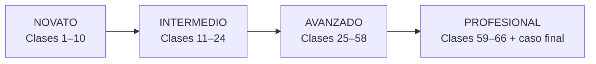
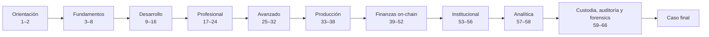

# 📚 Currículo

> [⬅️ Volver al programa](../README.md) · [📖 Bibliografía y fuentes](../docs/bibliografia.md) · [🧪 Laboratorios](../labs/CATALOG.md) · [🗺️ Roadmap](../ROADMAP.md)

66 clases progresivas e independientes, numeradas de forma continua, de los fundamentos criptográficos a la infraestructura
financiera programable y a la analítica de datos on-chain: criptografía, Bitcoin, Ethereum, contratos, seguridad, producción,
y después dinero, stablecoins, MDBC, pagos, tokenización, mercados de capitales, custodia
y regulación; y finalmente exchanges, contabilidad, reservas, auditoría y forensics. Cada clase tiene archivo y URL propios, enlaza a la siguiente y trae su
**fundamento**, **fuente de referencia**, **gráfico pedagógico**, práctica y evidencia verificable. Las 33 carpetas son mapas temáticos de compatibilidad, no clases agrupadas.
Estudia las clases **en orden**: cada una prepara la siguiente.

La última etapa especializa; no reemplaza el tronco técnico ni convierte el programa en una formación exclusivamente financiera.

La guía transversal [¿Y si cruzas la línea?](../docs/y-si-cruzas-la-linea-blockchain.md)
acompaña la progresión: en desarrollo distingue prueba local de explotación; en operación,
acceso de autoridad; y en la etapa profesional, indicador de atribución y PoR de auditoría.
No es una clase 67, sino un criterio obligatorio cuando una acción puede dañar a terceros.

## Mapa de progresión

## Índice

<!-- indice-clases:inicio -->
| Clase | Documento independiente | Pregunta guía | Tema y fuente base |
|---|---|---|---|
| **1** | [Qué problema intenta resolver blockchain](00-orientacion/clase-01-que-problema-intenta-resolver-blockchain.md) | ¿Cuándo un registro compartido necesita consenso y cuándo basta una base de datos? | [Mapa: Orientación](00-orientacion/README.md) · *Mastering Blockchain* (Bashir) y *The Blockchain and the New Architecture of Trust* (Werbach) |
| **2** | [Decidir y comunicar sin vender humo](00-orientacion/clase-02-decidir-y-comunicar-sin-vender-humo.md) | ¿Cómo se defiende una decisión técnica ante personas no técnicas? | [Mapa: Orientación](00-orientacion/README.md) · *Mastering Blockchain* (Bashir) y *The Blockchain and the New Architecture of Trust* (Werbach) |
| **3** | [Hashes, integridad y compromisos](01-criptografia/clase-03-hashes-integridad-y-compromisos.md) | ¿Cómo se detecta una alteración sin ocultar necesariamente el dato? | [Mapa: Criptografía aplicada](01-criptografia/README.md) · *Serious Cryptography* (Aumasson) y *Introduction to Modern Cryptography* (Katz, Lindell) |
| **4** | [Firmas, claves y ciclo de vida](01-criptografia/clase-04-firmas-claves-y-ciclo-de-vida.md) | ¿Qué prueba una firma y cómo se gobierna la clave que la produce? | [Mapa: Criptografía aplicada](01-criptografia/README.md) · *Serious Cryptography* (Aumasson) y *Introduction to Modern Cryptography* (Katz, Lindell) |
| **5** | [Replicación, latencia y fallas](02-sistemas-distribuidos/clase-05-replicacion-latencia-y-fallas.md) | ¿Qué significa mantener una verdad compartida cuando la red se parte? | [Mapa: Sistemas distribuidos y redes P2P](02-sistemas-distribuidos/README.md) · *Introduction to Reliable and Secure Distributed Programming* (Cachin, Guerraoui, Rodrigues) y *Distributed Systems* (Tanenbaum, van Steen) |
| **6** | [Redes P2P y adversarios](02-sistemas-distribuidos/clase-06-redes-p2p-y-adversarios.md) | ¿Cómo se propaga información sin confiar en cada participante? | [Mapa: Sistemas distribuidos y redes P2P](02-sistemas-distribuidos/README.md) · *Introduction to Reliable and Secure Distributed Programming* (Cachin, Guerraoui, Rodrigues) y *Distributed Systems* (Tanenbaum, van Steen) |
| **7** | [Elegir un historial válido](03-consenso/clase-07-elegir-un-historial-valido.md) | ¿Cómo acuerdan los nodos qué ocurrió sin una autoridad central? | [Mapa: Consenso](03-consenso/README.md) · whitepaper de Bitcoin (Nakamoto) y *Practical Byzantine Fault Tolerance* (Castro, Liskov) |
| **8** | [PoW, PoS y BFT bajo amenaza](03-consenso/clase-08-pow-pos-y-bft-bajo-amenaza.md) | ¿Qué recurso impide identidades gratuitas y qué ocurre si el actor miente? | [Mapa: Consenso](03-consenso/README.md) · whitepaper de Bitcoin (Nakamoto) y *Practical Byzantine Fault Tolerance* (Castro, Liskov) |
| **9** | [UTXO y anatomía de una transacción](04-bitcoin/clase-09-utxo-y-anatomia-de-una-transaccion.md) | ¿Dónde está el saldo de Bitcoin y qué autoriza realmente una entrada? | [Mapa: Bitcoin](04-bitcoin/README.md) · *Mastering Bitcoin* (Antonopoulos) y *Mastering the Lightning Network* (Antonopoulos, Osuntokun, Pickhardt) |
| **10** | [Verificación, minería y operación segura](04-bitcoin/clase-10-verificacion-mineria-y-operacion-segura.md) | ¿Qué comprueba un nodo propio y qué delega un cliente ligero? | [Mapa: Bitcoin](04-bitcoin/README.md) · *Mastering Bitcoin* (Antonopoulos) y *Mastering the Lightning Network* (Antonopoulos, Osuntokun, Pickhardt) |
| **11** | [Cuentas, estado y transacciones Ethereum](05-ethereum-evm/clase-11-cuentas-estado-y-transacciones-ethereum.md) | ¿Cómo cambia el estado global cuando una cuenta firma una operación? | [Mapa: Ethereum y EVM](05-ethereum-evm/README.md) · *Mastering Ethereum* (Antonopoulos, Wood) y *Ethereum Yellow Paper* (Wood) |
| **12** | [EVM, ABI y costo de ejecución](05-ethereum-evm/clase-12-evm-abi-y-costo-de-ejecucion.md) | ¿Cómo convierte la EVM una llamada en cambios de estado y consumo de gas? | [Mapa: Ethereum y EVM](05-ethereum-evm/README.md) · *Mastering Ethereum* (Antonopoulos, Wood) y *Ethereum Yellow Paper* (Wood) |
| **13** | [Diseño de contratos e invariantes](06-solidity-foundry/clase-13-diseno-de-contratos-e-invariantes.md) | ¿Qué debe ser siempre verdadero antes de escribir una línea de Solidity? | [Mapa: Solidity y Foundry](06-solidity-foundry/README.md) · documentación de Solidity y *The Foundry Book* |
| **14** | [Pruebas profundas con Foundry](06-solidity-foundry/clase-14-pruebas-profundas-con-foundry.md) | ¿Cómo encontramos secuencias que una prueba feliz nunca ejecuta? | [Mapa: Solidity y Foundry](06-solidity-foundry/README.md) · documentación de Solidity y *The Foundry Book* |
| **15** | [Lecturas, RPC y estado de interfaz](07-dapps/clase-15-lecturas-rpc-y-estado-de-interfaz.md) | ¿Qué puede mostrar una dApp sin pedir permiso ni firma al usuario? | [Mapa: Aplicaciones descentralizadas](07-dapps/README.md) · documentación de ethereum.org y de viem |
| **16** | [Firmas y experiencia transaccional](07-dapps/clase-16-firmas-y-experiencia-transaccional.md) | ¿Cómo entiende el usuario lo que firmará y qué ocurrió después? | [Mapa: Aplicaciones descentralizadas](07-dapps/README.md) · documentación de ethereum.org y de viem |
| **17** | [Estándares y derechos del token](08-tokens/clase-17-estandares-y-derechos-del-token.md) | ¿Qué interfaz garantiza un ERC y qué derechos económicos quedan fuera? | [Mapa: Tokens y estándares](08-tokens/README.md) · EIPs de Ethereum y OpenZeppelin Contracts |
| **18** | [Permisos, distribución y necesidad](08-tokens/clase-18-permisos-distribucion-y-necesidad.md) | ¿Por qué un token técnicamente correcto puede ser un mal producto? | [Mapa: Tokens y estándares](08-tokens/README.md) · EIPs de Ethereum y OpenZeppelin Contracts |
| **19** | [Modelado de amenazas y revisión manual](09-seguridad/clase-19-modelado-de-amenazas-y-revision-manual.md) | ¿Qué puede romper un atacante si conoce mejor el sistema que su autor? | [Mapa: Seguridad y auditoría](09-seguridad/README.md) · Trail of Bits *Building Secure Contracts* y ConsenSys *Smart Contract Best Practices* |
| **20** | [Auditoría reproducible y remediación](09-seguridad/clase-20-auditoria-reproducible-y-remediacion.md) | ¿Cómo se demuestra que un hallazgo fue corregido sin introducir otro? | [Mapa: Seguridad y auditoría](09-seguridad/README.md) · Trail of Bits *Building Secure Contracts* y ConsenSys *Smart Contract Best Practices* |
| **21** | [Oráculos y calidad del dato](10-oraculos-indexacion/clase-21-oraculos-y-calidad-del-dato.md) | ¿Qué confianza entra al contrato cuando importamos un precio externo? | [Mapa: Oráculos, almacenamiento e indexación](10-oraculos-indexacion/README.md) · documentación de Chainlink y de The Graph |
| **22** | [Eventos, indexación y disponibilidad](10-oraculos-indexacion/clase-22-eventos-indexacion-y-disponibilidad.md) | ¿Cómo consultamos historia sin confundir un índice con la verdad del protocolo? | [Mapa: Oráculos, almacenamiento e indexación](10-oraculos-indexacion/README.md) · documentación de Chainlink y de The Graph |
| **23** | [Propuestas, voto y ejecución](11-dao-gobernanza/clase-23-propuestas-voto-y-ejecucion.md) | ¿Cómo pasa una intención colectiva a un cambio ejecutable y demorado? | [Mapa: DAO y gobernanza](11-dao-gobernanza/README.md) · OpenZeppelin Governor y Compound Governance |
| **24** | [Captura y gobernanza de emergencia](11-dao-gobernanza/clase-24-captura-y-gobernanza-de-emergencia.md) | ¿Quién puede detener el sistema y quién controla a quien controla? | [Mapa: DAO y gobernanza](11-dao-gobernanza/README.md) · OpenZeppelin Governor y Compound Governance |
| **25** | [Familias de escalabilidad](12-escalabilidad/clase-25-familias-de-escalabilidad.md) | ¿Qué movemos fuera de L1 y qué garantía conservamos? | [Mapa: Escalabilidad y capas 2](12-escalabilidad/README.md) · *An Incomplete Guide to Rollups* (Buterin) y L2BEAT |
| **26** | [Riesgo operativo de una L2](12-escalabilidad/clase-26-riesgo-operativo-de-una-l2.md) | ¿Puede el usuario recuperar fondos si el secuenciador o el portal fallan? | [Mapa: Escalabilidad y capas 2](12-escalabilidad/README.md) · *An Incomplete Guide to Rollups* (Buterin) y L2BEAT |
| **27** | [Mensajes y activos entre cadenas](13-interoperabilidad/clase-27-mensajes-y-activos-entre-cadenas.md) | ¿Qué significa mover un activo si cada red mantiene su propio estado? | [Mapa: Interoperabilidad y ecosistemas](13-interoperabilidad/README.md) · documentación de Cosmos IBC y de Polkadot (XCM) |
| **28** | [Modelo de amenazas de puentes](13-interoperabilidad/clase-28-modelo-de-amenazas-de-puentes.md) | ¿Qué nueva confianza introduce cada capa de interoperabilidad? | [Mapa: Interoperabilidad y ecosistemas](13-interoperabilidad/README.md) · documentación de Cosmos IBC y de Polkadot (XCM) |
| **29** | [Compromisos y pruebas de conocimiento cero](14-privacidad-zk/clase-29-compromisos-y-pruebas-de-conocimiento-cero.md) | ¿Cómo se demuestra una afirmación sin revelar el dato que la sostiene? | [Mapa: Privacidad y zero knowledge](14-privacidad-zk/README.md) · *Proofs, Arguments, and Zero-Knowledge* (Thaler) y ZKProof Community Reference |
| **30** | [SNARK, STARK y privacidad real](14-privacidad-zk/clase-30-snark-stark-y-privacidad-real.md) | ¿Qué compromisos cambian entre sistemas y qué metadatos siguen visibles? | [Mapa: Privacidad y zero knowledge](14-privacidad-zk/README.md) · *Proofs, Arguments, and Zero-Knowledge* (Thaler) y ZKProof Community Reference |
| **31** | [Cuentas programables y actualizaciones](15-arquitectura-avanzada/clase-31-cuentas-programables-y-actualizaciones.md) | ¿Cómo añadimos recuperación y cambios sin crear una llave maestra invisible? | [Mapa: Arquitectura avanzada](15-arquitectura-avanzada/README.md) · ERC-4337 / EIP-7702 (abstracción de cuenta) e investigación de Flashbots (MEV) |
| **32** | [MEV y arquitectura de producción](15-arquitectura-avanzada/clase-32-mev-y-arquitectura-de-produccion.md) | ¿Qué actores pueden reordenar operaciones y cómo cambia el diseño? | [Mapa: Arquitectura avanzada](15-arquitectura-avanzada/README.md) · ERC-4337 / EIP-7702 (abstracción de cuenta) e investigación de Flashbots (MEV) |
| **33** | [Operar nodos con objetivos medibles](16-infraestructura-nodos/clase-33-operar-nodos-con-objetivos-medibles.md) | ¿Qué servicio presta el nodo y qué disponibilidad necesita el negocio? | [Mapa: Infraestructura y operación de nodos](16-infraestructura-nodos/README.md) · documentación de clientes de nodo (ethereum.org, Geth, Lighthouse) y guías de operación de EthStaker |
| **34** | [Resiliencia, actualización e incidentes](16-infraestructura-nodos/clase-34-resiliencia-actualizacion-e-incidentes.md) | ¿Cómo se cambia software crítico sin perder disponibilidad ni evidencia? | [Mapa: Infraestructura y operación de nodos](16-infraestructura-nodos/README.md) · documentación de clientes de nodo (ethereum.org, Geth, Lighthouse) y guías de operación de EthStaker |
| **35** | [Valor empresarial y límites](17-blockchain-en-la-empresa/clase-35-valor-empresarial-y-limites.md) | ¿Qué coordinación mejora y qué costo nuevo introduce una red compartida? | [Mapa: Blockchain en la empresa: valor, casos y costos](17-blockchain-en-la-empresa/README.md) · informes del BIS y el WEF, casos públicos documentados y *The Blockchain and the New Architecture of Trust* (Werbach) |
| **36** | [Comunicación, piloto y medición](17-blockchain-en-la-empresa/clase-36-comunicacion-piloto-y-medicion.md) | ¿Cómo se prueba valor sin prometer una transformación completa? | [Mapa: Blockchain en la empresa: valor, casos y costos](17-blockchain-en-la-empresa/README.md) · informes del BIS y el WEF, casos públicos documentados y *The Blockchain and the New Architecture of Trust* (Werbach) |
| **37** | [Integración end-to-end](18-implementacion-empresarial/clase-37-integracion-end-to-end.md) | ¿Cómo se conectan contratos, identidad, datos y sistemas heredados? | [Mapa: Implementación empresarial end-to-end](18-implementacion-empresarial/README.md) · prácticas públicas de integración del sector financiero y documentación de los componentes citados |
| **38** | [Paso a producción y operación](18-implementacion-empresarial/clase-38-paso-a-produccion-y-operacion.md) | ¿Qué debe estar listo antes de que una transacción tenga consecuencias reales? | [Mapa: Implementación empresarial end-to-end](18-implementacion-empresarial/README.md) · prácticas públicas de integración del sector financiero y documentación de los componentes citados |
| **39** | [AMM, liquidez y formación de precio](19-defi/clase-39-amm-liquidez-y-formacion-de-precio.md) | ¿Cómo fija precio un pool sin libro de órdenes? | [Mapa: DeFi: mercados, préstamo y riesgo on-chain](19-defi/README.md) · documentación de los protocolos citados, investigación del BIS sobre finanzas descentralizadas y literatura académica de microestructura de mercados |
| **40** | [Préstamo, colateral y riesgo DeFi](19-defi/clase-40-prestamo-colateral-y-riesgo-defi.md) | ¿Cómo permanece solvente un mercado sin evaluar personalmente al deudor? | [Mapa: DeFi: mercados, préstamo y riesgo on-chain](19-defi/README.md) · documentación de los protocolos citados, investigación del BIS sobre finanzas descentralizadas y literatura académica de microestructura de mercados |
| **41** | [Qué es dinero bancario](20-dinero-banca-liquidacion/clase-41-que-es-dinero-bancario.md) | Cuando pagas, ¿qué activo se mueve y qué institución te debe? | [Mapa: Dinero, banca y liquidación](20-dinero-banca-liquidacion/README.md) · publicaciones del BIS y del Comité de Pagos e Infraestructuras del Mercado (CPMI), documentación del Banco Central de Chile y del Banco Central Europeo |
| **42** | [Finalidad, liquidez y riesgo de liquidación](20-dinero-banca-liquidacion/clase-42-finalidad-liquidez-y-riesgo-de-liquidacion.md) | ¿Cuándo un pago es técnico, económico y jurídicamente final? | [Mapa: Dinero, banca y liquidación](20-dinero-banca-liquidacion/README.md) · publicaciones del BIS y del Comité de Pagos e Infraestructuras del Mercado (CPMI), documentación del Banco Central de Chile y del Banco Central Europeo |
| **43** | [Modelos de stablecoin y paridad](21-stablecoins/clase-43-modelos-de-stablecoin-y-paridad.md) | ¿Quién promete la paridad y con qué mecanismo intenta sostenerla? | [Mapa: Stablecoins](21-stablecoins/README.md) · informes del BIS y del Consejo de Estabilidad Financiera (FSB), Reglamento MiCA de la Unión Europea y documentación pública de los emisores citados |
| **44** | [Reservas, redención y riesgo operacional](21-stablecoins/clase-44-reservas-redencion-y-riesgo-operacional.md) | ¿Puede el tenedor convertir el token en dinero y bajo qué condiciones? | [Mapa: Stablecoins](21-stablecoins/README.md) · informes del BIS y del Consejo de Estabilidad Financiera (FSB), Reglamento MiCA de la Unión Europea y documentación pública de los emisores citados |
| **45** | [Depósitos tokenizados](22-deposito-tokenizado-cbdc/clase-45-depositos-tokenizados.md) | ¿Qué cambia cuando el pasivo bancario se representa en un registro programable? | [Mapa: Depósitos tokenizados y CBDC/MDBC](22-deposito-tokenizado-cbdc/README.md) · BIS Innovation Hub y CPMI, informes del Banco Central de Chile, Banco Central Europeo y demás bancos centrales citados |
| **46** | [CBDC/MDBC y diseño de política pública](22-deposito-tokenizado-cbdc/clase-46-cbdc-mdbc-y-diseno-de-politica-publica.md) | ¿Qué decisiones técnicas cambian privacidad, acceso y estabilidad financiera? | [Mapa: Depósitos tokenizados y CBDC/MDBC](22-deposito-tokenizado-cbdc/README.md) · BIS Innovation Hub y CPMI, informes del Banco Central de Chile, Banco Central Europeo y demás bancos centrales citados |
| **47** | [Anatomía de un pago transfronterizo](23-pagos-fx-onchain/clase-47-anatomia-de-un-pago-transfronterizo.md) | ¿Por qué un mensaje rápido no elimina corresponsales, FX ni cumplimiento? | [Mapa: Pagos, cross-border y FX on-chain](23-pagos-fx-onchain/README.md) · hoja de ruta del G20 sobre pagos transfronterizos (FSB), publicaciones del CPMI-BIS, Banco Mundial (*Remittance Prices Worldwide*) y documentación de los sistemas citados |
| **48** | [FX on-chain y pago contra pago](23-pagos-fx-onchain/clase-48-fx-on-chain-y-pago-contra-pago.md) | ¿Cómo se eliminan principal risk y patas descoordinadas? | [Mapa: Pagos, cross-border y FX on-chain](23-pagos-fx-onchain/README.md) · hoja de ruta del G20 sobre pagos transfronterizos (FSB), publicaciones del CPMI-BIS, Banco Mundial (*Remittance Prices Worldwide*) y documentación de los sistemas citados |
| **49** | [Del activo al derecho tokenizado](24-tokenizacion-rwa/clase-49-del-activo-al-derecho-tokenizado.md) | ¿Qué posee jurídicamente quien controla el token? | [Mapa: Tokenización y activos del mundo real (RWA)](24-tokenizacion-rwa/README.md) · informes del BIS y de IOSCO sobre tokenización, documentación de estándares (ERC-20, ERC-1400, ERC-3643) y prácticas públicas de emisión de valores digitales |
| **50** | [Ciclo de vida y controles de RWA](24-tokenizacion-rwa/clase-50-ciclo-de-vida-y-controles-de-rwa.md) | ¿Cómo se mantienen sincronizados token, activo y restricciones? | [Mapa: Tokenización y activos del mundo real (RWA)](24-tokenizacion-rwa/README.md) · informes del BIS y de IOSCO sobre tokenización, documentación de estándares (ERC-20, ERC-1400, ERC-3643) y prácticas públicas de emisión de valores digitales |
| **51** | [Infraestructura del mercado de capitales](25-mercados-capitales-onchain/clase-51-infraestructura-del-mercado-de-capitales.md) | ¿Qué hacen emisión, negociación, compensación, depósito y liquidación? | [Mapa: Mercados de capitales on-chain](25-mercados-capitales-onchain/README.md) · *Principles for Financial Market Infrastructures* (CPMI-IOSCO), publicaciones del BIS sobre liquidación y tokenización, y documentación pública de emisiones de valores digitales |
| **52** | [Mercado tokenizado y DvP](25-mercados-capitales-onchain/clase-52-mercado-tokenizado-y-dvp.md) | ¿Qué elimina la atomicidad y qué funciones institucionales permanecen? | [Mapa: Mercados de capitales on-chain](25-mercados-capitales-onchain/README.md) · *Principles for Financial Market Infrastructures* (CPMI-IOSCO), publicaciones del BIS sobre liquidación y tokenización, y documentación pública de emisiones de valores digitales |
| **53** | [Custodia institucional de claves](26-custodia-identidad/clase-53-custodia-institucional-de-claves.md) | ¿Cómo se evita que una persona o falla única controle los activos? | [Mapa: Custodia, wallets institucionales e identidad digital](26-custodia-identidad/README.md) · BIPs 32/39/44, ERC-4337, estándares W3C de identificadores descentralizados y credenciales verificables, y normativa de custodia y finanzas abiertas citada |
| **54** | [Identidad y autorización verificable](26-custodia-identidad/clase-54-identidad-y-autorizacion-verificable.md) | ¿Cómo demostramos atributos sin convertir la wallet en una identidad universal? | [Mapa: Custodia, wallets institucionales e identidad digital](26-custodia-identidad/README.md) · BIPs 32/39/44, ERC-4337, estándares W3C de identificadores descentralizados y credenciales verificables, y normativa de custodia y finanzas abiertas citada |
| **55** | [Leer regulación desde la fuente](27-regulacion-cumplimiento/clase-55-leer-regulacion-desde-la-fuente.md) | ¿Cómo distinguimos una obligación vigente de una guía o noticia? | [Mapa: Regulación y cumplimiento](27-regulacion-cumplimiento/README.md) · textos normativos oficiales (Reglamento MiCA, Ley 21.521 de Chile), Recomendaciones del GAFI/FATF, estándares del Comité de Basilea y de IOSCO |
| **56** | [Cumplimiento basado en riesgo](27-regulacion-cumplimiento/clase-56-cumplimiento-basado-en-riesgo.md) | ¿Qué controles responden al riesgo sin convertir toda señal en culpabilidad? | [Mapa: Regulación y cumplimiento](27-regulacion-cumplimiento/README.md) · textos normativos oficiales (Reglamento MiCA, Ley 21.521 de Chile), Recomendaciones del GAFI/FATF, estándares del Comité de Basilea y de IOSCO |
| **57** | [Extraer y normalizar datos on-chain](28-data-analytics-onchain/clase-57-extraer-y-normalizar-datos-on-chain.md) | ¿Cómo convertimos bloques y transacciones en un dataset reproducible? | [Mapa: Blockchain Data Analytics y minería de datos on-chain](28-data-analytics-onchain/README.md) · documentación de Bitcoin Core y de ethereum.org, especificación JSON-RPC de Ethereum, *Mastering Bitcoin* (Antonopoulos) y las guías de FATF/GAFI sobre activos virtuales |
| **58** | [Grafo, anomalías y límites de atribución](28-data-analytics-onchain/clase-58-grafo-anomalias-y-limites-de-atribucion.md) | ¿Qué patrón observamos y qué identidad no podemos afirmar? | [Mapa: Blockchain Data Analytics y minería de datos on-chain](28-data-analytics-onchain/README.md) · documentación de Bitcoin Core y de ethereum.org, especificación JSON-RPC de Ethereum, *Mastering Bitcoin* (Antonopoulos) y las guías de FATF/GAFI sobre activos virtuales |
| **59** | [Exchanges, custodia y libros internos](29-exchanges-operaciones-custodia/clase-59-exchanges-custodia-y-libros-internos.md) | ¿Dónde se ejecuta una operación y quién controla las claves? | [Mapa: Exchanges y operaciones de custodia](29-exchanges-operaciones-custodia/README.md) · documentación técnica de Bitcoin y Ethereum, estándares de gestión de claves de NIST y principios de custodia del IOSCO |
| **60** | [Wallets operacionales y evidencia blockchain](29-exchanges-operaciones-custodia/clase-60-wallets-operacionales-y-evidencia-blockchain.md) | ¿Cómo vinculamos una orden interna con direcciones y transaction IDs? | [Mapa: Exchanges y operaciones de custodia](29-exchanges-operaciones-custodia/README.md) · documentación técnica de Bitcoin y Ethereum, estándares de gestión de claves de NIST y principios de custodia del IOSCO |
| **61** | [Tres realidades contables](30-contabilidad-conciliacion/clase-61-tres-realidades-contables.md) | ¿Cómo se relacionan Internal Ledger, Exchange Reality y Blockchain State? | [Mapa: Contabilidad blockchain y conciliación](30-contabilidad-conciliacion/README.md) · principios de control interno de COSO, documentación de nodos Bitcoin/Ethereum y literatura contable sobre criptoactivos |
| **62** | [Conciliación y gestión de diferencias](30-contabilidad-conciliacion/clase-62-conciliacion-y-gestion-de-diferencias.md) | ¿Qué explica una diferencia y cuándo se convierte en incidente? | [Mapa: Contabilidad blockchain y conciliación](30-contabilidad-conciliacion/README.md) · principios de control interno de COSO, documentación de nodos Bitcoin/Ethereum y literatura contable sobre criptoactivos |
| **63** | [Del saldo del cliente a una prueba Merkle](31-proof-reserves-solvencia/clase-63-del-saldo-del-cliente-a-una-prueba-merkle.md) | ¿Cómo demuestra un cliente que su saldo fue incluido sin publicar todos los saldos? | [Mapa: Proof of Reserves, pasivos y solvencia](31-proof-reserves-solvencia/README.md) · especificaciones de Certificate Transparency/Merkle trees, marcos de encargos de aseguramiento y publicaciones regulatorias sobre proof of reserves |
| **64** | [Del snapshot a una conclusión profesional](31-proof-reserves-solvencia/clase-64-del-snapshot-a-una-conclusion-profesional.md) | ¿Qué falta para pasar de controlar wallets a concluir solvencia? | [Mapa: Proof of Reserves, pasivos y solvencia](31-proof-reserves-solvencia/README.md) · especificaciones de Certificate Transparency/Merkle trees, marcos de encargos de aseguramiento y publicaciones regulatorias sobre proof of reserves |
| **65** | [Forensics con evidencia reproducible](32-forensics-auditoria-gobernanza/clase-65-forensics-con-evidencia-reproducible.md) | ¿Cómo investigamos flujos sin convertir heurísticas en acusaciones? | [Mapa: Blockchain forensics, auditoría y gobernanza](32-forensics-auditoria-gobernanza/README.md) · guías FATF/GAFI, estándares de evidencia digital NIST y principios de control interno COSO |
| **66** | [Auditoría, cumplimiento y gobierno custodial](32-forensics-auditoria-gobernanza/clase-66-auditoria-cumplimiento-y-gobierno-custodial.md) | ¿Quién autoriza, ejecuta, registra, concilia e investiga cada movimiento? | [Mapa: Blockchain forensics, auditoría y gobernanza](32-forensics-auditoria-gobernanza/README.md) · guías FATF/GAFI, estándares de evidencia digital NIST y principios de control interno COSO |
<!-- indice-clases:fin -->

> 👛 **Wallets integradas:** claves y semillas aparecen en la clase 4; selección UTXO,
> direcciones y verificación en 9–10; cuentas y consentimiento en 11 y 16; custodia
> institucional y operaciones en 53–54 y 59–60. [Wallets desde cero](../docs/wallets-desde-cero.md)
> es una guía de consulta, no una clase adicional. El total permanece en 66.

## Cómo está construida cada clase

Cada documento de clase usa una estrategia adecuada —demostración, simulación,
incidente, taller, debate o auditoría— según el tipo de aprendizaje:
objetivos medibles, resultados de aprendizaje, tabla de temas, modelo mental,
**esquema visual** (diagramas Mermaid), conceptos con definiciones, **profundización**
con casos reales y ejemplos numéricos, laboratorio guiado, reto verificable con
criterio de aceptación, errores frecuentes, seguridad y ética, **referencias a libros
y fuentes primarias**, y navegación a la unidad anterior y siguiente.

Para la dimensión profesional del ecosistema —cómo se construye una red, el stack,
los equipos, las empresas y los modelos de negocio— consulta la sección
[Industria](../industria/README.md). La etapa financiera se apoya además en
[casos reales](../docs/casos-reales/README.md) analizados con estructura fija y en la
carpeta de [regulación](../regulation/README.md), donde cada afirmación normativa declara
su rango y su fuente oficial.

Las fuentes se detallan en la [bibliografía central](../docs/bibliografia.md), que
también recoge los **hitos recientes del ecosistema** (Merge, Dencun/EIP-4844,
Pectra/EIP-7702) para mantener el material al día.

## Ruta recomendada

| Nivel | Clases | Resultado |
|---|---|---|
| Orientación | 1–2 | Distinguir blockchain de una base de datos |
| Fundamentos | 3–8 | Criptografía, redes y consenso |
| Desarrollo | 9–16 | Bitcoin, wallets, EVM, contratos y una dApp |
| Profesional | 17–24 | Tokens, seguridad, oráculos y DAO |
| Avanzado | 25–32 | L2, interoperabilidad, ZK y arquitectura |
| Producción | 33–38 | Infraestructura real, caso de negocio e implementación en la empresa |
| Finanzas on-chain | 39–52 | DeFi, dinero y liquidación, stablecoins, MDBC, pagos, tokenización y mercados |
| Institucional y regulación | 53–56 | Custodia, identidad digital, cumplimiento y marcos regulatorios |
| Analítica de datos on-chain | 57–58 | Minería de datos blockchain, grafos, patrones, anomalías y sus límites |
| Custodia, auditoría y forensics | 59–66 | Exchanges, wallets, conciliación, PoR/PoL, solvencia, forensics, gobierno y auditoría |

Empieza por la [Clase 1 · Qué problema intenta resolver blockchain](00-orientacion/clase-01-que-problema-intenta-resolver-blockchain.md).

---

## 🧭 Navegación

[🏠 Programa](../README.md) · [📖 Bibliografía](../docs/bibliografia.md) · [🧪 Laboratorios](../labs/CATALOG.md) · ➡️ [Clase 1 · Orientación](00-orientacion/README.md#clase-1--qué-problema-intenta-resolver-blockchain)
