# 📚 Currículo

> [⬅️ Volver al programa](../README.md) · [📖 Bibliografía y fuentes](../docs/bibliografia.md) · [🧪 Laboratorios](../labs/CATALOG.md) · [🗺️ Roadmap](../ROADMAP.md)

28 módulos progresivos (00–27), de los fundamentos criptográficos a la infraestructura
financiera programable: criptografía, Bitcoin, Ethereum, contratos, seguridad, producción,
y después dinero, stablecoins, MDBC, pagos, tokenización, mercados de capitales, custodia
y regulación. Cada módulo enlaza al siguiente y trae su
**fuente de referencia**, un **esquema visual**, un laboratorio y un reto verificable.
Estúdialos **en orden**: cada uno asume el anterior.

## Mapa del programa

```mermaid
flowchart LR
    subgraph N0["Orientación"]
        M00["00"]
    end
    subgraph N1["Fundamentos"]
        M01["01 Cripto"] --> M02["02 Distribuidos"] --> M03["03 Consenso"]
    end
    subgraph N2["Desarrollo"]
        M04["04 Bitcoin"] --> W["👛 Wallets desde cero"] --> M05["05 EVM"] --> M06["06 Solidity"] --> M07["07 dApps"]
    end
    subgraph N3["Profesional"]
        M08["08 Tokens"] --> M09["09 Seguridad"] --> M10["10 Oráculos"] --> M11["11 DAO"]
    end
    subgraph N4["Avanzado"]
        M12["12 L2"] --> M13["13 Interop"] --> M14["14 ZK"] --> M15["15 Arquitectura"]
    end
    subgraph N5["Producción"]
        M16["16 Infraestructura"] --> M17["17 Empresa"] --> M18["18 Implementación"]
    end
    subgraph N6["Finanzas on-chain"]
        M19["19 DeFi"] --> M20["20 Dinero"] --> M21["21 Stablecoins"] --> M22["22 MDBC"]
        M22 --> M23["23 Pagos y FX"] --> M24["24 Tokenización"] --> M25["25 Mercados"]
    end
    subgraph N7["Institucional"]
        M26["26 Custodia e identidad"] --> M27["27 Regulación"]
    end
    M00 --> M01
    M03 --> M04
    M07 --> M08
    M11 --> M12
    M15 --> M16
    M18 --> M19
    M25 --> M26
    M27 --> CAP["🎓 Capstone"]
```

## Índice

| # | Módulo | Pregunta central | Fuente principal |
|---:|---|---|---|
| 00 | [Orientación](00-orientacion/README.md) | ¿Necesito blockchain? | Bashir · Werbach |
| 01 | [Criptografía aplicada](01-criptografia/README.md) | ¿Cómo verificamos integridad y autoría? | Aumasson · Katz-Lindell |
| 02 | [Sistemas distribuidos y P2P](02-sistemas-distribuidos/README.md) | ¿Cómo cooperan nodos que fallan? | Cachin · Tanenbaum |
| 03 | [Consenso](03-consenso/README.md) | ¿Cómo se elige un historial? | Nakamoto · Castro-Liskov |
| 04 | [Bitcoin](04-bitcoin/README.md) | ¿Cómo funciona el dinero UTXO? | Antonopoulos — *Mastering Bitcoin* |
| 05 | [Ethereum y EVM](05-ethereum-evm/README.md) | ¿Cómo se ejecuta estado programable? | Antonopoulos/Wood — *Mastering Ethereum* |
| 06 | [Solidity y Foundry](06-solidity-foundry/README.md) | ¿Cómo escribimos contratos comprobables? | Docs de Solidity · Foundry Book |
| 07 | [dApps](07-dapps/README.md) | ¿Cómo conecta una interfaz con una wallet? | ethereum.org · viem |
| 08 | [Tokens y estándares](08-tokens/README.md) | ¿Qué garantiza un estándar? | EIPs · OpenZeppelin |
| 09 | [Seguridad y auditoría](09-seguridad/README.md) | ¿Cómo piensa un atacante? | Trail of Bits · ConsenSys |
| 10 | [Oráculos e indexación](10-oraculos-indexacion/README.md) | ¿Cómo entra información confiable? | Chainlink · The Graph |
| 11 | [DAO y gobernanza](11-dao-gobernanza/README.md) | ¿Cómo gobernamos protocolos? | OZ Governor · Compound |
| 12 | [Escalabilidad y L2](12-escalabilidad/README.md) | ¿Qué se mueve fuera de L1? | Buterin · L2BEAT |
| 13 | [Interoperabilidad](13-interoperabilidad/README.md) | ¿Cómo se conectan ecosistemas? | Cosmos IBC · Polkadot |
| 14 | [Privacidad y ZK](14-privacidad-zk/README.md) | ¿Qué se demuestra sin revelar? | Thaler · ZKProof |
| 15 | [Arquitectura avanzada](15-arquitectura-avanzada/README.md) | ¿Cómo llega un protocolo a producción? | ERC-4337 · Flashbots |
| 16 | [Infraestructura y nodos](16-infraestructura-nodos/README.md) | ¿Qué máquinas y nube necesita esto? | ethereum.org · EthStaker |
| 17 | [Blockchain en la empresa](17-blockchain-en-la-empresa/README.md) | ¿Qué gana la empresa, con qué casos y costos? | BIS · WEF · Werbach |
| 18 | [Implementación empresarial](18-implementacion-empresarial/README.md) | ¿Cómo se integra con los sistemas existentes? | Prácticas del sector financiero |
| 19 | [DeFi](19-defi/README.md) | ¿Cómo funciona un mercado sin intermediario? | Uniswap · Aave · BIS |
| 20 | [Dinero, banca y liquidación](20-dinero-banca-liquidacion/README.md) | ¿Qué se mueve cuando pago? | CPMI-BIS · bancos centrales |
| 21 | [Stablecoins](21-stablecoins/README.md) | ¿Qué sostiene la paridad y cuándo se rompe? | BIS · FSB · MiCA |
| 22 | [Depósitos tokenizados y CBDC/MDBC](22-deposito-tokenizado-cbdc/README.md) | ¿Quién responde por cada forma de dinero digital? | BIS Innovation Hub · Banco Central de Chile |
| 23 | [Pagos, cross-border y FX on-chain](23-pagos-fx-onchain/README.md) | ¿Por qué una transferencia internacional tarda dos días? | FSB/G20 · Banco Mundial |
| 24 | [Tokenización y RWA](24-tokenizacion-rwa/README.md) | ¿Qué del activo viaja al token? | BIS · IOSCO · ERC-3643 |
| 25 | [Mercados de capitales on-chain](25-mercados-capitales-onchain/README.md) | ¿Cómo se emite, negocia y liquida un valor? | CPMI-IOSCO — PFMI |
| 26 | [Custodia, wallets institucionales e identidad](26-custodia-identidad/README.md) | ¿Quién tiene la llave y cómo se prueba quién eres? | BIPs · ERC-4337 · W3C |
| 27 | [Regulación y cumplimiento](27-regulacion-cumplimiento/README.md) | ¿Qué obliga la norma y quién la dicta? | MiCA · GAFI · Basilea · CMF |

> 👛 **Unidad transversal:** [Wallets desde cero: uso, seguridad y recuperación](../docs/wallets-desde-cero.md)
> se estudia **entre el módulo 04 y el 05** y es obligatoria para principiantes: qué administra
> una wallet, cómo usarla con seguridad y qué hacer ante una emergencia. No lleva número
> para no alterar la secuencia 00–27; su práctica es la 71 del [catálogo](../labs/CATALOG.md).

## Cómo está construido cada módulo

Todos siguen la misma estructura (ver [`MODULE_TEMPLATE.md`](MODULE_TEMPLATE.md)):
objetivos medibles, resultados de aprendizaje, tabla de temas, modelo mental,
**esquema visual** (diagramas Mermaid), conceptos con definiciones, **profundización**
con casos reales y ejemplos numéricos, laboratorio guiado, reto verificable con
criterio de aceptación, errores frecuentes, seguridad y ética, **referencias a libros
y fuentes primarias**, y navegación al módulo anterior y siguiente.

Para la dimensión profesional del ecosistema —cómo se construye una red, el stack,
los equipos, las empresas y los modelos de negocio— consulta la sección
[Industria](../industria/README.md). La etapa financiera se apoya además en
[casos reales](../docs/casos-reales/README.md) analizados con estructura fija y en la
carpeta de [regulación](../regulation/README.md), donde cada afirmación normativa declara
su rango y su fuente oficial.

Las fuentes se detallan en la [bibliografía central](../docs/bibliografia.md), que
también recoge los **hitos recientes del ecosistema** (Merge, Dencun/EIP-4844,
Pectra/EIP-7702) para mantener el material al día.

## Ruta recomendada

| Nivel | Módulos | Resultado |
|---|---|---|
| Orientación | 00 | Distinguir blockchain de una base de datos |
| Fundamentos | 01–03 | Criptografía, redes y consenso |
| Desarrollo | 04–07 (+ [Wallets desde cero](../docs/wallets-desde-cero.md) tras el 04) | Bitcoin, wallets, EVM, contratos y una dApp |
| Profesional | 08–11 | Tokens, seguridad, oráculos y DAO |
| Avanzado | 12–15 | L2, interoperabilidad, ZK y arquitectura |
| Producción | 16–18 | Infraestructura real, caso de negocio e implementación en la empresa |
| Finanzas on-chain | 19–25 | DeFi, dinero y liquidación, stablecoins, MDBC, pagos, tokenización y mercados |
| Institucional y regulación | 26–27 | Custodia, identidad digital, cumplimiento y marcos regulatorios |

Empieza por el [Módulo 00 · Orientación](00-orientacion/README.md).

---

## 🧭 Navegación

[🏠 Programa](../README.md) · [📖 Bibliografía](../docs/bibliografia.md) · [🧪 Laboratorios](../labs/CATALOG.md) · ➡️ [Módulo 00 · Orientación](00-orientacion/README.md)
