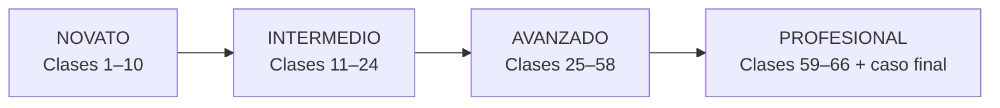

# 📚 Currículo

> [⬅️ Volver al programa](../README.md) · [📖 Bibliografía y fuentes](../docs/bibliografia.md) · [🧪 Laboratorios](../labs/CATALOG.md) · [🗺️ Roadmap](../ROADMAP.md)

66 clases progresivas, numeradas de forma continua y agrupadas por tema en 33 unidades documentales, de los fundamentos criptográficos a la infraestructura
financiera programable y a la analítica de datos on-chain: criptografía, Bitcoin, Ethereum, contratos, seguridad, producción,
y después dinero, stablecoins, MDBC, pagos, tokenización, mercados de capitales, custodia
y regulación; y finalmente exchanges, contabilidad, reservas, auditoría y forensics. Cada unidad reúne dos clases distintas, enlaza a la siguiente y trae su
**fuente de referencia**, un **esquema visual**, un laboratorio y un reto verificable.
Estudia las clases **en orden**: cada una prepara la siguiente.

La última etapa especializa; no reemplaza el tronco técnico ni convierte el programa en una formación exclusivamente financiera.

## Mapa del programa

```mermaid
flowchart LR
    subgraph N0["Orientación"]
        M00["Clases 1–2"]
    end
    subgraph N1["Fundamentos"]
        M01["3–4 Cripto"] --> M02["5–6 Distribuidos"] --> M03["7–8 Consenso"]
    end
    subgraph N2["Desarrollo"]
        M04["9–10 Bitcoin"] --> W["👛 Wallets desde cero"] --> M05["11–12 EVM"] --> M06["13–14 Solidity"] --> M07["15–16 dApps"]
    end
    subgraph N3["Profesional"]
        M08["17–18 Tokens"] --> M09["19–20 Seguridad"] --> M10["21–22 Oráculos"] --> M11["23–24 DAO"]
    end
    subgraph N4["Avanzado"]
        M12["25–26 L2"] --> M13["27–28 Interop"] --> M14["29–30 ZK"] --> M15["31–32 Arquitectura"]
    end
    subgraph N5["Producción"]
        M16["33–34 Infraestructura"] --> M17["35–36 Empresa"] --> M18["37–38 Implementación"]
    end
    subgraph N6["Finanzas on-chain"]
        M19["39–40 DeFi"] --> M20["41–42 Dinero"] --> M21["43–44 Stablecoins"] --> M22["45–46 MDBC"]
        M22 --> M23["47–48 Pagos y FX"] --> M24["49–50 Tokenización"] --> M25["51–52 Mercados"]
    end
    subgraph N7["Institucional"]
        M26["53–54 Custodia e identidad"] --> M27["55–56 Regulación"]
    end
    subgraph N8["Analítica de datos"]
        M28["57–58 Data Analytics on-chain"]
    end
    subgraph N9["Custodia, auditoría y forensics"]
        M29["59–60 Exchanges"] --> M30["61–62 Conciliación"] --> M31["63–64 PoR y solvencia"] --> M32["65–66 Forensics y auditoría"]
    end
    M00 --> M01
    M03 --> M04
    M07 --> M08
    M11 --> M12
    M15 --> M16
    M18 --> M19
    M25 --> M26
    M27 --> M28
    M28 --> M29
    M32 --> CAP["🎓 Caso final"]
```

## Índice

<!-- indice-clases:inicio -->
| Tema y material común | Clases | Preguntas guía | Fuente base |
|---|---|---|---|
| [Orientación](00-orientacion/README.md) | **1** Qué problema intenta resolver blockchain **2** Decidir y comunicar sin vender humo | ¿Cuándo un registro compartido necesita consenso y cuándo basta una base de datos? ¿Cómo se defiende una decisión técnica ante personas no técnicas? | *Mastering Blockchain* (Bashir) y *The Blockchain and the New Architecture of Trust* (Werbach) |
| [Criptografía aplicada](01-criptografia/README.md) | **3** Hashes, integridad y compromisos **4** Firmas, claves y ciclo de vida | ¿Cómo se detecta una alteración sin ocultar necesariamente el dato? ¿Qué prueba una firma y cómo se gobierna la clave que la produce? | *Serious Cryptography* (Aumasson) y *Introduction to Modern Cryptography* (Katz, Lindell) |
| [Sistemas distribuidos y redes P2P](02-sistemas-distribuidos/README.md) | **5** Replicación, latencia y fallas **6** Redes P2P y adversarios | ¿Qué significa mantener una verdad compartida cuando la red se parte? ¿Cómo se propaga información sin confiar en cada participante? | *Introduction to Reliable and Secure Distributed Programming* (Cachin, Guerraoui, Rodrigues) y *Distributed Systems* (Tanenbaum, van Steen) |
| [Consenso](03-consenso/README.md) | **7** Elegir un historial válido **8** PoW, PoS y BFT bajo amenaza | ¿Cómo acuerdan los nodos qué ocurrió sin una autoridad central? ¿Qué recurso impide identidades gratuitas y qué ocurre si el actor miente? | whitepaper de Bitcoin (Nakamoto) y *Practical Byzantine Fault Tolerance* (Castro, Liskov) |
| [Bitcoin](04-bitcoin/README.md) | **9** UTXO y anatomía de una transacción **10** Verificación, minería y operación segura | ¿Dónde está el saldo de Bitcoin y qué autoriza realmente una entrada? ¿Qué comprueba un nodo propio y qué delega un cliente ligero? | *Mastering Bitcoin* (Antonopoulos) y *Mastering the Lightning Network* (Antonopoulos, Osuntokun, Pickhardt) |
| [Ethereum y EVM](05-ethereum-evm/README.md) | **11** Cuentas, estado y transacciones Ethereum **12** EVM, ABI y costo de ejecución | ¿Cómo cambia el estado global cuando una cuenta firma una operación? ¿Cómo convierte la EVM una llamada en cambios de estado y consumo de gas? | *Mastering Ethereum* (Antonopoulos, Wood) y *Ethereum Yellow Paper* (Wood) |
| [Solidity y Foundry](06-solidity-foundry/README.md) | **13** Diseño de contratos e invariantes **14** Pruebas profundas con Foundry | ¿Qué debe ser siempre verdadero antes de escribir una línea de Solidity? ¿Cómo encontramos secuencias que una prueba feliz nunca ejecuta? | documentación de Solidity y *The Foundry Book* |
| [Aplicaciones descentralizadas](07-dapps/README.md) | **15** Lecturas, RPC y estado de interfaz **16** Firmas y experiencia transaccional | ¿Qué puede mostrar una dApp sin pedir permiso ni firma al usuario? ¿Cómo entiende el usuario lo que firmará y qué ocurrió después? | documentación de ethereum.org y de viem |
| [Tokens y estándares](08-tokens/README.md) | **17** Estándares y derechos del token **18** Permisos, distribución y necesidad | ¿Qué interfaz garantiza un ERC y qué derechos económicos quedan fuera? ¿Por qué un token técnicamente correcto puede ser un mal producto? | EIPs de Ethereum y OpenZeppelin Contracts |
| [Seguridad y auditoría](09-seguridad/README.md) | **19** Modelado de amenazas y revisión manual **20** Auditoría reproducible y remediación | ¿Qué puede romper un atacante si conoce mejor el sistema que su autor? ¿Cómo se demuestra que un hallazgo fue corregido sin introducir otro? | Trail of Bits *Building Secure Contracts* y ConsenSys *Smart Contract Best Practices* |
| [Oráculos, almacenamiento e indexación](10-oraculos-indexacion/README.md) | **21** Oráculos y calidad del dato **22** Eventos, indexación y disponibilidad | ¿Qué confianza entra al contrato cuando importamos un precio externo? ¿Cómo consultamos historia sin confundir un índice con la verdad del protocolo? | documentación de Chainlink y de The Graph |
| [DAO y gobernanza](11-dao-gobernanza/README.md) | **23** Propuestas, voto y ejecución **24** Captura y gobernanza de emergencia | ¿Cómo pasa una intención colectiva a un cambio ejecutable y demorado? ¿Quién puede detener el sistema y quién controla a quien controla? | OpenZeppelin Governor y Compound Governance |
| [Escalabilidad y capas 2](12-escalabilidad/README.md) | **25** Familias de escalabilidad **26** Riesgo operativo de una L2 | ¿Qué movemos fuera de L1 y qué garantía conservamos? ¿Puede el usuario recuperar fondos si el secuenciador o el portal fallan? | *An Incomplete Guide to Rollups* (Buterin) y L2BEAT |
| [Interoperabilidad y ecosistemas](13-interoperabilidad/README.md) | **27** Mensajes y activos entre cadenas **28** Modelo de amenazas de puentes | ¿Qué significa mover un activo si cada red mantiene su propio estado? ¿Qué nueva confianza introduce cada capa de interoperabilidad? | documentación de Cosmos IBC y de Polkadot (XCM) |
| [Privacidad y zero knowledge](14-privacidad-zk/README.md) | **29** Compromisos y pruebas de conocimiento cero **30** SNARK, STARK y privacidad real | ¿Cómo se demuestra una afirmación sin revelar el dato que la sostiene? ¿Qué compromisos cambian entre sistemas y qué metadatos siguen visibles? | *Proofs, Arguments, and Zero-Knowledge* (Thaler) y ZKProof Community Reference |
| [Arquitectura avanzada](15-arquitectura-avanzada/README.md) | **31** Cuentas programables y actualizaciones **32** MEV y arquitectura de producción | ¿Cómo añadimos recuperación y cambios sin crear una llave maestra invisible? ¿Qué actores pueden reordenar operaciones y cómo cambia el diseño? | ERC-4337 / EIP-7702 (abstracción de cuenta) e investigación de Flashbots (MEV) |
| [Infraestructura y operación de nodos](16-infraestructura-nodos/README.md) | **33** Operar nodos con objetivos medibles **34** Resiliencia, actualización e incidentes | ¿Qué servicio presta el nodo y qué disponibilidad necesita el negocio? ¿Cómo se cambia software crítico sin perder disponibilidad ni evidencia? | documentación de clientes de nodo (ethereum.org, Geth, Lighthouse) y guías de operación de EthStaker |
| [Blockchain en la empresa: valor, casos y costos](17-blockchain-en-la-empresa/README.md) | **35** Valor empresarial y límites **36** Comunicación, piloto y medición | ¿Qué coordinación mejora y qué costo nuevo introduce una red compartida? ¿Cómo se prueba valor sin prometer una transformación completa? | informes del BIS y el WEF, casos públicos documentados y *The Blockchain and the New Architecture of Trust* (Werbach) |
| [Implementación empresarial end-to-end](18-implementacion-empresarial/README.md) | **37** Integración end-to-end **38** Paso a producción y operación | ¿Cómo se conectan contratos, identidad, datos y sistemas heredados? ¿Qué debe estar listo antes de que una transacción tenga consecuencias reales? | prácticas públicas de integración del sector financiero y documentación de los componentes citados |
| [DeFi: mercados, préstamo y riesgo on-chain](19-defi/README.md) | **39** AMM, liquidez y formación de precio **40** Préstamo, colateral y riesgo DeFi | ¿Cómo fija precio un pool sin libro de órdenes? ¿Cómo permanece solvente un mercado sin evaluar personalmente al deudor? | documentación de los protocolos citados, investigación del BIS sobre finanzas descentralizadas y literatura académica de microestructura de mercados |
| [Dinero, banca y liquidación](20-dinero-banca-liquidacion/README.md) | **41** Qué es dinero bancario **42** Finalidad, liquidez y riesgo de liquidación | Cuando pagas, ¿qué activo se mueve y qué institución te debe? ¿Cuándo un pago es técnico, económico y jurídicamente final? | publicaciones del BIS y del Comité de Pagos e Infraestructuras del Mercado (CPMI), documentación del Banco Central de Chile y del Banco Central Europeo |
| [Stablecoins](21-stablecoins/README.md) | **43** Modelos de stablecoin y paridad **44** Reservas, redención y riesgo operacional | ¿Quién promete la paridad y con qué mecanismo intenta sostenerla? ¿Puede el tenedor convertir el token en dinero y bajo qué condiciones? | informes del BIS y del Consejo de Estabilidad Financiera (FSB), Reglamento MiCA de la Unión Europea y documentación pública de los emisores citados |
| [Depósitos tokenizados y CBDC/MDBC](22-deposito-tokenizado-cbdc/README.md) | **45** Depósitos tokenizados **46** CBDC/MDBC y diseño de política pública | ¿Qué cambia cuando el pasivo bancario se representa en un registro programable? ¿Qué decisiones técnicas cambian privacidad, acceso y estabilidad financiera? | BIS Innovation Hub y CPMI, informes del Banco Central de Chile, Banco Central Europeo y demás bancos centrales citados |
| [Pagos, cross-border y FX on-chain](23-pagos-fx-onchain/README.md) | **47** Anatomía de un pago transfronterizo **48** FX on-chain y pago contra pago | ¿Por qué un mensaje rápido no elimina corresponsales, FX ni cumplimiento? ¿Cómo se eliminan principal risk y patas descoordinadas? | hoja de ruta del G20 sobre pagos transfronterizos (FSB), publicaciones del CPMI-BIS, Banco Mundial (*Remittance Prices Worldwide*) y documentación de los sistemas citados |
| [Tokenización y activos del mundo real (RWA)](24-tokenizacion-rwa/README.md) | **49** Del activo al derecho tokenizado **50** Ciclo de vida y controles de RWA | ¿Qué posee jurídicamente quien controla el token? ¿Cómo se mantienen sincronizados token, activo y restricciones? | informes del BIS y de IOSCO sobre tokenización, documentación de estándares (ERC-20, ERC-1400, ERC-3643) y prácticas públicas de emisión de valores digitales |
| [Mercados de capitales on-chain](25-mercados-capitales-onchain/README.md) | **51** Infraestructura del mercado de capitales **52** Mercado tokenizado y DvP | ¿Qué hacen emisión, negociación, compensación, depósito y liquidación? ¿Qué elimina la atomicidad y qué funciones institucionales permanecen? | *Principles for Financial Market Infrastructures* (CPMI-IOSCO), publicaciones del BIS sobre liquidación y tokenización, y documentación pública de emisiones de valores digitales |
| [Custodia, wallets institucionales e identidad digital](26-custodia-identidad/README.md) | **53** Custodia institucional de claves **54** Identidad y autorización verificable | ¿Cómo se evita que una persona o falla única controle los activos? ¿Cómo demostramos atributos sin convertir la wallet en una identidad universal? | BIPs 32/39/44, ERC-4337, estándares W3C de identificadores descentralizados y credenciales verificables, y normativa de custodia y finanzas abiertas citada |
| [Regulación y cumplimiento](27-regulacion-cumplimiento/README.md) | **55** Leer regulación desde la fuente **56** Cumplimiento basado en riesgo | ¿Cómo distinguimos una obligación vigente de una guía o noticia? ¿Qué controles responden al riesgo sin convertir toda señal en culpabilidad? | textos normativos oficiales (Reglamento MiCA, Ley 21.521 de Chile), Recomendaciones del GAFI/FATF, estándares del Comité de Basilea y de IOSCO |
| [Blockchain Data Analytics y minería de datos on-chain](28-data-analytics-onchain/README.md) | **57** Extraer y normalizar datos on-chain **58** Grafo, anomalías y límites de atribución | ¿Cómo convertimos bloques y transacciones en un dataset reproducible? ¿Qué patrón observamos y qué identidad no podemos afirmar? | documentación de Bitcoin Core y de ethereum.org, especificación JSON-RPC de Ethereum, *Mastering Bitcoin* (Antonopoulos) y las guías de FATF/GAFI sobre activos virtuales |
| [Exchanges y operaciones de custodia](29-exchanges-operaciones-custodia/README.md) | **59** Exchanges, custodia y libros internos **60** Wallets operacionales y evidencia blockchain | ¿Dónde se ejecuta una operación y quién controla las claves? ¿Cómo vinculamos una orden interna con direcciones y transaction IDs? | documentación técnica de Bitcoin y Ethereum, estándares de gestión de claves de NIST y principios de custodia del IOSCO |
| [Contabilidad blockchain y conciliación](30-contabilidad-conciliacion/README.md) | **61** Tres realidades contables **62** Conciliación y gestión de diferencias | ¿Cómo se relacionan Internal Ledger, Exchange Reality y Blockchain State? ¿Qué explica una diferencia y cuándo se convierte en incidente? | principios de control interno de COSO, documentación de nodos Bitcoin/Ethereum y literatura contable sobre criptoactivos |
| [Proof of Reserves, pasivos y solvencia](31-proof-reserves-solvencia/README.md) | **63** Del saldo del cliente a una prueba Merkle **64** Del snapshot a una conclusión profesional | ¿Cómo demuestra un cliente que su saldo fue incluido sin publicar todos los saldos? ¿Qué falta para pasar de controlar wallets a concluir solvencia? | especificaciones de Certificate Transparency/Merkle trees, marcos de encargos de aseguramiento y publicaciones regulatorias sobre proof of reserves |
| [Blockchain forensics, auditoría y gobernanza](32-forensics-auditoria-gobernanza/README.md) | **65** Forensics con evidencia reproducible **66** Auditoría, cumplimiento y gobierno custodial | ¿Cómo investigamos flujos sin convertir heurísticas en acusaciones? ¿Quién autoriza, ejecuta, registra, concilia e investiga cada movimiento? | guías FATF/GAFI, estándares de evidencia digital NIST y principios de control interno COSO |
<!-- indice-clases:fin -->

> 👛 **Unidad transversal:** [Wallets desde cero: uso, seguridad y recuperación](../docs/wallets-desde-cero.md)
> se estudia **entre las clases 10 y 11** y es obligatoria para principiantes: qué administra
> una wallet, cómo usarla con seguridad y qué hacer ante una emergencia. No lleva número
> como puente transversal; su práctica es la 71 del [catálogo](../labs/CATALOG.md).

## Cómo está construida cada pareja de clases

Las unidades comparten una anatomía reconocible (ver [`MODULE_TEMPLATE.md`](MODULE_TEMPLATE.md)),
pero sus clases usan estrategias diferentes —demostración, simulación, incidente,
taller, debate o auditoría— según el tipo de aprendizaje:
objetivos medibles, resultados de aprendizaje, tabla de temas, modelo mental,
**esquema visual** (diagramas Mermaid), conceptos con definiciones, **profundización**
con casos reales y ejemplos numéricos, laboratorio guiado, reto verificable con
criterio de aceptación, errores frecuentes, seguridad y ética, **referencias a libros
y fuentes primarias**, y navegación a la unidad anterior y siguiente.

Para la dimensión profesional del ecosistema —cómo se construye una red, el stack,
los equipos, las empresas y los modelos de negocio— consulta la sección
[Industria](../industria/README.md). La etapa financiera se apoya además en
[casos reales](../docs/casos-reales/README.md) analizados con estructura fija y en la
carpeta de [regulación](../regulation/README.md), donde cada afirmación normativa declara
su rango y su fuente oficial.

Las fuentes se detallan en la [bibliografía central](../docs/bibliografia.md), que
también recoge los **hitos recientes del ecosistema** (Merge, Dencun/EIP-4844,
Pectra/EIP-7702) para mantener el material al día.

## Ruta recomendada

| Nivel | Clases | Resultado |
|---|---|---|
| Orientación | 1–2 | Distinguir blockchain de una base de datos |
| Fundamentos | 3–8 | Criptografía, redes y consenso |
| Desarrollo | 9–16 (+ [Wallets desde cero](../docs/wallets-desde-cero.md) después de la clase 10) | Bitcoin, wallets, EVM, contratos y una dApp |
| Profesional | 17–24 | Tokens, seguridad, oráculos y DAO |
| Avanzado | 25–32 | L2, interoperabilidad, ZK y arquitectura |
| Producción | 33–38 | Infraestructura real, caso de negocio e implementación en la empresa |
| Finanzas on-chain | 39–52 | DeFi, dinero y liquidación, stablecoins, MDBC, pagos, tokenización y mercados |
| Institucional y regulación | 53–56 | Custodia, identidad digital, cumplimiento y marcos regulatorios |
| Analítica de datos on-chain | 57–58 | Minería de datos blockchain, grafos, patrones, anomalías y sus límites |
| Custodia, auditoría y forensics | 59–66 | Exchanges, wallets, conciliación, PoR/PoL, solvencia, forensics, gobierno y auditoría |

Empieza por la [Clase 1 · Qué problema intenta resolver blockchain](00-orientacion/README.md#clase-1--qué-problema-intenta-resolver-blockchain).

---

## 🧭 Navegación

[🏠 Programa](../README.md) · [📖 Bibliografía](../docs/bibliografia.md) · [🧪 Laboratorios](../labs/CATALOG.md) · ➡️ [Clase 1 · Orientación](00-orientacion/README.md#clase-1--qué-problema-intenta-resolver-blockchain)
