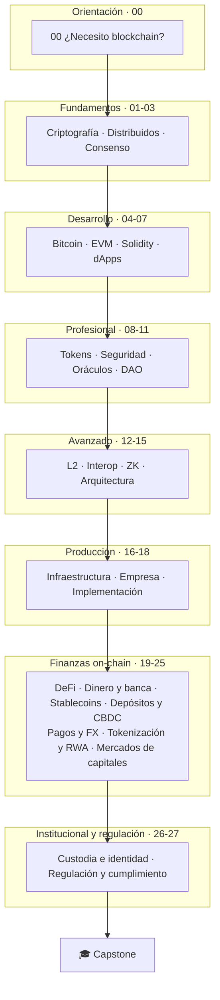

# Auditoría · Arquitectura propuesta del programa

> [⬅️ Índice de la auditoría](README.md) · [⬅️ Contenido obsoleto](OUTDATED_CONTENT.md) · [➡️ Plan de migración](MIGRATION_PLAN.md)

## Decisión de fondo: extender la numeración, no reordenarla

El encargo proponía una macroestructura de 44 partes. La estructura existente ya
cubría con calidad la mitad técnica de esa lista y **estaba referenciada desde
todas partes**. La decisión adoptada —explícitamente permitida por el encargo
("no forzar esta estructura si ya existe una mejor")— fue:

> **Conservar `00`–`18` sin tocar y añadir `19`–`27` a continuación**, agrupados
> en dos etapas nuevas: *Finanzas on-chain* e *Institucional y regulación*.

### Por qué esta forma y no otra

| Alternativa | Coste | Beneficio | Decisión |
|---|---|---|---|
| Renumerar a 44 partes | Rompe ~300 enlaces, quizzes, catálogo, verificadores de app, syllabus | Nomenclatura idéntica al encargo | **Rechazada** |
| Insertar los módulos financieros en medio (p. ej. dinero antes de Bitcoin) | Renumeración parcial, mismo problema | Orden conceptual discutible: el dinero programable se entiende mejor *después* de saber qué es un contrato | **Rechazada** |
| Repositorio paralelo | Duplica CI, plantilla, glosario y navegación | Ninguno | **Rechazada** (y prohibida por el encargo) |
| **Extender 19→27** | Actualizar cifras y la cadena del módulo 18 | Cero enlaces rotos, el sitio y el manual los recogen solos | **Adoptada** |

El orden pedagógico resultante también es el correcto: el alumno llega al dinero
programable **sabiendo ya** qué es un contrato, qué es un token, qué puede fallar
y cómo se opera en producción. Explicar una stablecoin a quien no sabe qué es un
oráculo o una llamada externa no reentrante produce comprensión aparente.

## Macroestructura resultante



## Los nueve módulos nuevos y su razón de ser

| # | Módulo | Pregunta central | Por qué está aquí y no antes |
|---:|---|---|---|
| 19 | DeFi: mercados, préstamo y riesgo | ¿Cómo funciona un mercado sin intermediario? | Necesita tokens (08), oráculos (10) y seguridad (09) |
| 20 | Dinero, banca y liquidación | ¿Qué es el dinero que ya usamos y cómo se liquida? | **Bisagra del programa**: sin él, 21–25 son vocabulario |
| 21 | Stablecoins | ¿Qué sostiene la paridad y cuándo se rompe? | Necesita 19 (mercado, arbitraje) y 20 (reservas, emisor) |
| 22 | Depósitos tokenizados y CBDC/MDBC | ¿Quién responde por cada forma de dinero digital? | Solo tiene sentido tras entender dinero bancario (20) y stablecoins (21) |
| 23 | Pagos, cross-border y FX on-chain | ¿Por qué una transferencia internacional tarda dos días? | Necesita las tres formas de dinero digital (21, 22) |
| 24 | Tokenización y RWA | ¿Qué del activo viaja al token y qué se queda fuera? | Necesita custodia conceptual y oráculos; prepara el 25 |
| 25 | Mercados de capitales on-chain | ¿Cómo se emite, negocia y liquida un valor? | Necesita 24 (el activo) y 20 (liquidación y DvP) |
| 26 | Custodia, wallets institucionales e identidad | ¿Quién tiene la llave y cómo se prueba quién eres? | Transversal: se coloca donde ya hay activos que custodiar |
| 27 | Regulación y cumplimiento | ¿Qué obliga la norma y quién la dicta? | Al final, porque regula todo lo anterior y hay que conocerlo para entenderla |

## Principios de diseño aplicados al contenido nuevo

1. **Puente, no sustitución.** Cada tema financiero se presenta primero **como
   funciona hoy**, después qué cambia al llevarlo a una cadena, y **qué no
   cambia**. La tercera pregunta es la que más se olvida y la que más enseña.
2. **Neutralidad obligatoria.** Ninguna sección afirma que la versión on-chain sea
   superior. Todas las comparativas incluyen columna de límites y de riesgos
   nuevos.
3. **Sin cifras de mercado volátiles.** No se citan capitalizaciones, TVL ni
   precios: envejecen en semanas y no enseñan nada que el mecanismo no enseñe.
   Los ejemplos numéricos son **cálculos trabajados** con cifras propias del
   ejemplo, verificables por el lector con una calculadora.
4. **Fuente primaria o nada.** Organismos (BIS, GAFI, IOSCO, FMI, Banco Central
   de Chile, CMF), textos normativos y documentación oficial de protocolo. Los
   blogs no sostienen ninguna afirmación.
5. **Práctica determinista.** Los laboratorios financieros nuevos son
   simulaciones en Node sin red ni claves, con pruebas. Un cálculo de *health
   factor* o de atomicidad DvP no necesita mainnet — y no debe tocarla.

## Estructura de directorios añadida

```text
curriculum/19-defi/ … 27-regulacion-cumplimiento/   9 módulos nuevos
labs/19-defi/                                        AMM, pérdida impermanente, health factor
labs/21-stablecoins/                                 colateral, peg y depeg
labs/23-pagos-fx/                                    corresponsalía vs. on-chain, PvP
labs/25-mercados-capitales/                          DvP, ciclo de vida de un bono
labs/26-custodia/                                    política M-de-N, ceremonias
labs/27-cumplimiento/                                Travel Rule, cribado de riesgo
regulation/                                          chile · UE · EE.UU. · LatAm · internacional · comparación
docs/casos-reales/                                   casos con estructura fija (qué falló, qué control faltó)
docs/audit/                                          este entregable
docs/skills-matrix.md                                matriz de competencias
```

---

## 🧭 Navegación

[⬅️ Contenido obsoleto](OUTDATED_CONTENT.md) · [📋 Índice](README.md) · ➡️ [Plan de migración](MIGRATION_PLAN.md)
