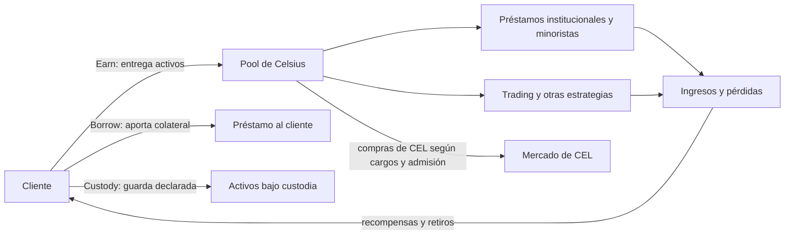

# Caso · Celsius: préstamo, custodia e información al cliente

> [⬅️ Casos reales](README.md) · [📖 Clases 39–40 · Préstamo y riesgo](../../curriculum/19-defi/README.md) · [📖 Clases 53–54 · Custodia](../../curriculum/26-custodia-identidad/README.md)

**Hechos principales:** 2018–julio de 2022. **Jurisdicción citada:** Estados
Unidos, Distrito Sur de Nueva York. **Corte de esta ficha:** 28 de septiembre de
2026.

> **Estado probatorio.** Las demandas de SEC y CFTC de julio de 2023 contenían
> alegaciones. Alexander Mashinsky se declaró culpable de fraude de materias
> primas y de valores el 3 de diciembre de 2024 y fue sentenciado a 12 años el 8
> de mayo de 2025. La CFTC resolvió su acción mediante orden consentida en junio
> de 2026. Cada estado se cita por separado.

## Contexto

Celsius ofrecía al menos tres relaciones económicas diferentes: `Earn` recibía
activos y prometía recompensas; `Borrow` concedía préstamos contra colateral; y
`Custody` describía un servicio de guarda. Llamar «depósito» a todas ellas oculta
preguntas decisivas: quién era propietario, quién podía reutilizar los activos,
qué rendimiento se prometía, qué derecho de retiro existía y qué ocurría en
insolvencia.

## El problema

La información pública debía permitir al cliente distinguir custodia de préstamo.
En `Earn`, Celsius agrupaba y desplegaba activos para generar ingresos. Según la
declaración de culpabilidad y la sentencia, Mashinsky tergiversó rentabilidad,
seguridad, estrategias y sostenibilidad de las recompensas, mientras Celsius
asumía riesgos crecientes. El caso no enseña que prestar criptoactivos sea fraude;
enseña que el contrato económico y sus riesgos deben coincidir con lo comunicado.

## Arquitectura

El saldo de la aplicación era un derecho frente a Celsius, no una dirección
separada por cliente. La disponibilidad dependía de vencimientos, colateral,
liquidez de posiciones, pérdidas y capacidad de convertir activos al solicitado.

## Economía

Una tasa alta solo es sostenible si existe una fuente de ingresos suficiente y
ajustada por pérdidas. Si los clientes pueden retirar a corto plazo y los activos
se prestan o invierten a mayor plazo o riesgo, aparece transformación de liquidez.
Las compras de CEL añadían concentración y conflicto: el precio del token podía
afectar tanto la imagen del balance como las ventas personales del directivo.

## Qué falló y en qué orden

1. Clientes transfirieron activos atraídos por seguridad y rendimientos comunicados.
2. Celsius agrupó activos de `Earn` y los desplegó en préstamos, trading y otras
   estrategias de riesgo.
3. Según el DOJ, Mashinsky falseó rentabilidad, seguridad, sostenibilidad y naturaleza
   de esas actividades; también admitió fraude relacionado con CEL.
4. Pérdidas y descalces redujeron liquidez mientras continuaban las garantías públicas.
5. Celsius congeló retiros el 12 de junio de 2022.
6. Solicitó Capítulo 11 el 13 de julio de 2022.
7. Acciones civiles y penales posteriores separaron alegaciones, admisión de
   culpabilidad, sentencia y remedios regulatorios.

## Cronología fechada

| Fecha | Hecho y calificación |
|---|---|
| 2018 | Comienza el periodo de oferta y declaraciones descrito por la SEC y la CFTC |
| 12 de junio de 2022 | Celsius congela retiros, intercambios y transferencias |
| 13 de julio de 2022 | Celsius solicita protección bajo Capítulo 11 |
| 13 de julio de 2023 | DOJ presenta cargos; SEC y CFTC interponen acciones civiles: alegaciones en esa fecha |
| 3 de diciembre de 2024 | Mashinsky se declara culpable de dos cargos de fraude |
| 8 de mayo de 2025 | Sentencia penal de 12 años y decomiso |
| 18 de junio de 2026 | Orden consentida resuelve la acción de la CFTC contra Mashinsky |

## Controles y límites

| Control | Qué detecta o reduce | Qué no detecta solo |
|---|---|---|
| Contrato y pantalla separados por producto | Confusión entre custodia, préstamo y colateral | Veracidad de datos internos no comprobados |
| Conciliación por activo y corte | Déficit y diferencias operativas | Calidad crediticia y liquidez futura |
| Escalera de vencimientos y estrés de retiros | Descalce de liquidez | Fraude o intención personal |
| Límites de contraparte y colateral | Concentración y pérdidas de crédito | Manipulación de un token propio |
| Revelación de fuente del rendimiento | Subsidios, riesgo y sostenibilidad | Que la estrategia vaya a rendir |
| Gobierno de operaciones con CEL | Conflictos y compras fuera de política | Solvencia integral del resto del negocio |

## Regulación

La SEC alegó oferta no registrada y fraude; la CFTC alegó fraude y operación no
registrada de un *commodity pool*; el DOJ obtuvo una declaración de culpabilidad y
sentencia penal. Esas vías no son intercambiables. Para un diseño nuevo deben
analizarse producto, titularidad, reutilización, registro, publicidad, conflictos,
custodia y régimen concursal en cada jurisdicción.

## Ejercicio guiado

Sin red y con datos ficticios, dibuja tres contratos de una página: `Earn`, `Borrow`
y `Custody`. Para cada uno completa:

1. quién conserva la propiedad económica y quién controla la clave;
2. si el operador puede prestar, pignorar o mezclar el activo;
3. fuente del rendimiento o coste del préstamo;
4. plazo de activo y obligación, y derecho de retiro;
5. evidencia periódica y escenario de insolvencia.

Después ejecuta `pnpm lab:conciliacion` y clasifica cada fila como evidencia de
existencia, obligación, disponibilidad o diferencia. No añadas nombres, cuentas o
supuestos registros de Celsius.

### Respuestas orientadoras

- `Earn` se parece económicamente a un préstamo del cliente al operador si este
  puede reutilizar el activo; llamarlo custodia no cambia ese riesgo.
- `Borrow` exige separar el activo prestado del colateral y explicar liquidación,
  valoración y devolución del sobrante.
- `Custody` requiere términos coherentes con guarda y no reutilización, además de
  evidencia de segregación y control.
- La conciliación detecta diferencias al corte, pero no puntúa crédito, vencimientos,
  titularidad ni veracidad de las comunicaciones.

## Lecciones

1. Préstamo, colateral y custodia son relaciones distintas aunque compartan app.
2. El rendimiento necesita una fuente y un portador de pérdidas identificables.
3. Liquidez, solvencia y rentabilidad no son sinónimos.
4. Un token propio introduce valoración, concentración y conflicto de interés.
5. La información al cliente es parte del control, no una capa de marketing.

## Referencias

Todas fueron consultadas el **28 de septiembre de 2026**.

- [DOJ, SDNY · Mashinsky se declara culpable](https://www.justice.gov/usao-sdny/pr/celsius-founder-and-former-ceo-alexander-mashinsky-pleads-guilty-multi-billion-dollar) — EE. UU.; hechos 2018–2022; declaración y publicación 03-12-2024.
- [DOJ, SDNY · sentencia de Mashinsky](https://www.justice.gov/usao-sdny/pr/founder-celsius-sentenced-12-years-fraud-and-market-manipulation) — EE. UU.; sentencia y publicación 08-05-2025.
- [SEC · *Celsius Network Limited and Alexander Mashinsky*, 1:23-cv-06005](https://www.sec.gov/enforcement-litigation/litigation-releases/lr-25779) — EE. UU.; alegaciones civiles; demanda 13-07-2023, publicación 14-07-2023.
- [CFTC · acción contra Celsius y Mashinsky](https://www.cftc.gov/PressRoom/PressReleases/8749-23) — EE. UU.; alegaciones y orden consentida contra Celsius; publicación 13-07-2023.
- [CFTC · resolución de la acción contra Mashinsky](https://www.cftc.gov/PressRoom/PressReleases/9256-26) — EE. UU.; orden consentida; publicación 18-06-2026.

---

## 🧭 Navegación

[⬅️ Casos reales](README.md) · [📖 Clases 39–40](../../curriculum/19-defi/README.md) · [📖 Clases 53–54](../../curriculum/26-custodia-identidad/README.md)
