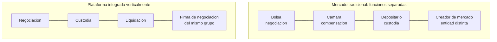

# Caso · FTX: custodia, segregación e integración vertical

> [⬅️ Casos reales](README.md) · [📖 Módulo 26 · Custodia e identidad](../../curriculum/26-custodia-identidad/README.md) · [🏠 Programa](../../README.md)

**Cuándo:** noviembre de 2022. **Qué:** una de las mayores plataformas de intercambio de
criptoactivos del mundo se declaró en concurso tras revelarse que **los fondos de clientes
no estaban donde debían estar**. Su fundador fue condenado por fraude en 2023 en Estados
Unidos.

> **Alcance.** Se analiza **el fallo de controles**, que es lo que enseña. Los hechos aquí
> descritos proceden de procedimientos concursales y penales públicos.

## Contexto

FTX operaba una plataforma de intercambio y custodiaba los activos de sus clientes. En el
mismo grupo existía **una firma de negociación propia** (Alameda Research) que operaba en los
mismos mercados. Esa proximidad, y la ausencia de separación efectiva entre ambas, está en el
centro del caso.

## El problema estructural: integración vertical sin separación

En un mercado de valores tradicional, **negociar, custodiar, liquidar y hacer de creador de
mercado son actividades separadas por norma**, precisamente para evitar conflictos de
interés. Es la preocupación que [IOSCO](../../regulation/international/README.md) ha
señalado repetidamente respecto de las plataformas de criptoactivos.

Cuando una sola entidad hace las cuatro cosas, **nadie externo observa el balance de las
otras tres**. Los controles que en el mercado tradicional son estructurales —una entidad
distinta que tendría que estar de acuerdo— pasan a depender de la buena voluntad interna.

## Qué falló y en qué orden

1. **Los activos de clientes no estaban segregados** de forma efectiva del patrimonio y de
   las operaciones del grupo.
2. **No existía un tercero independiente** que verificara la correspondencia entre lo que la
   plataforma decía tener y lo que tenía.
3. Un deterioro del valor de ciertos activos vinculados al propio grupo **redujo la capacidad
   de cubrir los saldos de clientes**.
4. Al hacerse pública la situación del balance, **se produjo una salida masiva de fondos**.
5. La plataforma **suspendió retiradas** y se declaró en concurso.

**El registro público funcionó perfectamente durante todo el proceso.** Ese es el punto que
más importa aquí: el fallo no fue de la cadena, sino de **dónde estaban los activos y quién
lo comprobaba**. Los saldos que los clientes veían eran anotaciones en una base de datos
interna, no posiciones verificables.

## Qué control habría cambiado el resultado

| Control | Por qué habría importado |
|---|---|
| **Segregación efectiva y verificable** de activos de clientes | Es la obligación central de la custodia; sin ella el resto es decorado |
| **Prueba de reservas con prueba de pasivos** | Enseñar activos sin enseñar obligaciones no prueba solvencia |
| **Custodio independiente del operador del mercado** | Rompe la integración vertical en el punto donde más duele |
| **Auditoría por firma con capacidad y alcance adecuados** | La calidad del auditor forma parte del control |
| **Separación real entre la plataforma y la firma de negociación** | Elimina el conflicto en su origen, no lo gestiona |
| **Gobierno corporativo básico**: consejo, controles internos, registros | Su ausencia fue señalada en el propio procedimiento concursal |

## Una precisión sobre "prueba de reservas"

Tras el caso se popularizaron las **pruebas de reservas** basadas en árboles de Merkle, que
permiten a un cliente verificar que su saldo está incluido en un total. Es una mejora real y
**no es suficiente**:

- Demuestra **activos**, no **pasivos**. Una plataforma puede probar que tiene fondos y deber
  mucho más.
- No demuestra que esos activos **no estén prestados o pignorados**.
- No demuestra que no se hayan tomado prestados **el día de la comprobación**.

Una prueba útil incluye **activos y pasivos**, con verificación independiente. Que la parte
criptográfica sea elegante no convierte el conjunto en una garantía.

## Regulación

El caso ha sido citado con frecuencia en el trabajo regulatorio posterior sobre **custodia y
segregación**, que es exactamente lo que exigen tanto el régimen europeo de proveedores de
servicios ([MiCA](../../regulation/european-union/README.md)) como los principios de
conducta de [IOSCO](../../regulation/international/README.md). La lección regulatoria es
sencilla de enunciar: **la obligación de segregar activos de clientes existe desde hace
décadas en el sistema financiero, y su ausencia produjo aquí el resultado que produce
siempre**.

## Lecciones

1. **"No es tu llave, no son tus monedas" no es un eslogan**: describe el riesgo de
   contraparte de un custodio con precisión.
2. **La corrección técnica no es solvencia.** El registro funcionó; los controles no existían.
3. **La segregación se comprueba, no se cree.** Pregunta por cuentas identificables, por la
   conciliación y por qué ocurriría en un concurso del custodio.
4. **Prueba de reservas sin prueba de pasivos no prueba nada relevante.**
5. **La integración vertical es un riesgo estructural**, no una eficiencia. Cuando la misma
   entidad negocia, custodia y liquida, no hay nadie fuera mirando.

## Referencias

- IOSCO — recomendaciones sobre mercados de criptoactivos y conflictos de interés: <https://www.iosco.org/>
- FSB — trabajo sobre riesgos de los mercados de criptoactivos: <https://www.fsb.org/>
- Departamento de Justicia de EE. UU. — comunicados sobre el procedimiento penal: <https://www.justice.gov/>
- SEC — acciones relacionadas: <https://www.sec.gov/>
- Módulos del programa: [26 · Custodia](../../curriculum/26-custodia-identidad/README.md) · [27 · Regulación](../../curriculum/27-regulacion-cumplimiento/README.md)

---

## 🧭 Navegación

[⬅️ Casos reales](README.md) · [📖 Módulo 26](../../curriculum/26-custodia-identidad/README.md) · [🏠 Programa](../../README.md)
