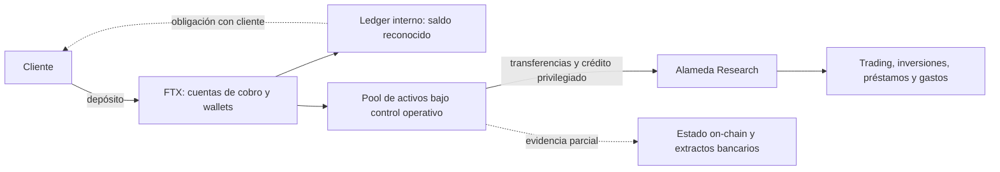

# Caso · FTX: ledger, custodia y privilegios de Alameda

> [⬅️ Casos reales](README.md) · [📖 Clases 53–54 · Custodia e identidad](../../curriculum/26-custodia-identidad/README.md) · [🏠 Programa](../../README.md)

**Hechos principales:** 2019–noviembre de 2022. **Jurisdicción citada:** Estados
Unidos, Distrito Sur de Nueva York (penal y SEC/CFTC) y Segundo Circuito
(apelación). **Corte de esta ficha:** 28 de septiembre de 2026.

> **Estado probatorio.** Un jurado declaró culpable a Samuel Bankman-Fried en
> noviembre de 2023; fue sentenciado a 25 años el 28 de marzo de 2024. El Segundo
> Circuito confirmó la condena el 12 de junio de 2026. Al corte de esta ficha hay
> una petición de *certiorari* presentada ante la Corte Suprema el 10 de septiembre
> de 2026; presentarla no revoca la condena confirmada. Las afirmaciones de la SEC y
> la CFTC que no fueron objeto de ese veredicto penal se identifican como alegaciones.

## Contexto

FTX ofrecía negociación y custodia de criptoactivos. Alameda Research, firma de
negociación fundada por Bankman-Fried, era a la vez afiliada, cliente importante y
creador de mercado. La cadena pública podía mostrar movimientos de direcciones,
pero el derecho de cada cliente y gran parte de la negociación vivían en el ledger
interno de FTX.

## El problema

El caso no se entiende diciendo solo que «faltó separación». Hay cuatro objetos
distintos que deben reconstruirse:

| Objeto | Pregunta que responde | Lo que no demuestra |
|---|---|---|
| **Ledger interno** | ¿Qué saldo reconocía FTX a cada cliente? | Que existieran activos disponibles para pagarlo |
| **Custodia y control de activos** | ¿Qué entidad podía mover cada wallet o cuenta bancaria? | Que el activo estuviera libre de gravamen o reservado para clientes |
| **Privilegios de Alameda** | ¿Qué límites, excepciones y crédito tenía la afiliada? | Que una posición registrada fuera económicamente recuperable |
| **Obligación con clientes** | ¿Qué debía FTX, bajo qué términos y a qué fecha? | Que un total contable incluyera toda la población debida |

El DOJ acreditó en el juicio que se desviaron fondos de clientes hacia Alameda. La
SEC y la CFTC alegaron además trato especial no divulgado: una línea de crédito
prácticamente ilimitada y exenciones de controles de riesgo. Estas conclusiones
concretas sustituyen afirmaciones absolutas como «no había ninguna auditoría» o
«todas las funciones estaban legalmente obligadas a ser entidades separadas», que
requieren precisar entidad, jurisdicción, periodo y alcance.

## Arquitectura

```mermaid
flowchart LR
    C[Cliente] -->|depósito| F[FTX: cuentas de cobro y wallets]
    F --> L[Ledger interno: saldo reconocido]
    F --> A[Pool de activos bajo control operativo]
    A -->|transferencias y crédito privilegiado| AL[Alameda Research]
    AL --> M[Trading, inversiones, préstamos y gastos]
    L -. obligación con cliente .-> C
    A -. evidencia parcial .-> B[Estado on-chain y extractos bancarios]
```

Una compraventa dentro de FTX podía cambiar dos saldos del ledger sin transacción
on-chain. Por eso `saldo en pantalla ≠ activo custodiado ≠ activo disponible`. El
código que permitía a Alameda retirar o mantener saldos negativos afectaba el
vínculo entre esos tres planos; no era una vulnerabilidad de consenso de una red.

## Economía

Alameda tomó exposición financiada con recursos que FTX debía poder devolver a sus
clientes. Parte del riesgo dependía de activos vinculados al propio grupo y de su
liquidez. Una valoración nominal positiva no equivale a capacidad de atender
retiros: importan plazo, profundidad de mercado, concentración, colateral,
gravámenes y la facultad jurídica y técnica de disponer del activo.

## Qué falló y en qué orden

1. FTX recibió fondos de clientes y registró obligaciones en un ledger interno.
2. Según el veredicto penal confirmado, Bankman-Fried dirigió el traspaso y uso de
   fondos de clientes por Alameda, ocultándolo a clientes, inversores y prestamistas.
3. La SEC y la CFTC alegaron que Alameda obtuvo excepciones y una línea de crédito
   prácticamente ilimitada financiada por activos de clientes.
4. El grupo acumuló posiciones ilíquidas y obligaciones pagaderas a la vista.
5. En noviembre de 2022 aumentaron las solicitudes de retiro; FTX no pudo atenderlas.
6. FTX suspendió retiradas y las entidades relevantes solicitaron protección bajo
   el Capítulo 11 el 11 de noviembre de 2022.
7. La investigación penal separó alegaciones iniciales de hechos probados en juicio;
   la condena fue dictada, apelada y confirmada.

## Cronología fechada

| Fecha | Hecho y calificación |
|---|---|
| Mayo de 2019 | Comienza la operación de FTX; el DOJ sitúa desde entonces el esquema acreditado en juicio |
| 2 de noviembre de 2022 | Se publica información sobre la concentración de activos vinculados a FTX en el balance de Alameda; es contexto de mercado, no por sí sola prueba penal |
| 8 de noviembre de 2022 | FTX detiene retiradas de clientes |
| 11 de noviembre de 2022 | FTX y afiliadas solicitan Capítulo 11 |
| 13 de diciembre de 2022 | DOJ, SEC y CFTC publican cargos o demandas; en ese momento eran alegaciones |
| 2 de noviembre de 2023 | El jurado declara culpable a Bankman-Fried en siete cargos |
| 28 de marzo de 2024 | El tribunal impone 25 años de prisión y decomiso |
| 12 de junio de 2026 | El Segundo Circuito confirma la condena |
| 10 de septiembre de 2026 | Se presenta petición de *certiorari* ante la Corte Suprema; pendiente al corte |

## Cinco afirmaciones que no deben confundirse

1. **Inclusión en un conjunto declarado de pasivos.** Una prueba Merkle puede
   demostrar que un saldo concreto está incluido en el conjunto publicado.
2. **Integridad del conjunto.** La inclusión de un cliente no prueba que estén
   incluidos todos los clientes, productos, cuentas negativas válidas, intereses o
   reclamaciones. Hace falta reconciliar la población con libros y fuentes externas.
3. **Prueba de control de activos.** Una firma o movimiento de desafío puede mostrar
   control de una dirección en un momento. No acredita titularidad económica de todo
   su saldo ni cubre bancos, custodios o activos off-chain.
4. **Disponibilidad y gravámenes.** Un activo controlado puede estar prestado,
   pignorado, bloqueado, comprometido con otra entidad o no ser liquidable al corte.
5. **Solvencia.** Exige valorar activos y pasivos completos, vencimientos, liquidez,
   contingencias y restricciones. No se deduce de una raíz Merkle ni de un cociente
   puntual de activos y pasivos declarados.

Una prueba criptográfica puede aportar evidencia fuerte dentro de su alcance; **no es
una auditoría integral** y no hereda independencia, exhaustividad o aseguramiento por
el hecho de usar hashes.

## Controles y límites

| Control | Qué detecta o reduce | Qué no resuelve solo |
|---|---|---|
| Conciliación por activo, entidad y corte | Diferencias entre ledger, terceros y cadena | Derechos legales, valoración o pasivos omitidos |
| Inclusión Merkle de pasivos | Omisión o alteración del saldo del cliente que verifica | Integridad de toda la población |
| Firma de wallets declaradas | Control técnico puntual | Titularidad, gravámenes o disponibilidad futura |
| Límites sin excepción unilateral | Crédito o retiros fuera de política | Colusión entre aprobadores o datos de entrada falsos |
| Gobierno y revisión independiente | Conflictos, excepciones y concentración de poder | Riesgo de mercado o garantía absoluta |
| Auditoría con alcance publicado | Evidencia financiera bajo criterios definidos | Hechos fuera del periodo o alcance |

## Regulación

El caso combina fraude penal, protección de inversores y clientes, derivados,
insolvencia y custodia. No existe una única etiqueta regulatoria que sustituya el
análisis por producto, entidad y jurisdicción. Para diseño, la lección es exigir
segregación verificable, límites a partes relacionadas, libros conciliables,
revelación de conflictos y capacidad real de atender retiros.

## Ejercicio guiado

Usa únicamente los datos sintéticos existentes de
[`labs/30-conciliacion`](../../labs/30-conciliacion/README.md) y
[`labs/31-proof-reserves`](../../labs/31-proof-reserves/README.md).

1. Ejecuta `pnpm lab:conciliacion` y anota, por activo, pasivos, activos en tercero,
   activos on-chain, diferencia y comparabilidad del corte.
2. Ejecuta `pnpm lab:por`; verifica la inclusión de `C-002` con la interfaz ya
   probada por `por.test.mjs`.
3. Redacta cinco conclusiones separadas usando las distinciones anteriores.
4. Introduce solo como hipótesis escrita dos escenarios: un pasivo omitido y un
   activo pignorado. No alteres fixtures ni inventes registros de FTX.
5. Para cada control, marca **detecta**, **no detecta** o **requiere otra evidencia**.

### Respuestas orientadoras

- La conciliación esperada muestra BTC cubierto por una diferencia positiva de
  `5 000 000` de unidades mínimas y USDC con `shortfall`; no autoriza compensar
  activos distintos por su valor nominal.
- La prueba de `C-002` confirma inclusión en la raíz publicada y falla si se cambia
  su saldo. No demuestra que no exista otro cliente omitido.
- El activo pignorado puede seguir visible y bajo control técnico; hace falta
  contrato, confirmación del custodio y prueba de disponibilidad.
- Aun con `assets >= liabilities` en el snapshot declarado, no se ha demostrado
  solvencia integral ni capacidad de retiro continuo.

## Lecciones

1. El saldo del cliente es una obligación del operador, no un UTXO identificable.
2. Una parte relacionada con privilegios modifica el modelo de riesgo aunque el
   motor de matching y las cadenas subyacentes funcionen correctamente.
3. Segregación, conciliación, control de activos, disponibilidad y solvencia son
   pruebas relacionadas, no sinónimos.
4. Los absolutos sobre auditoría o separación de funciones deben sustituirse por
   evidencia, jurisdicción, entidad, periodo y alcance.
5. El estado procesal cambia: acusación, veredicto, sentencia y recurso se citan por
   separado.

## Referencias

Todas fueron consultadas el **28 de septiembre de 2026**.

- [DOJ, SDNY · sentencia de Samuel Bankman-Fried](https://www.justice.gov/usao-sdny/pr/samuel-bankman-fried-sentenced-25-years-prison) — EE. UU.; hechos 2019–2022; sentencia 28-03-2024; publicación 28-03-2024, actualizada 30-04-2024.
- [Segundo Circuito · *United States v. Bankman-Fried*, 24-961-cr](https://ww3.ca2.uscourts.gov/decisions/OPN/24-961_opn.pdf) — EE. UU.; decisión que confirma la condena, 12-06-2026.
- [Corte Suprema de EE. UU. · expediente 26-349](https://www.supremecourt.gov/docket/docketfiles/html/public/26-349.html) — petición presentada 10-09-2026; pendiente al corte.
- [SEC · demanda civil, caso 1:22-cv-10501](https://www.sec.gov/files/litigation/complaints/2023/comp25616.pdf) — EE. UU.; alegaciones sobre fondos de clientes, Alameda y revelaciones; presentada 13-12-2022.
- [CFTC · cargos contra FTX, Alameda y Bankman-Fried](https://www.cftc.gov/PressRoom/PressReleases/8638-22) — EE. UU.; alegaciones sobre privilegios de Alameda; publicada 13-12-2022.

---

## 🧭 Navegación

[⬅️ Casos reales](README.md) · [📖 Clases 53–54](../../curriculum/26-custodia-identidad/README.md) · [🏠 Programa](../../README.md)
