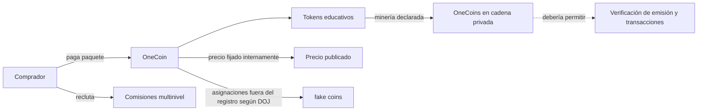

# Caso · OneCoin: afirmaciones tecnológicas y evidencia verificable

> [⬅️ Casos reales](README.md) · [📖 Clases 55–56 · Regulación y cumplimiento](../../curriculum/27-regulacion-cumplimiento/README.md) · [🏠 Programa](../../README.md)

**Hechos principales:** 2014–2019. **Jurisdicción citada:** Estados Unidos,
Distrito Sur de Nueva York. **Corte de esta ficha:** 28 de septiembre de 2026.

> **Estado probatorio.** Karl Sebastian Greenwood se declaró culpable de fraude
> electrónico y lavado y fue sentenciado a 20 años el 12 de septiembre de 2023.
> Ruja Ignatova fue acusada; permanece prófuga y las imputaciones contra ella son
> alegaciones, no una condena. El estado personal de cada partícipe no se hereda
> por asociación.

## Contexto

OneCoin vendía paquetes educativos que incluían tokens y promovía una supuesta
criptomoneda mediante una red multinivel. Se presentaba como competidora de
Bitcoin, afirmaba que había minería, una blockchain privada y un precio determinado
por oferta y demanda.

Una cadena privada, un token centralizado o un programa de referidos **no son fraude
por sus características aisladas**. Una base permisionada puede ser legítima; un
token puede representar un derecho real; y una comisión de distribución puede
remunerar ventas genuinas. La pregunta es si las afirmaciones materiales coinciden
con evidencia reproducible y si los ingresos y pagos proceden de actividad real.

## El problema

El DOJ acreditó respecto de Greenwood que el precio era fijado internamente, no por
oferta y demanda; no existían los equipos o pools de minería anunciados; y se
asignaron monedas que ni siquiera existían en la supuesta blockchain privada. La
red de referidos amplificó esas falsedades y las ventas de paquetes.

## Arquitectura declarada y evidencia observada

La falta de acceso público no prueba falsedad: una cadena permisionada puede ofrecer
pruebas a auditores y participantes autorizados. Aquí importan discrepancias más
fuertes: emisión no conciliada, minería descrita de forma falsa y precio presentado
como mercado cuando lo fijaba el operador.

## Economía

La red multinivel pagaba comisiones por reclutar compradores de paquetes. Para
evaluarla hay que separar ingresos por un producto con demanda independiente de
ingresos por incorporación de participantes. Un precio que nunca baja y que no
surge de intercambios accesibles no es evidencia de valor realizable. La liquidez se
prueba con contrapartes, reglas y retiros ejecutables, no con un número en pantalla.

## Qué falló y en qué orden

1. Se vendieron paquetes usando comparaciones con Bitcoin y promesas de crecimiento.
2. Se comunicó minería sin infraestructura de minería y un precio supuestamente
   determinado por mercado que en realidad fijaba OneCoin.
3. La estructura multinivel premió el reclutamiento y multiplicó la distribución.
4. Desde aproximadamente marzo de 2015 se asignaron, según documentos acreditados,
   OneCoins ausentes de la supuesta cadena privada.
5. Las discrepancias entre afirmación, registro e ingresos no podían ser verificadas
   de manera pública e independiente por los compradores.
6. Procedimientos penales separaron condenados, declarantes de culpabilidad y
   personas aún acusadas.

## Cronología fechada

| Fecha | Hecho y calificación |
|---|---|
| 2014 | Greenwood e Ignatova cofundan OneCoin en Bulgaria |
| Marzo de 2015 | El DOJ sitúa el inicio aproximado de asignaciones llamadas internamente «fake coins» |
| 4 de julio de 2015 | Se anuncia la apertura del mercado estadounidense |
| 12 de octubre de 2017 | Ignatova es acusada en SDNY; sigue rigiendo presunción de inocencia |
| 25 de octubre de 2017 | Ignatova viaja de Sofía a Atenas y deja de aparecer públicamente |
| Julio de 2018 | Greenwood es detenido en Tailandia; luego extraditado a EE. UU. |
| 30 de junio de 2022 | FBI incluye a Ignatova entre sus diez fugitivos más buscados |
| 16 de diciembre de 2022 | Greenwood se declara culpable |
| 12 de septiembre de 2023 | Greenwood recibe sentencia de 20 años |
| 13 de abril de 2026 | DOJ anuncia proceso de compensación con activos decomisados |

## Matriz de contraste

| Afirmación | Evidencia mínima esperable | Hallazgo documentado | Conclusión calibrada |
|---|---|---|---|
| «Hay una cadena privada» | Especificación, nodos, historial, reconciliación y acceso de revisión | El DOJ acreditó monedas asignadas fuera del supuesto registro | La afirmación concreta no conciliaba; una cadena privada no es fraude por definición |
| «Los tokens se minan» | Regla de emisión, trabajo o proceso verificable y supply conciliado | No había pools ni equipos de minería anunciados | La descripción de emisión fue falsa en el caso acreditado |
| «El mercado fija el precio» | Órdenes, contrapartes, volumen y retiros | OneCoin fijaba internamente el precio | El número publicado no probaba descubrimiento de precio |
| «El referido crea adopción» | Demanda final no dependiente de reclutas | Las comisiones premiaban nuevas ventas de paquetes | Es señal de dependencia, no prueba aislada; debe conciliarse la fuente de ingresos |
| «Una auditoría lo revisó» | Encargo, independencia, alcance, criterios y evidencia | La publicidad de revisión no sustituía acceso verificable | Nunca inferir aseguramiento integral de una etiqueta |

## Controles y límites

| Control | Qué detecta | Qué no detecta solo |
|---|---|---|
| Reconciliar emisión, asignación y saldos | Monedas fuera del registro y supply inconsistente | Valor económico o legalidad completa |
| Nodo o export independiente verificable | Integridad del historial entregado | Datos omitidos antes del perímetro |
| Mercado con órdenes y retiros ejecutables | Descubrimiento de precio y liquidez observable | Manipulación coordinada no investigada |
| Análisis de ingresos por cohorte | Dependencia de nuevas incorporaciones | Dolo de una persona concreta |
| Revisión de publicidad contra evidencia | Afirmaciones materiales falsas o no sustentadas | Todo el universo de comunicaciones |
| Verificación de identidad y entidad | Quién contrata y recibe fondos | Solvencia o autenticidad tecnológica |

## Regulación

El caso implicó fraude electrónico, valores y lavado en EE. UU., además de víctimas y
operaciones transfronterizas. La etiqueta «cripto» no reemplaza las reglas contra
engaño, pero tampoco permite declarar fraudulenta cualquier tecnología centralizada.
El análisis debe identificar la representación concreta, su materialidad, evidencia,
autor, destinatario y estado judicial.

## Ejercicio guiado

Trabaja offline con un producto ficticio llamado `AulaCoin`; no copies nombres,
cuentas ni datos de víctimas.

1. Recibes cinco afirmaciones: «cadena privada», «100 000 tokens minados», «precio
   de mercado 5», «20 % por referidos» y «auditado».
2. Diseña una evidencia verificable para cada afirmación y un resultado que la
   refutaría.
3. Clasifica cada característica aislada como **neutral**, **señal de riesgo** o
   **discrepancia demostrada**.
4. Dibuja la procedencia del dinero que paga comisiones sin asumir que todo referido
   es piramidal.
5. Redacta un hallazgo que distinga hecho, inferencia, alegación y condena.

### Respuestas orientadoras

- «Cadena privada» y «programa de referidos» son neutrales sin más hechos.
- Supply no conciliado, retiros imposibles o precio fijado mientras se anuncia como
  mercado son discrepancias verificables.
- Una comisión financiada solo por nuevos participantes es una señal estructural;
  probarla exige libros, contratos y flujos, no una captura de pantalla.
- «Auditado» carece de significado suficiente sin informe, alcance, fecha, criterios
  e independencia.
- Sobre Ignatova debe decirse «acusada y prófuga», no «condenada».

## Lecciones

1. Verifica afirmaciones, no etiquetas tecnológicas.
2. Una cadena permisionada puede ser válida si su alcance y gobierno son honestos.
3. Un token no obtiene valor por existir en un registro.
4. Referidos legítimos y captación piramidal se distinguen por producto, demanda y
   fuente de pagos.
5. El estado judicial pertenece a cada persona y fecha.

## Referencias

Todas fueron consultadas el **28 de septiembre de 2026**.

- [DOJ, SDNY · sentencia de Karl Sebastian Greenwood](https://www.justice.gov/usao-sdny/pr/co-founder-multibillion-dollar-cryptocurrency-scheme-onecoin-sentenced-20-years-prison) — EE. UU.; hechos 2014–2019; sentencia y publicación 12-09-2023.
- [DOJ, SDNY · cargos contra líderes de OneCoin](https://www.justice.gov/usao-sdny/pr/manhattan-us-attorney-announces-charges-against-leaders-onecoin-multibillion-dollar) — EE. UU.; alegaciones contra Ignatova e Ignatov; publicación 08-03-2019.
- [FBI · ficha de Ruja Ignatova](https://www.fbi.gov/wanted/topten/ruja-ignatova) — EE. UU.; acusación y condición de prófuga; consulta al corte.
- [DOJ · proceso de compensación OneCoin](https://www.justice.gov/opa/pr/justice-department-announces-compensation-process-onecoin-fraud-victims-funds-recovered) — EE. UU.; publicación 13-04-2026.

---

## 🧭 Navegación

[⬅️ Casos reales](README.md) · [📖 Clases 55–56](../../curriculum/27-regulacion-cumplimiento/README.md) · [🏠 Programa](../../README.md)
