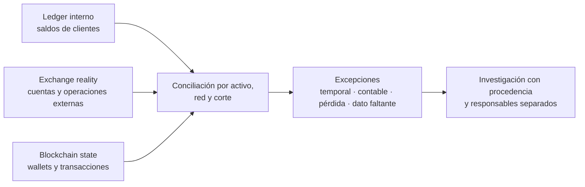

# Caso en desarrollo · Orionx: ledger, custodia y estado blockchain

> [⬅️ Casos reales](README.md) · [📖 Clases 59–66](../../curriculum/29-exchanges-operaciones-custodia/README.md) · [🏠 Programa](../../README.md)

**Corte de la ficha:** 7 de septiembre de 2026. **Qué:** Orionx comunicó el cierre de sus
operaciones después de informar un descalce entre activos registrados y activos que habría
podido verificar bajo su custodia. La empresa presentó acciones penales; la investigación
está abierta.

> ⚖️ **Alcance y presunción de inocencia.** Esta ficha separa hechos públicos, afirmaciones
> de la empresa, alegaciones de una querella e inferencias educativas. No determina
> responsabilidad penal o civil, no atribuye direcciones a personas y debe releerse contra
> fuentes actualizadas antes de citarla.

## Por qué este caso originó la pregunta educativa

Sí: este es exactamente el tipo de problema que motiva el principio transversal del
programa:

```text
Internal Ledger ≠ Exchange Reality ≠ Blockchain State
```

El saldo que ve un cliente es una obligación registrada por el exchange. Los activos pueden
estar en wallets propias, en otro custodio o exchange, comprometidos en operaciones, en
tránsito o ausentes. La cadena muestra transacciones y saldos de direcciones, pero no
demuestra por sí sola quién controla cada clave ni a quién pertenece económicamente cada
activo. La tarea profesional consiste en relacionar los tres universos con población
completa, procedencia, corte común y responsables identificados.

## Qué está públicamente confirmado

- Orionx anunció un proceso de cierre y la suspensión temporal de retiros.
- La propia empresa afirmó que una revisión forense identificó salidas de activos bajo
  custodia hacia wallets que no administraba, por más de USD 7 millones, y comunicó la
  presentación de una denuncia y una querella.
- La Comisión para el Mercado Financiero informó el 4 de septiembre de 2026 que Orionx no
  estaba inscrita ni autorizada para prestar servicios regulados por la Ley Fintec. También
  aclaró que la CMF no administra el cierre ni puede ordenar la restitución de activos.
- Medios que revisaron la querella informaron que la acción compara registros internos con
  información verificable en las cadenas de Bitcoin, Ethereum, XRP Ledger y Polygon.

## Qué sigue siendo alegación o materia de investigación

- La causa exacta de cada diferencia y si corresponde a apropiación, pérdida operacional,
  error de registro, operación autorizada u otra explicación.
- La vinculación de wallets o cuentas de terceros con personas concretas.
- La responsabilidad de los querellados, de otros participantes o de los órganos de gobierno.
- El universo definitivo de activos, obligaciones y recuperaciones.

Una clase de forensics falla si elimina estas reservas. “La querella sostiene” y “la empresa
informó” son categorías de fuente; no equivalen a una sentencia ni a una conclusión de
auditoría independiente.

## Reconstrucción del problema sin prejuzgar



El orden importa. Primero se totaliza cada población de manera independiente; después se
compara. Ajustar el ledger para hacerlo coincidir antes de explicar la diferencia destruye la
evidencia. Una conciliación defendible registra al menos:

| Campo | Por qué importa |
|---|---|
| Activo, red, contrato y unidad mínima | “ETH”, “USDT” o “POL” sin red ni decimales no identifica una posición |
| Fecha UTC, altura y hash de bloque | Dos cifras de cortes distintos pueden crear un déficit aparente |
| Cuenta o dirección y fuente de atribución | La cadena no entrega el propietario legal de una dirección |
| Txid, orden, asiento y referencia externa | Permite unir hechos sin asumir correspondencia uno a uno |
| Estado pendiente, confirmado, revertido o huérfano | Evita contabilizar como final algo que aún puede cambiar |
| Preparó, aprobó, ejecutó, registró y concilió | Expone conflictos de funciones y puntos únicos de control |

## Dos movimientos que una conciliación debe poder explicar

Un asiento interno puede mostrar salida y reingreso por el mismo importe, con efecto neto
cero. Eso no prueba que los activos nunca salieran: en la cadena pueden existir dos
transacciones separadas, con contraparte, tiempo, riesgo y comisión. A la inversa, un retiro
agrupado puede reunir a muchos clientes en una sola transacción; buscar una salida idéntica
al monto solicitado puede producir una falsa discrepancia.

Por eso el enlace profesional no es “saldo igual a saldo”. Es una relación documentada entre
evento de negocio, asiento, autorización, movimiento externo y estado final, aceptando
comisiones, batching, cambio UTXO, reorgs y diferencias de corte.

## Controles que el caso obliga a evaluar

| Capa | Pregunta de auditoría | Evidencia esperada |
|---|---|---|
| Gobierno de wallets | ¿Una sola persona puede crear destino, aprobar y firmar? | Política M-de-N/MPC, límites, allowlist, actas y logs del HSM |
| Contabilidad | ¿Se concilian obligaciones y activos por activo y a diario? | Reporte de diferencias, aging, dueño y escalamiento |
| Exchanges externos | ¿Las subcuentas y operaciones se incorporan completas? | Export firmado/hasheado, API read-only, confirmación del tercero |
| On-chain | ¿El inventario de direcciones es completo y el control fue probado? | Registro de wallets, mensajes de control, txids, bloque de corte |
| Independencia | ¿Quien opera puede ocultar o cerrar su propia excepción? | Segregación de funciones, revisión y canal de denuncia |
| Recuperación | ¿Una pérdida o indisponibilidad congela el patrimonio? | Ensayo de recuperación, rotación y continuidad documentada |

## Qué habría aportado —y qué no— una Proof of Reserves

Una raíz Merkle permitiría a clientes comprobar inclusión en una población de pasivos. Una
prueba de control de wallets aportaría evidencia sobre ciertos activos. Juntas mejoran la
observabilidad, pero todavía no prueban población completa, titularidad económica,
gravámenes, préstamos recibidos para la foto, operaciones fuera de balance ni continuidad.

La conclusión correcta sería acotada: “para este corte, población y procedimiento, los
activos identificados cubren —o no cubren— los pasivos incluidos”. Llamarlo auditoría
financiera completa excedería la evidencia.

## Actividad de clase

1. Clasifica cada frase de una noticia como **hecho confirmado**, **afirmación de parte**,
   **alegación**, **inferencia** o **desconocido**.
2. Diseña el inventario mínimo para reconciliar BTC, ETH, XRP y POL sin convertir símbolos en
   identificadores suficientes.
3. Escribe tres procedimientos: completitud de pasivos, control de wallets y conciliación de
   operaciones externas.
4. Redacta una conclusión de cinco líneas que informe el hallazgo sin declarar culpabilidad.
5. Compara ese trabajo con el [caso ficticio Aurora Custody](../../capstone/empresa-custodial/README.md),
   donde los datos son sintéticos y sí existe una respuesta reproducible.

## Lecciones provisionales

1. **El ledger es una obligación, no una reserva.** Un número de interfaz no identifica el
   activo que la respalda.
2. **La transparencia de la cadena no sustituye el inventario de wallets.** Sin atribución
   documentada, hay saldos visibles sin perímetro verificable.
3. **Efecto neto cero no significa riesgo cero.** Dos movimientos compensados pueden haber
   expuesto activos entre ambos momentos.
4. **Forensics no es acusación.** Un grafo organiza hechos; la identidad necesita evidencia
   externa legítima y una cadena de custodia defendible.
5. **Regulación, auditoría y gobernanza son capas diferentes.** Una no garantiza
   automáticamente las otras.

## Fuentes y estado

- Orionx — aviso público y estado del proceso de cierre (afirmaciones de la empresa): <https://www.orionx.com/status>
- CMF Chile — situación de autorización y alcance de la supervisión, 4 de septiembre de 2026: <https://www.cmfchile.cl/portal/prensa/625/w4-article-113273.html>
- La Tercera — descripción de la querella y de la reconciliación alegada: <https://www.latercera.com/pulso/noticia/las-operaciones-que-llevaron-al-abrupto-cierre-de-la-plataforma-de-criptomonedas-orionx/>
- BioBioChile — revisión periodística de la querella y distinción entre cifras informadas: <https://www.biobiochile.cl/noticias/economia/actualidad-economica/2026/09/04/como-se-esfumaron-dineros-de-los-clientes-de-orionx-la-querella-que-apunta-a-sus-propios-fundadores.shtml>
- Clases del programa: [59–60 · Exchanges y custodia](../../curriculum/29-exchanges-operaciones-custodia/README.md) · [61–62 · Conciliación](../../curriculum/30-contabilidad-conciliacion/README.md) · [63–64 · PoR y solvencia](../../curriculum/31-proof-reserves-solvencia/README.md) · [65–66 · Forensics y gobierno](../../curriculum/32-forensics-auditoria-gobernanza/README.md)

---

## 🧭 Navegación

[⬅️ Casos reales](README.md) · [📖 Clases 59–66](../../curriculum/29-exchanges-operaciones-custodia/README.md) · [🎓 Aurora Custody](../../capstone/empresa-custodial/README.md)
