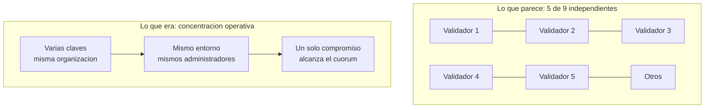

# Caso · Puente Ronin: compromiso del cuórum de validadores

> [⬅️ Casos reales](README.md) · [📖 Módulo 13 · Interoperabilidad](../../curriculum/13-interoperabilidad/README.md) · [🏠 Programa](../../README.md)

**Cuándo:** marzo de 2022. **Qué:** un atacante obtuvo control de la mayoría de las claves
validadoras de un puente entre cadenas y retiró los fondos custodiados. Es uno de los
mayores incidentes documentados del sector por importe.

## Contexto

Un **puente de bloqueo y acuñación** custodia activos en la cadena de origen y acuña sus
representaciones en la de destino. La seguridad de todo lo custodiado depende, por tanto, de
**quién puede autorizar una retirada** — es decir, de un cuórum de validadores, exactamente
el problema del [módulo 26](../../curriculum/26-custodia-identidad/README.md).

El puente operaba con un conjunto de validadores y una política de tipo M-de-N para aprobar
retiradas.

## Qué falló y en qué orden

1. **El atacante comprometió varias claves validadoras** operadas por la misma organización.
2. Obtuvo además **acceso a una clave adicional** que le permitió alcanzar el umbral de firma.
3. Con el cuórum en su poder, **firmó retiradas válidas**. Desde el punto de vista del
   contrato, eran operaciones legítimas: la política se cumplió.
4. **El incidente no se detectó durante días.** Se descubrió cuando un usuario intentó retirar
   fondos y no pudo.

## El fallo de fondo: independencia aparente

Un cuórum M-de-N solo aporta seguridad si los firmantes son **realmente independientes**.
Cuando varias claves las opera la misma organización, con la misma infraestructura y los
mismos administradores, **no hay N firmantes: hay uno con N copias**.

El segundo fallo, igual de grave y mucho menos citado, es de **detección**. Un sistema que
custodia fondos y no detecta durante días una retirada anómala no tiene monitorización: tiene
registros que nadie mira. La prevención falló una vez; la detección falló durante días.

## Qué control habría cambiado el resultado

| Control | Por qué habría importado |
|---|---|
| **Independencia real de los firmantes** | Organizaciones, entornos y administradores distintos: el compromiso deja de ser único |
| **Retardo temporal en retiradas grandes** | Da tiempo a detectar y a intervenir; es el único control de **detección** efectivo |
| **Límites por operación y por periodo** | Acota la pérdida máxima aunque el cuórum caiga |
| **Alerta automática por umbral y por anomalía** | Días de retraso son incompatibles con custodia |
| **Rotación y revisión periódica de firmantes** | Reduce la ventana de una clave comprometida |
| **Lista de destinos permitidos** | Una retirada masiva a una dirección nueva debería exigir cuórum máximo |

## Economía del ataque

El diseño de un puente tiene una asimetría que conviene ver con claridad: **el coste de
atacarlo es fijo** (comprometer M claves) mientras que **el botín crece con lo custodiado**.
A partir de cierto volumen, cualquier cuórum operado con comodidad se vuelve rentable de
atacar. Por eso los diseños serios escalan los controles con el importe en custodia —más
firmantes, más independencia, retardos, límites— en lugar de mantener la política con la que
nacieron.

## Regulación

El caso no es primariamente regulatorio, pero ilustra dos exigencias que sí lo son en
contextos supervisados: **segregación y control de acceso a claves** (ver
[custodia](../../curriculum/26-custodia-identidad/README.md)) y **notificación de incidentes**
en plazos cortos. Un retraso de días en la detección es incompatible con las obligaciones de
comunicación que rigen en infraestructuras financieras.

## Lecciones

1. **La política M-de-N mide seguridad solo si los firmantes son independientes.** Cuéntalos
   por organizaciones y entornos, no por claves.
2. **Prevención y detección son controles distintos.** Un sistema sin el segundo descubre los
   incidentes por casualidad.
3. **Los retardos temporales no son fricción: son la ventana de reacción.**
4. **Un puente es un custodio.** Debe evaluarse con los criterios de custodia, no con los de
   un protocolo de mensajería.
5. **Los controles deben escalar con el importe custodiado**, no quedarse en los del día de
   lanzamiento.

## Referencias

- Módulos del programa: [13 · Interoperabilidad](../../curriculum/13-interoperabilidad/README.md) · [26 · Custodia](../../curriculum/26-custodia-identidad/README.md) · [09 · Seguridad](../../curriculum/09-seguridad/README.md)
- Trail of Bits — *Building Secure Contracts*: <https://secure-contracts.com/>
- OpenZeppelin — prácticas de control de acceso y gobernanza: <https://docs.openzeppelin.com/>
- Chainalysis — informes públicos sobre incidentes en puentes: <https://www.chainalysis.com/>

---

## 🧭 Navegación

[⬅️ Casos reales](README.md) · [📖 Módulo 13](../../curriculum/13-interoperabilidad/README.md) · [🏠 Programa](../../README.md)
