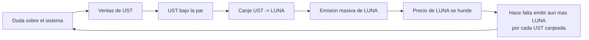

# Caso · Terra/UST: colapso de una stablecoin algorítmica

> [⬅️ Casos reales](README.md) · [📖 Módulo 21 · Stablecoins](../../curriculum/21-stablecoins/README.md) · [🏠 Programa](../../README.md)

**Cuándo:** mayo de 2022. **Qué:** una stablecoin algorítmica referida al dólar (UST) y su
token volátil asociado (LUNA) perdieron la paridad y prácticamente todo su valor en pocos
días.

> **Alcance.** Este análisis se limita al **mecanismo** y a lo que enseña sobre diseño. Las
> responsabilidades individuales y su calificación jurídica son objeto de procedimientos en
> varias jurisdicciones y **no se juzgan aquí**.

## Contexto

UST no estaba respaldada por reservas externas. Su estabilidad dependía de un mecanismo de
canje con LUNA: **1 UST siempre podía canjearse por 1 dólar en LUNA**, y viceversa. Si UST
cotizaba por debajo de la par, un arbitrajista la compraba barata, la canjeaba por LUNA y
vendía — retirando UST del mercado y **emitiendo LUNA**.

Sobre ese mecanismo se había construido demanda mediante un protocolo de depósito que
ofrecía un rendimiento muy superior al de mercado sobre saldos en UST. Esa demanda no
procedía del uso de UST como medio de pago, sino del rendimiento ofrecido.

## El problema de diseño

El mecanismo es **reflexivo**: el respaldo de UST era, en última instancia, **el valor de
mercado de LUNA**, y el valor de LUNA dependía de la confianza en el sistema del que UST
formaba parte. El respaldo y lo respaldado eran, en el fondo, la misma cosa.

Mientras la demanda crecía, el bucle funcionaba y el diseño parecía elegante. En una caída
sostenida, **cada canje empeoraba las condiciones del siguiente**. La retroalimentación era
positiva en la dirección equivocada, y ninguna intervención podía detenerla sin un respaldo
externo del que el sistema carecía por definición.

## Qué falló y en qué orden

1. **Retiradas significativas** en el principal mercado de UST reducen su profundidad.
2. **UST pierde la paridad.** El descuento inicial es pequeño.
3. **Se activa el canje masivo** a LUNA, que es el mecanismo previsto.
4. **LUNA se emite en cantidades crecientes** y su precio cae.
5. La caída de LUNA obliga a emitir **aún más** por cada UST canjeada.
6. Un intento de defensa con reservas externas adquiridas previamente resulta insuficiente
   frente al volumen de salidas.
7. En cuestión de días, **ambos activos pierden prácticamente todo su valor**.

**Ningún paso fue un error de implementación.** El sistema hizo exactamente lo que su
especificación decía. Falló el **diseño económico**, en un escenario que el mecanismo no
podía sobrevivir.

## Economía: el rendimiento como señal

El rendimiento ofrecido sobre depósitos en UST era muy superior al que generaba ningún
activo subyacente, porque **no procedía de un activo subyacente**: se financiaba con
reservas del propio ecosistema. Un rendimiento sostenido por encima del mercado, sin una
fuente identificable, **es la señal de riesgo, no el atractivo**. La pregunta que había que
hacerse —y que el [módulo 19](../../curriculum/19-defi/README.md) obliga a hacerse— es
siempre la misma: **¿de dónde sale este rendimiento y quién lo paga?**

## Qué control habría cambiado el resultado

| Control | Por qué habría importado |
|---|---|
| **Respaldo externo real y verificable** | El canje habría tenido a qué acudir sin emitir más del token reflexivo |
| **Redención directa contra un activo ajeno al sistema** | Rompe el bucle: el arbitraje deja de presionar al respaldo |
| **Límites al volumen de canje por periodo** | Amortigua, pero no resuelve: retrasa la espiral |
| **Comunicación honesta del mecanismo** | Muchos tenedores no sabían que no había respaldo externo |
| **No condicionar la demanda a un rendimiento subvencionado** | La demanda desaparece cuando desaparece el subsidio |

Los tres primeros describen, en realidad, **otro instrumento**: uno con respaldo. Esa es la
conclusión incómoda del caso — el fallo no era corregible con parámetros.

## Regulación

El episodio influyó de forma visible en el trabajo regulatorio posterior sobre stablecoins.
Los marcos que se han desarrollado desde entonces —entre ellos
[MiCA](../../regulation/european-union/README.md) y las recomendaciones del
[FSB](../../regulation/international/README.md)— insisten en tres puntos que este caso
ilumina: **reserva efectiva**, **derecho de redención a la par** e **información al público**
sobre el mecanismo de estabilización.

Los procedimientos judiciales y administrativos derivados siguen en curso en varias
jurisdicciones; su resultado **no forma parte de este análisis**.

## Lecciones

1. **Una stablecoin sin respaldo externo no tiene respaldo.** Un token del mismo sistema no
   puede respaldar a otro token del mismo sistema.
2. **Los mecanismos reflexivos funcionan hasta que dejan de funcionar, y entonces lo hacen
   de golpe.** No hay degradación suave.
3. **Un rendimiento superior al de mercado, sin fuente identificable, es la advertencia.**
4. **"Funcionó durante mucho tiempo" no es evidencia de solidez** en un sistema cuya
   estabilidad depende del crecimiento.
5. **La claridad de la comunicación es un control de riesgo.** Muchos tenedores creían que
   había reservas.

## Referencias

- BIS — investigación sobre stablecoins y su estabilidad: <https://www.bis.org/>
- FSB — recomendaciones sobre acuerdos globales de stablecoins: <https://www.fsb.org/>
- FMI — análisis de dinero digital y estabilidad financiera: <https://www.imf.org/en/Topics/fintech>
- Módulos del programa: [21 · Stablecoins](../../curriculum/21-stablecoins/README.md) · [19 · DeFi](../../curriculum/19-defi/README.md)

---

## 🧭 Navegación

[⬅️ Casos reales](README.md) · [📖 Módulo 21](../../curriculum/21-stablecoins/README.md) · [🏠 Programa](../../README.md)
