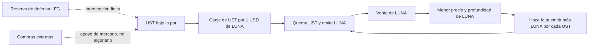

# Caso · Terra/UST: fragilidad económica, reservas e intervención

> [⬅️ Casos reales](README.md) · [📖 Clases 43–44 · Stablecoins](../../curriculum/21-stablecoins/README.md) · [🏠 Programa](../../README.md)

**Hechos principales:** mayo de 2021–mayo de 2022. **Jurisdicción citada:**
Estados Unidos, Distrito Sur de Nueva York (civil y penal). **Corte de esta
ficha:** 28 de septiembre de 2026.

> **Estado probatorio.** La pérdida de paridad de UST demuestra fragilidad del
> mecanismo, no fraude por sí sola. Por separado, un jurado declaró civilmente
> responsables a Terraform Labs y Do Kwon por fraude en abril de 2024; Kwon se
> declaró culpable de delitos federales en agosto de 2025 y fue sentenciado a 15
> años el 11 de diciembre de 2025. Esta ficha no convierte toda decisión técnica
> fallida en conducta fraudulenta: identifica las declaraciones y manipulaciones
> acreditadas en esos procedimientos.

## Contexto

TerraUSD (UST) buscaba mantener un valor de un dólar mediante conversión con LUNA:
un UST podía canjearse por un dólar de LUNA, y viceversa. Anchor Protocol ofrecía
un rendimiento cercano al 20 % anual sobre depósitos de UST, impulsando demanda.
En 2022 la Luna Foundation Guard (LFG) mantenía criptoactivos externos, incluido
bitcoin, con el propósito declarado de defender la paridad.

## El problema

El sistema combinó tres capas que no deben llamarse «reserva» como si fueran lo
mismo:

| Capa | Función | Límite |
|---|---|---|
| **Respaldo ordinario** | Activo externo que permite redimir a la par bajo un derecho exigible | UST no ofrecía una reserva ordinaria 1:1 ni una redención equivalente a un depósito |
| **Mecanismo endógeno** | Quema/emisión entre UST y LUNA para incentivar arbitraje | Su capacidad dependía del precio y liquidez de LUNA, parte del mismo ecosistema |
| **Reserva de defensa** | Activos de LFG para intervenir en mercado en situaciones de tensión | Era finita, discrecional y distinta de un derecho individual de redención |
| **Intervención externa** | Compras de un tercero para sostener el precio | Puede restaurar temporalmente el precio sin probar que el algoritmo lo hizo |

## Arquitectura

```mermaid
flowchart LR
    U[UST bajo la par] --> C[Canje de UST por 1 USD de LUNA]
    C --> Q[Quema UST y emite LUNA]
    Q --> V[Venta de LUNA]
    V --> P[Menor precio y profundidad de LUNA]
    P --> M[Hace falta emitir más LUNA por cada UST]
    M --> Q
    D[Reserva de defensa LFG] -. intervención finita .-> U
    E[Compras externas] -. apoyo de mercado, no algoritmo .-> U
```

La cadena podía ejecutar correctamente el canje y, aun así, amplificar el problema.
Eso es fragilidad económica. Una compra externa no cambia la especificación del
protocolo, pero sí cambia la explicación causal de por qué volvió la paridad.

## Economía

La demanda de UST estaba fuertemente vinculada al rendimiento subvencionado de
Anchor. Cuando salen depósitos, el canje crea oferta de LUNA; si su precio cae,
cada dólar de UST exige emitir más unidades de LUNA. El respaldo y lo respaldado
se vuelven reflexivos. Los activos externos de LFG podían comprar tiempo, pero no
convertían automáticamente cada UST en una reclamación 1:1 contra esos activos.

## Qué falló y en qué orden

1. El ecosistema creció con el incentivo de Anchor y con la promesa de estabilidad
   algorítmica.
2. En mayo de 2021 UST perdió temporalmente la paridad. Kwon admitió después que
   una firma de negociación compró grandes cantidades de UST por acuerdo con él;
   presentar la recuperación como obra exclusiva del algoritmo fue engañoso.
3. LFG se lanzó en enero de 2022 y acumuló una reserva de defensa externa.
4. En mayo de 2022 las ventas de UST superaron la profundidad disponible.
5. El canje previsto emitió cantidades crecientes de LUNA y reforzó la caída.
6. La reserva de defensa y otras intervenciones no restablecieron una paridad
   sostenible; UST y LUNA colapsaron.
7. Los procedimientos posteriores acreditaron declaraciones falsas sobre la
   estabilidad, la intervención de 2021 y otros usos de la tecnología de Terraform.

## Cronología fechada

| Fecha | Hecho y calificación |
|---|---|
| Septiembre de 2020 | Terraform anuncia UST y el canje UST/LUNA |
| Mayo de 2021 | Primera pérdida relevante de paridad; una firma externa interviene por acuerdo con Kwon, según su posterior declaración de culpabilidad |
| Enero de 2022 | Se anuncia LFG como entidad de defensa y acumulación de reservas externas |
| 7–13 de mayo de 2022 | UST pierde la paridad, se acelera la emisión de LUNA y colapsa el sistema |
| 16 de febrero de 2023 | La SEC presenta su demanda; sus cargos eran alegaciones en esa fecha |
| 5 de abril de 2024 | Jurado federal declara responsables civilmente a Terraform y Kwon por fraude |
| 12 de junio de 2024 | Se dicta el acuerdo y sentencia civil final con remedios económicos |
| 12 de agosto de 2025 | Kwon se declara culpable de conspiración y fraude electrónico |
| 11 de diciembre de 2025 | Kwon recibe sentencia penal de 15 años |

## Fraude acreditado no equivale a pérdida de paridad

| Observación | Conclusión legítima | Conclusión que no se sigue sola |
|---|---|---|
| UST cotiza bajo un dólar | El mecanismo o la liquidez no sostuvieron el precio | Que alguien cometió fraude |
| Se emite LUNA durante la redención | El protocolo aplica su regla reflexiva | Que la emisión fue oculta o ilícita |
| Un tercero compra UST | Hubo apoyo externo al precio | Que el algoritmo restauró por sí solo la paridad |
| Existe bitcoin en LFG | Hay una reserva de defensa declarada | Que cada tenedor posee un derecho 1:1 sobre ella |
| Una autoridad presenta cargos | Hay alegaciones formalizadas | Que ya existe condena |
| Declaración de culpabilidad y sentencia | Se acreditaron delitos admitidos y sancionados | Que todo fallo técnico de Terra fue delictivo |

## Controles y límites

| Control | Qué detecta o reduce | Qué no detecta por sí solo |
|---|---|---|
| Prueba de estrés de redenciones | Espiral de emisión, profundidad necesaria y puntos de ruptura | Declaraciones falsas a inversores |
| Inventario verificable de LFG | Existencia, control y movimientos de activos declarados | Derecho de redención individual o suficiencia futura |
| Atribución del retorno de paridad | Separa algoritmo, reserva y compras externas | Intención fraudulenta sin evidencia adicional |
| Revelación de subsidios de Anchor | Fuente y duración del rendimiento | Riesgo total de mercado y ejecución |
| Gobierno de la reserva | Quién decide, límites y conflictos | Que el precio vaya a sostenerse |
| Auditoría con periodo y alcance | Contrasta representaciones definidas | Garantía integral o permanente |

## Regulación

El procedimiento civil de la SEC trató ofertas de criptoactivos y fraude; el
procedimiento penal trató fraude electrónico, de valores y de materias primas. Los
marcos de stablecoins suelen exigir transparencia de reservas, gobernanza, gestión
de liquidez y redención. Aplicarlos requiere clasificar el instrumento y la
jurisdicción: llamar «stablecoin» a un token no crea por sí solo un depósito ni una
reclamación contra una reserva.

## Ejercicio guiado

Trabaja offline con una hoja de cálculo o papel. Parte de un escenario **ficticio**:
1 000 UST sintéticos, LUNA a 10 unidades monetarias, profundidad máxima de venta de
50 LUNA por ronda y reserva de defensa de 200 unidades monetarias.

1. Calcula cuánta LUNA se emite al redimir 100 UST si LUNA vale 10, luego 5 y luego 1.
2. Decide qué rondas exceden la profundidad y explica la realimentación.
3. Separa tres eventos: canje algorítmico, venta de reserva y compra externa.
4. Clasifica qué evidencia demostraría cada evento y qué conclusión seguiría abierta.
5. Repite con la reserva agotada; no uses precios o wallets reales.

### Respuestas orientadoras

- Se emiten 10, 20 y 100 LUNA respectivamente. La tercera ronda excede la
  profundidad ficticia y puede agravar el descenso del precio.
- Vender la reserva de defensa puede absorber ventas hasta 200 unidades, pero no
  concede a cada tenedor una redención ordinaria ni elimina el bucle endógeno.
- Una compra externa puede explicar una recuperación observada. Sin registros de
  mercado y acuerdos no debe atribuirse esa recuperación solo al algoritmo.
- El ejercicio detecta fragilidad y dependencia de liquidez; no prueba engaño,
  intención, control secreto ni destino de fondos.

## Lecciones

1. La pérdida de paridad es un resultado económico; fraude exige evidencia adicional.
2. Respaldo ordinario, reserva de defensa e intervención externa tienen derechos,
   incentivos y evidencias diferentes.
3. Un mecanismo puede ejecutar exactamente su código y ser económicamente frágil.
4. Si un tercero restaura el precio, la comunicación debe atribuir la causa real.
5. La cronología procesal evita presentar una acusación como condena o una pérdida
   como prueba automática de delito.

## Referencias

Todas fueron consultadas el **28 de septiembre de 2026**.

- [DOJ, SDNY · Do Kwon se declara culpable](https://www.justice.gov/usao-sdny/pr/do-kwon-pleads-guilty-fraud) — EE. UU.; hechos 2018–2022; declaración 12-08-2025; publicación 12-08-2025.
- [DOJ, SDNY · expediente de víctimas *United States v. Kwon*, 23 Cr. 151](https://www.justice.gov/usao-sdny/united-states-v-kwon-23-cr-151-pae-terraform-labs-fraud) — EE. UU.; sentencia 11-12-2025; actualización publicada 12-12-2025 y página actualizada 13-01-2026.
- [SEC · veredicto y acuerdo final contra Terraform y Kwon](https://www.sec.gov/newsroom/press-releases/2024-73) — EE. UU.; veredicto 05-04-2024; publicación 13-06-2024.
- [SEC · sentencia final, caso 1:23-cv-1346](https://www.sec.gov/files/terraform-labs-pte-ltd-do-hyeong-kwon-final-judgment.pdf) — EE. UU.; documento presentado 12-06-2024.
- [SEC · distribución a inversores perjudicados](https://www.sec.gov/enforcement-litigation/distributions-harmed-investors/sec-v-terraform-labs-pte-ltd-do-hyeong-kwon-no-23-cv-1346-jsr-sdny) — EE. UU.; estado de liquidación y documentos; actualizada 18-09-2025.

---

## 🧭 Navegación

[⬅️ Casos reales](README.md) · [📖 Clases 43–44](../../curriculum/21-stablecoins/README.md) · [🏠 Programa](../../README.md)
