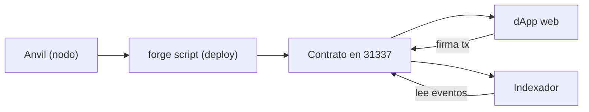

# Despliegue integral local

> [⬅️ Volver al programa](../README.md) · [📚 Currículo](../curriculum/README.md) · [🖥️ dApps](../curriculum/07-dapps/README.md)

Guía para levantar el sistema completo en local: nodo Anvil, contrato desplegado con
Foundry, interfaz web e indexador de eventos. Cada fase indica **qué hace**, el **comando**,
la **salida esperada** y su **verificación**. El desarrollo de la dApp se estudia en
[07 · dApps](../curriculum/07-dapps/README.md).

## Flujo local



## Puertos y servicios

| Servicio | Puerto por defecto | Rol |
|---|---:|---|
| Anvil (RPC) | 8545 | Nodo EVM local |
| dApp web (Vite) | 5173 | Interfaz de usuario |
| Indexador | — | Proceso de fondo, escribe estado en disco |

## Fase 1 · Dependencias

Qué hace: prepara las herramientas necesarias.

Requisitos: Node.js LTS, pnpm y Foundry. Docker es necesario **solo** para Bitcoin regtest.

Verificación: `node -v`, `pnpm -v` y `forge --version` responden sin error.

## Fase 2 · Nodo local (Terminal A)

Qué hace: arranca un nodo EVM local con chain ID 31337.

```bash
anvil --chain-id 31337
```

Salida esperada: una lista de cuentas de prueba con sus claves privadas y el RPC
escuchando en `http://127.0.0.1:8545`.

Verificación: la terminal muestra "Listening on 127.0.0.1:8545".

## Fase 3 · Contrato (Terminal B)

Qué hace: instala dependencias, configura el entorno y despliega el contrato.

```bash
cd projects/community-funding
forge install foundry-rs/forge-std --no-commit
cp ../../.env.example .env
# Usa una clave de prueba mostrada por Anvil.
set -a; source .env; set +a
forge script script/Deploy.s.sol:DeployCommunityFunding \
  --rpc-url "$RPC_URL" --broadcast
```

Salida esperada: `forge` reporta la transacción de despliegue y la dirección del contrato.

Verificación: registra la **dirección desplegada, chain ID y bloque**. No copies una
clave fuera del entorno local.

## Fase 4 · Interfaz

Qué hace: configura y sirve la dApp web apuntando al contrato recién desplegado.

```bash
cp apps/community-funding-web/.env.example apps/community-funding-web/.env
# Configura la dirección anterior.
pnpm --filter @blockchain-course/community-funding-web dev
```

Salida esperada: Vite sirve la interfaz en `http://localhost:5173`.

Verificación: conecta una wallet configurada para Anvil, crea una campaña mediante `cast`
o un script, y contribuye desde la interfaz.

## Fase 5 · Indexador

Qué hace: lee los eventos del contrato y deriva un estado consultable.

```bash
cp apps/event-indexer/.env.example apps/event-indexer/.env
set -a; source apps/event-indexer/.env; set +a
pnpm --filter @blockchain-course/event-indexer start
```

Salida esperada: el proceso reporta bloques procesados y eventos capturados.

Verificación: inspecciona `event-indexer-state.json`, produce un evento nuevo y repite.
Para producción debes agregar reorg handling, base transaccional y observabilidad.

## Fase 6 · Cierre

Qué hace: detiene los servicios y limpia secretos locales.

Detén servicios, elimina claves locales exportadas y conserva solo direcciones, txids
locales y bitácora **sin secretos**.

Verificación: no queda ninguna clave privada en `.env` ni en el historial de la terminal.

## Troubleshooting

| Síntoma | Causa probable | Solución |
|---|---|---|
| `connection refused` en 8545 | Anvil no está corriendo | Arranca la Fase 2 en otra terminal |
| `forge script` falla al firmar | `RPC_URL`/clave no cargadas | Vuelve a `set -a; source .env; set +a` |
| La dApp no muestra estado | Dirección del contrato mal configurada | Corrige el `.env` de la interfaz |
| Wallet rechaza la red | Chain ID distinto de 31337 | Reconfigura la red de la wallet a 31337 |
| El indexador no ve eventos | Empezó después de emitirlos | Reinícialo desde el bloque de despliegue |
| Puerto 5173 ocupado | Otra instancia de Vite activa | Ciérrala o deja que Vite use otro puerto |

## Recursos relacionados

- [07 · dApps](../curriculum/07-dapps/README.md)
- [Modelo de amenazas del proyecto](threat-model-project.md)
- [Operación e incidentes](operacion-incidentes.md)
