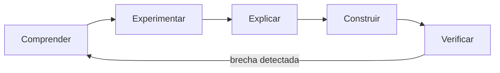

# Diseño pedagógico

> [⬅️ Volver al programa](../README.md) · [📚 Currículo](../curriculum/README.md) · [📝 Evaluación](evaluacion.md)

Este documento describe **cómo está diseñado el aprendizaje** del programa: el ciclo
de trabajo de cada módulo, la taxonomía de objetivos, la construcción de una lección,
el manejo de la carga cognitiva y la estrategia de evaluación. No es un temario; es la
ingeniería instruccional que sostiene los 19 módulos.

## Principios

- La aprobación no depende solo de compilar. El estudiante justifica decisiones,
  identifica riesgos y reproduce resultados.
- Cada concepto se estudia por su modelo mental, no por su sintaxis.
- Los casos reales anclan la teoría; las analogías se usan y luego se rompen.
- La evidencia es reproducible: comando, resultado esperado y resultado obtenido.

## Competencias finales

Al completar el programa, el estudiante puede:

1. decidir justificadamente si un problema necesita blockchain;
2. explicar criptografía, consenso, Bitcoin y EVM con modelos propios;
3. implementar, probar y conectar contratos;
4. descubrir fallos técnicos y económicos;
5. diseñar operación, gobernanza y respuesta ante incidentes;
6. comparar ecosistemas sin depender de marketing;
7. presentar un producto con costos, riesgos y límites explícitos.

## El ciclo de aprendizaje

Cada módulo recorre cinco fases. No se avanza a "construir" sin haber "experimentado",
ni se cierra sin "verificar". El ciclo es iterativo: verificar puede devolver a comprender.

| Fase | Pregunta que responde | Actividad típica |
|---|---|---|
| Comprender | ¿Qué problema resuelve y por qué? | Modelo mental, contraejemplo |
| Experimentar | ¿Qué ocurre si lo ejecuto? | Laboratorio guiado, demo reproducible |
| Explicar | ¿Puedo enseñarlo con mis palabras? | Nota técnica, diagrama propio |
| Construir | ¿Puedo aplicarlo a un caso nuevo? | Reto independiente, ADR |
| Verificar | ¿Cómo sé que funciona y dónde falla? | Pruebas, rúbrica, criterio de dominio |

## Taxonomía de objetivos

Cada nivel cognitivo se mapea a un verbo observable, un tipo de actividad y una
evidencia calificable. Un módulo maduro cubre desde recordar hasta crear.

| Nivel | Verbo observable | Tipo de actividad | Evidencia |
|---|---|---|---|
| Recordar | identificar | cuestionario diagnóstico | test corto |
| Entender | explicar | nota técnica, diagrama | documento |
| Aplicar | ejecutar | laboratorio | comandos y salida |
| Analizar | comparar | matriz de decisión | ADR o tabla |
| Evaluar | auditar | revisión, CTF | informe de hallazgos |
| Crear | diseñar | reto, proyecto final | artefacto verificable |

## Construcción de una lección

Cada módulo usa la plantilla de [`curriculum/MODULE_TEMPLATE.md`](../curriculum/MODULE_TEMPLATE.md).
Cada sección tiene un propósito instruccional explícito.

| Sección | Propósito |
|---|---|
| Diagnóstico breve | Activar conocimiento previo y detectar brechas |
| Explicación y demostración | Presentar el modelo mental con un ejemplo real |
| Práctica guiada | Reducir carga cognitiva con andamiaje |
| Reto independiente | Transferir a un contexto nuevo sin ayuda |
| Reflexión y bitácora | Consolidar y hacer visible el razonamiento |
| Prueba o rúbrica | Verificar el dominio con evidencia objetiva |
| Criterio de dominio | Definir el umbral para avanzar |

## Andamiaje y carga cognitiva

El programa gestiona la **carga cognitiva** para que el esfuerzo se invierta en aprender,
no en pelear con el entorno.

- **Andamiaje decreciente:** la práctica guiada da estructura; el reto la retira.
- **Un concepto nuevo por vez:** las herramientas se introducen cuando el concepto ya
  se entiende, no antes.
- **Entorno estable:** el mismo stack (Foundry, viem, Anvil) en todo el programa evita
  recargar memoria de trabajo con configuraciones cambiantes.
- **Fragmentación:** se construyen "trozos" reutilizables (hash, cuenta, invariante)
  que luego se combinan en sistemas.

## Evaluación formativa y sumativa

Ambas conviven; ver [Evaluación](evaluacion.md) para rúbricas y umbrales.

| Tipo | Cuándo | Función | Ejemplos |
|---|---|---|---|
| Formativa | Durante el módulo | Corregir el rumbo, dar retroalimentación | Diagnóstico, ticket de salida, revisión en pareja |
| Sumativa | Al cerrar el módulo o etapa | Certificar dominio | Reto verificable, CTF, proyecto final |

La retroalimentación formativa es frecuente y de bajo costo; la sumativa es escasa y
exige evidencia reproducible.

## Casos reales y límites de la analogía

- **Casos reales:** cada módulo ancla la teoría en incidentes o protocolos concretos
  (reentrancia del DAO, congestión de gas, fallos de oráculo). Un modelo sin caso queda
  como abstracción inerte.
- **Límites de la analogía:** toda analogía se presenta y luego **se rompe** de forma
  explícita ("hash ≠ cifrado", "dirección ≠ persona"). Nombrar dónde falla la analogía
  previene modelos mentales erróneos que cuestan caro en producción.

## Recursos relacionados

- [Planes de clase](planes-de-clase.md) — sesiones listas para instructores.
- [Evaluación](evaluacion.md) — rúbricas y criterios de dominio.
- [Glosario](glosario.md) — vocabulario común del programa.
