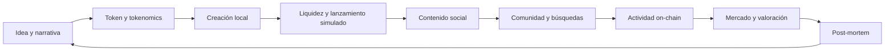

# Economía de un token viral: del contrato al post-mortem

> [⬅️ Volver al programa](../README.md) · [Tokens, clases 17–18](../curriculum/08-tokens/README.md) · [AMM, clase 39](../curriculum/19-defi/clase-39-amm-liquidez-y-formacion-de-precio.md) · [Analítica, clases 57–58](../curriculum/28-data-analytics-onchain/README.md) · [Proyecto final](../capstone/README.md)

Esta guía es un **hilo transversal** del programa, no un curso paralelo. Conecta lo que ya
se construye en Solidity y Foundry con microestructura de mercado, contenido social,
actividad on-chain, seguridad y análisis posterior.

Todo ejemplo es ficticio y toda operación se ejecuta en local. No hay recomendación de
inversión, promesa de rentabilidad ni instrucciones para manipular un mercado.

## 1. Cinco etiquetas que no significan lo mismo

Estas categorías describen la narrativa o función declarada. No sustituyen el análisis
del contrato, la distribución, los derechos jurídicos ni el comportamiento real.

| Categoría | Centro de la propuesta | Qué puede darle valor de uso | Riesgo de confusión |
|---|---|---|---|
| **Memecoin** | Meme, humor, símbolo o acontecimiento cultural | Coordinación social, pertenencia y atención | Confundir atención con derecho económico o valor sostenible |
| **Community token** | Participación en una comunidad | Acceso, voto, reputación o recompensas con reglas públicas | Que unos pocos insiders controlen suministro, canales y decisiones |
| **Social token** | Relación social entre un colectivo y su audiencia | Acceso a espacios, experiencias o coordinación compartida | Convertir seguidores en compradores cautivos |
| **Creator token** | Relación con una persona creadora concreta | Acceso a contenido, tiempo, eventos o gobernanza limitada | Depender de la reputación, actividad y promesas de una sola persona |
| **Utility token** | Función necesaria dentro de un producto o protocolo | Pago, acceso, colateral, staking o consumo verificable | Llamar “utilidad” a una fricción que podría resolverse con puntos o stablecoins |

Un mismo activo puede recibir varias etiquetas. La prueba útil no es el nombre, sino:
**qué derecho representa, quién lo puede cambiar y qué deja de funcionar si el token no
existe**. Si nada deja de funcionar, el token probablemente es narrativa o financiamiento,
no infraestructura necesaria.

## 2. El ciclo completo y dónde se estudia



| Paso | Pregunta comprobable | Parte del programa |
|---|---|---|
| Idea y narrativa | ¿Qué coordina y qué no promete? | Clases 1–2, 17–18 y 35–36 |
| Tokenomics | ¿Cuál es el suministro, la distribución, el vesting y cada autoridad? | Clases 17–18 y práctica 49 |
| Creación | ¿Qué estado cambia al desplegar, acuñar y transferir? | Clases 11–18 y práctica 32 |
| Liquidez | ¿Quién aporta cada reserva y qué puede retirarse? | Clase 39 y práctica 51 |
| Lanzamiento | ¿Qué condiciones, mensajes y controles se simulan? | Clases 19–20 y 37–38 |
| Contenido/comunidad | ¿Qué observamos fuera de cadena y con qué procedencia? | Clases 35–36 y 57–58 |
| Actividad on-chain | ¿Cuántas direcciones, eventos y transacciones hay realmente? | Clases 57–58 |
| Mercado | ¿Qué precio, volumen, slippage y profundidad existen? | Clase 39 |
| Post-mortem | ¿Qué fue hecho, indicador, inferencia o hipótesis? | Clases 58, 65–66 |

## 3. Laboratorio A: crear y observar un token sin dinero real

El repositorio usa **EVM local**, Solidity y Foundry. No añade una implementación Solana
porque no es el stack práctico del programa. La comparación sirve para no trasladar
conceptos entre redes como si fueran idénticos:

| Concepto solicitado | En SPL Token | En este laboratorio EVM |
|---|---|---|
| Mint | Cuenta `mint` + Token Program | Contrato `CourseToken` |
| Supply | Estado del mint | `totalSupply()` |
| Decimals | Campo del mint | `decimals()`; metadata opcional de ERC-20 |
| Metadata | Extensión/programa asociado | `name`, `symbol`, `decimals`; metadata externa si se necesita |
| Mint authority | Autoridad explícita del mint | `owner`, único autorizado por `mint()` |
| Freeze authority | Puede congelar cuentas del token | ERC-20 no la define; el lab usa una **pausa global** explícita y auditable |
| Cuenta receptora | Token account asociada al mint | Saldo `balanceOf(wallet)` dentro del contrato |

### Recorrido reproducible

```bash
cd labs/08-protocols
forge test -vvvv
```

La prueba `testTokenCapAndTransfer` crea el contrato, acuña a `alice`, transfiere a
`bob` y demuestra que el suministro no puede superar el cap. La prueba
`testTokenPauseDocumentsEmergencyAuthority` demuestra que:

1. una wallet no autorizada no puede pausar;
2. durante la pausa no se puede acuñar ni transferir;
3. al reanudar, las transferencias vuelven a funcionar.

La traza de Foundry cumple el papel de explorador local: muestra llamadas, emisores,
receptores, reverts y eventos. En una testnet, la misma evidencia aparece en el explorer
de esa red mediante dirección de contrato y transaction hash; no se necesita mainnet.

### Qué sucede cuando distintas wallets adquieren el activo

En una compra desde un AMM ocurren dos capas distintas:

1. La wallet firma una transacción que entrega el activo cotizado al pool.
2. El contrato del pool calcula la salida según sus reservas y comisión.
3. El token emite un evento `Transfer(pool, wallet, cantidad)`.
4. `balanceOf(wallet)` sube y `balanceOf(pool)` baja.
5. El pool conserva menos token y más activo cotizado; por eso cambia el precio marginal.
6. Un indexador lee los eventos y actualiza holders, volumen y actividad.

Una wallet nueva no equivale a una persona nueva. La misma persona puede controlar muchas
wallets, un exchange puede concentrar a miles detrás de una sola dirección y un bot puede
crear direcciones a bajo costo.

## 4. Tokenomics antes de narrativa

La ficha mínima debe declarar:

- suministro máximo y circulante;
- decimals y unidades base;
- asignación inicial por grupo;
- vesting y desbloqueos;
- autoridad de mint, pausa, upgrade, metadata y tesorería;
- condiciones para renunciar, rotar o someter cada autoridad a multisig/timelock;
- uso verificable y alternativa sin token;
- política de comunicación sin promesas de precio.

La narrativa puede explicar propósito y cultura; nunca debe ocultar poderes del contrato,
concentración, compensaciones pagadas a promotores ni conflictos de interés.

## 5. Liquidez, AMM y bonding curves

Un **pool de liquidez** contiene dos reservas. En el AMM de producto constante del curso,
`x · y = k`: comprar token reduce `x`, aumenta `y` y eleva el precio marginal `y / x`.
La operación grande recibe peor precio porque recorre una parte mayor de la curva.

Una **bonding curve** es una regla que relaciona cantidad emitida o disponible y precio.
Puede usarse para emisión primaria, mientras un AMM facilita intercambio secundario entre
dos reservas. Ambos son contratos con una curva; no son sinónimos. En los dos casos hay que
preguntar quién recibe el activo cotizado, quién puede cambiar la fórmula y qué ocurre al
vender.

### Cuatro cifras que un panel suele mezclar

Supongamos un token ficticio con:

- 1 000 000 unidades circulantes;
- 10 000 000 de suministro máximo;
- pool con 100 000 TOKEN y 5 000 unidades cotizadas;
- precio marginal `5 000 / 100 000 = 0,05`.

| Métrica | Cálculo | Resultado sintético | Qué significa |
|---|---:|---:|---|
| Precio marginal | reserva cotizada / reserva token | 0,05 | Precio de una unidad infinitesimal, no de vender todo |
| Market cap | precio × supply circulante | 50 000 | Valoración aritmética del circulante al último precio marginal |
| FDV | precio × supply máximo | 500 000 | Valoración hipotética si todo estuviera circulando al mismo precio |
| Liquidez marcada | ambos lados del pool al precio actual | 10 000 | Valor del inventario del pool, no caja libre |
| Reserva cotizada | unidades cotizadas dentro del pool | 5 000 | Límite físico previo al impacto; tampoco se extrae completo con una venta finita |

Por tanto:

```text
MARKET CAP ≠ LIQUIDEZ
MARKET CAP ≠ DINERO DISPONIBLE PARA RETIRAR
FDV ≠ CAPITAL INVERTIDO
```

Si se vende el 10 % del circulante (100 000 TOKEN) al pool del ejemplo y se ignoran
comisiones, la salida no es 5 000, como sugeriría multiplicar por el precio. Es 2 500:
la propia venta duplica la reserva de token y recorre la curva. Una venta mayor recibe
cada vez menos por unidad.

## 6. Caso sintético: atención, máximo y drawdown

El siguiente caso no pertenece a ningún token real. Sus cifras salen de
`labs/15-tokenomics/viral-token-cycle.mjs` y existen para poder repetir y refutar el
análisis.

```bash
pnpm lab:token-viral
node --test labs/15-tokenomics/viral-token-cycle.test.mjs
```

| Fase | Audiencia | Nuevas wallets | Precio | Market cap | Liquidez marcada | Volumen bruto | Drawdown |
|---|---:|---:|---:|---:|---:|---:|---:|
| Creación | 120 | 2 | 0,0500 | 50 000 | 10 000 | 0 | 0 % |
| Liquidez inicial | 180 | 6 | 0,0720 | 71 964 | 12 000 | 1 000 | 0 % |
| Contenido publicado | 4 000 | 25 | 0,1997 | 199 660 | 20 000 | 4 500 | 0 % |
| Difusión viral | 90 000 | 210 | 1,2456 | 1 245 630 | 50 000 | 23 000 | 0 % |
| Máximo | 240 000 | 430 | 6,0190 | 6 018 982 | 110 000 | 65 000 | 0 % |
| Ventas | 110 000 | 70 | 0,1237 | 123 733 | 15 793 | 63 104 | −97,9 % |
| Drawdown | 18 000 | 15 | 0,0156 | 15 582 | 5 611 | 8 091 | −99,7 % |

El máximo sintético supera 11 000 % respecto del inicio. Esa cifra no demuestra que once
mil por ciento del market cap haya entrado como dinero: en el máximo, la valoración supera
6 millones y la liquidez marcada es de unos 110 mil. Luego las ventas recorren la curva en
sentido contrario y el precio cae mucho antes de que pueda “retirarse el market cap”.

### Viralidad: una secuencia temporal no basta

En la serie, audiencia, búsquedas, wallets, volumen y precio aumentan alrededor del mismo
momento. La correlación audiencia/volumen es alta. Aun así, no sabemos si:

- el contenido causó compras;
- el movimiento de precio hizo viral el contenido;
- una campaña pagada impulsó ambos;
- bots generaron parte de las búsquedas, wallets o volumen;
- una noticia externa causó las dos series;
- los datos sociales fueron seleccionados después de conocer el precio.

Para hablar de causalidad haría falta una hipótesis previa, procedencia de datos, grupo de
comparación o contrafactual, orden temporal, variables de confusión y pruebas de robustez.
La formulación profesional es: **“el aumento coincide temporalmente con”**, no “el video
provocó”.

## 7. Riesgos: señal, límite y prevención

Una señal inicia una revisión; por sí sola no prueba intención ni identidad.

| Riesgo | Qué es | Señales observables | Prevención o respuesta |
|---|---|---|---|
| Pump-and-dump | Promoción coordinada seguida de ventas de quienes acumularon antes | Hype urgente, baja liquidez, wallets tempranas vendiendo cerca del máximo | No comprar por una sola señal social; revelar promociones y asignaciones; preservar evidencia |
| Rug pull | Retiro de liquidez o ejercicio abusivo de privilegios que deja sin salida al mercado | LP controlada por una clave, mint/upgrade oculto, liquidez desbloqueada | Timelock/multisig, privilegios visibles, bloqueo verificable si se promete, pruebas y monitoreo |
| Insiders | Actores con información, asignación o acceso previo no revelado | Concentración inicial, transferencias antes de anuncios, vesting opaco | Tabla de asignación, vesting on-chain, conflictos y wallets relacionadas declarados |
| Snipers | Bots que intentan entrar en los primeros bloques con ventaja de orden | Compras en el bloque de creación, fees anómalos, salidas rápidas | Lanzamiento por subasta/lotes o reglas uniformes; no competir elevando slippage |
| Bots | Automatización de órdenes o cuentas | Cadencia regular, sincronía, direcciones desechables | Medir actividad por cohortes y costo; no equiparar wallets con personas |
| Wallet concentration | Pocos holders controlan gran parte del suministro | Top-N y HHI altos, wallets financiadas desde un origen común | Distribución transparente, vesting, límites de tesorería y seguimiento |
| Fake volume / wash trading | Operaciones circulares que aparentan demanda sin cambio económico real | Ida y vuelta rápida, mismo beneficiario, volumen alto con pocos actores | Separar volumen bruto/económico, etiquetar heurísticas y contrastar off-chain |
| FOMO | Decisión por urgencia y miedo a quedar fuera | Cuenta regresiva, “última oportunidad”, promesas de riqueza | Pausa deliberada, checklist, límites personales y ninguna promesa de precio |
| Manipulación | Distorsión deliberada de precio, volumen o información | Pool pequeño, spot desconectado, mensajes coordinados, privilegios opacos | TWAP cuando corresponda, múltiples fuentes, circuit breakers y comunicación trazable |
| Phishing / drainer | Interfaz o firma engañosa que obtiene permisos para mover activos | Dominio falso, aprobación ilimitada, `permit` incomprensible | Verificar dominio/contrato, simular, aprobar monto exacto, revocar permisos |

Este programa **no implementa** snipers, wash trading, promoción coordinada ni extracción
de liquidez maliciosa. Los estudia como amenazas mediante escenarios deterministas.

## 8. Post-mortem reproducible

El informe final debe separar:

1. **Hechos:** reservas, eventos, hashes, balances, supply y timestamps observados.
2. **Indicadores:** concentración, sincronía, circularidad, slippage y anomalías.
3. **Inferencias:** explicaciones que dependen de supuestos declarados.
4. **Hipótesis:** causalidad o coordinación pendiente de evidencia adicional.

Incluye una línea temporal, cambios de autoridades, liquidez inicial y final, distribución,
precio máximo, drawdown, volumen bruto frente a volumen económico, decisiones tomadas y
controles que habrían reducido el daño. No atribuyas una wallet a una persona sin evidencia
externa legítima.

## 9. Fuentes primarias y técnicas

- ERC-20, interfaz, eventos y metadata opcional — <https://eips.ethereum.org/EIPS/eip-20>
- Ethereum.org, estándar ERC-20 — <https://ethereum.org/developers/docs/standards/tokens/erc-20/>
- OpenZeppelin, `ERC20Pausable` y control de acceso — <https://docs.openzeppelin.com/contracts/5.x/api/token/erc20>
- Uniswap v2, AMM de producto constante y reservas — <https://docs.uniswap.org/whitepaper.pdf>
- Solana, mint authority y freeze authority (comparación conceptual) — <https://solana.com/docs/tokens/basics>
- NIST, diseño experimental y por qué correlación no implica causalidad — <https://www.itl.nist.gov/div898/handbook/ppc/section1/ppc136.htm>
- CFTC, advertencia sobre pump-and-dump en tokens de baja liquidez — <https://www.cftc.gov/LearnAndProtect/AdvisoriesAndArticles/beware_virtual_currency_pump_dump.html>
- FTC, fraudes con criptomonedas y señales de prevención — <https://consumer.ftc.gov/articles/what-know-about-cryptocurrency-scams>

---

## Navegación

[Tokens, clases 17–18](../curriculum/08-tokens/README.md) · [Seguridad, clases 19–20](../curriculum/09-seguridad/README.md) · [AMM, clase 39](../curriculum/19-defi/clase-39-amm-liquidez-y-formacion-de-precio.md) · [Analítica, clases 57–58](../curriculum/28-data-analytics-onchain/README.md) · [Proyecto final](../capstone/README.md)
