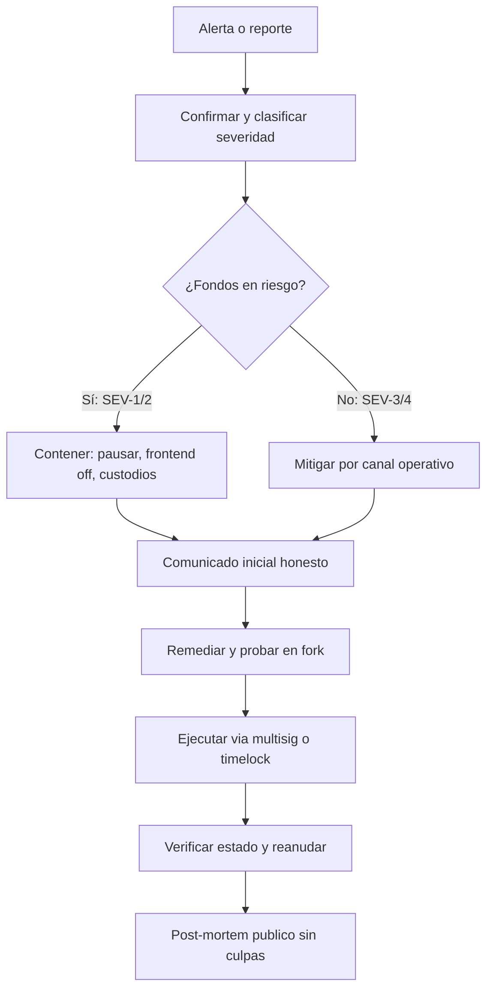

# Operación y respuesta ante incidentes

> [⬅️ Volver al programa](../README.md) · [📚 Currículo](../curriculum/README.md) · [🛡️ Mejores prácticas](mejores-practicas.md)

Runbook profesional de respuesta a incidentes para protocolos on-chain. En este dominio los incidentes se miden en minutos y los fondos son programáticamente extraíbles: la diferencia entre una pérdida parcial y una total suele ser la preparación previa.

## Clasificación de severidad

| Severidad | Definición | Ejemplos | Primera acción |
|---|---|---|---|
| SEV-1 | Exploit activo con fondos en riesgo inmediato | Drenado en curso, clave de administrador comprometida en uso | Contener ya: pausar, sin esperar consenso completo |
| SEV-2 | Vulnerabilidad crítica confirmada, aún sin explotar | Reporte de whitehat o auditor sobre contrato con fondos | War room privado; preparar mitigación antes de cualquier divulgación |
| SEV-3 | Anomalía operativa con impacto acotado | Oráculo con precio desviado u obsoleto, liquidaciones anómalas | Verificar con segunda fuente; activar protecciones (pausar mercado afectado) |
| SEV-4 | Degradación de infraestructura sin riesgo de fondos | RPC caído, indexador atrasado, frontend con errores | Canal operativo normal; comunicar si afecta usuarios |

Ante la duda entre dos niveles, clasifica en el más alto: bajar la severidad después es barato, subirla tarde es carísimo.

## Preparación previa (antes del despliegue)

La respuesta se decide antes del incidente. Checklist mínima:

- Inventario de contratos, roles, claves y dependencias.
- Multisig y timelock probados.
- Monitores para eventos, balances, pausas e invariantes, con alertas que despierten a alguien (no solo un dashboard).
- Contactos, severidades y canal de divulgación definidos; contactos de custodios, exchanges y SEAL 911 a mano.
- Copia reproducible del bytecode y parámetros.
- Simulación de actualización, pausa y recuperación.
- War room preconfigurado (canal privado con las personas correctas ya dentro).
- Ensayos trimestrales: simular un incidente completo, con reloj, incluyendo la comunicación.

## Roles del incidente

| Rol | Responsabilidad | Regla clave |
|---|---|---|
| Comandante del incidente (incident commander) | Coordina, decide, mantiene la línea de tiempo | No teclea: dirige. Una sola voz de mando |
| Responsable técnico | Diagnóstico, contención y remediación en código | Todo cambio se prueba en fork antes de mainnet |
| Comunicación | Comunicados, redes, respuesta a usuarios y prensa | Solo publica hechos confirmados por el comandante |
| Legal / cumplimiento | Obligaciones regulatorias, contacto con autoridades | Involucrado desde SEV-2 hacia arriba, no al final |

En equipos pequeños una persona cubre varios roles, pero los roles se nombran explícitamente al abrir el incidente.

## Runbook por fases

Tiempos objetivo para SEV-1; en severidades menores se relajan, no se eliminan.

### 1. Detectar (objetivo: minutos)

- La detección debe venir de alertas automáticas (eventos, balances, invariantes), no de Twitter.
- Conservar evidencia desde el primer momento: hashes de transacciones, estado, logs, capturas del mempool.
- Registrar la hora exacta de cada observación: la línea de tiempo del post-mortem se construye ahora.

### 2. Confirmar y clasificar (≤ 15 min)

- Verificar que la anomalía es real con una segunda fuente antes de escalar (otro RPC, otro oráculo, un fork local).
- Clasificar impacto: fondos, usuarios y redes afectadas; asignar severidad y abrir el war room.
- Nombrar explícitamente al comandante del incidente y a los demás roles.

### 3. Contener (≤ 30-60 min)

- Usar solo facultades previamente documentadas: pausar contratos, deshabilitar el frontend para frenar depósitos nuevos, revocar o rotar claves comprometidas.
- Contactar custodios y exchanges para congelar rutas de salida de fondos; contactar SEAL 911 si se necesita refuerzo.
- Evaluar efectos secundarios de cada acción de contención (una pausa también puede bloquear retiros legítimos o liquidaciones necesarias).

### 4. Comunicar (primer comunicado ≤ 2 h)

- Hechos confirmados, no especulación; una sola voz autorizada.
- Plantilla inicial honesta: "Estamos investigando un incidente que afecta [componente]. Hemos pausado [funciones]. No interactúes con el protocolo hasta nuevo aviso. Próxima actualización en [plazo]."
- Prometer un plazo de actualización y cumplirlo vale más que prometer soluciones. El silencio prolongado se interpreta como fuga del equipo (exit scam) y agrava el daño.

### 5. Remediar

- Corregir y probar en fork/local; revisión de al menos dos personas antes de tocar mainnet.
- Ejecutar mediante multisig/timelock según urgencia y facultades.
- Verificar estado y compensaciones antes de reanudar; la reanudación es gradual (guarded relaunch), no un interruptor.

### 6. Post-mortem (≤ 2 semanas)

- Retrospectiva pública y sin culpas (blameless): causas raíz, línea de tiempo, montos, controles nuevos con responsables y fechas.
- Publicarla aunque duela: los mejores equipos del ecosistema se reconocen por sus post-mortems, no por su ausencia de incidentes.

## Ejemplos reales de buena gestión

Citados como referencia de proceso, no como garantía de resultado:

- **Euler Finance (2023)**: tras un exploit de ~197 M USD, el equipo combinó negociación pública on-chain, presión coordinada y colaboración con investigadores; el atacante devolvió prácticamente todos los fondos en semanas. Lección: mantener canales de negociación abiertos y comunicar con disciplina puede recuperar lo que la técnica ya no puede.
- **Curve (2023, vulnerabilidad de Vyper)**: la coordinación entre equipos, whitehats y MEV searchers permitió rescatar una parte significativa de los fondos en riesgo. Lección: las relaciones con el ecosistema de seguridad se construyen antes del incidente.
- Como contraejemplo estudiado en el módulo de seguridad: los puentes explotados en 2021-2022 (Ronin, Wormhole, Nomad) muestran el costo de detectar tarde y de claves concentradas.

## Ejercicio

Simula un oráculo obsoleto y luego una clave de operador comprometida. Para cada caso define alertas, autoridad de pausa, efectos secundarios, comunicación y condición de reanudación. Ejecuta el ejercicio con reloj y registra la línea de tiempo como lo harías en un incidente real; la bitácora cuenta como evidencia de [evaluación](evaluacion.md).

## Referencias

- [SEAL 911](https://securityalliance.org/) — línea de emergencia de la Security Alliance para incidentes en curso.
- [Trail of Bits — publicaciones y guías](https://www.trailofbits.com/) y su repositorio [secure-contracts](https://secure-contracts.com/).
- [Immunefi](https://immunefi.com/) — programas de recompensas y estándares de divulgación responsable.
- [rekt.news](https://rekt.news/) — post-mortems de incidentes reales (útil para ensayos; verifica detalles técnicos en fuentes primarias).
- Más contexto de prevención en [mejores-practicas.md](mejores-practicas.md) y en el [modelo de amenazas del proyecto](threat-model-project.md).
