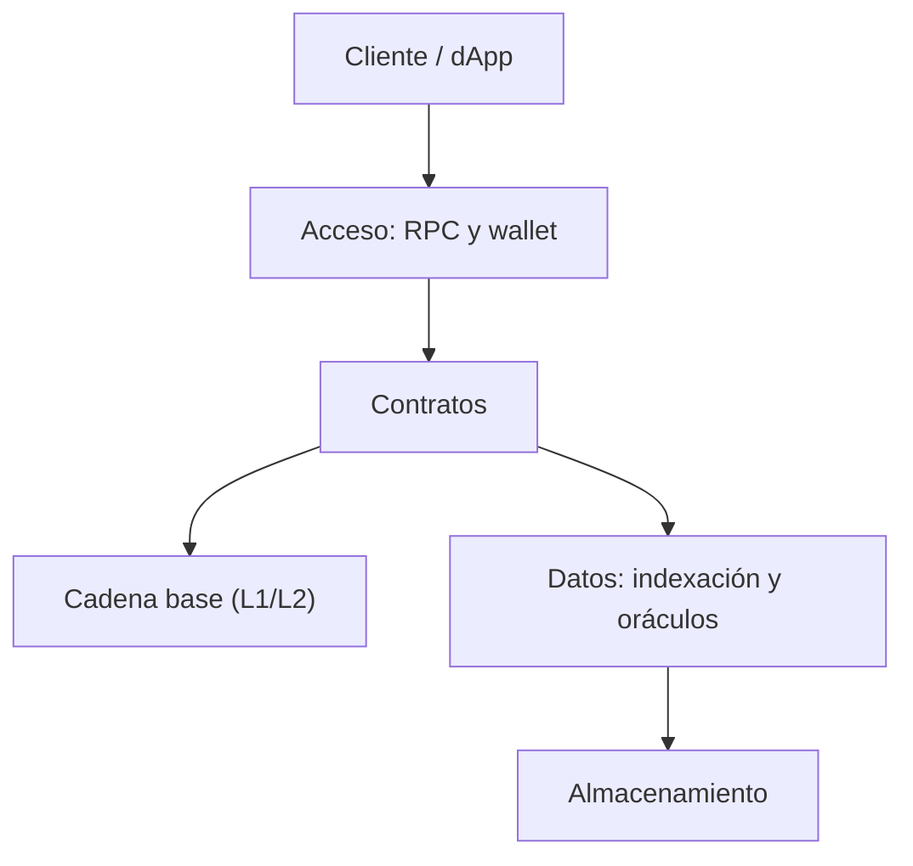

# Mapa de tecnologías

> [⬅️ Volver al programa](../README.md) · [📚 Currículo](../curriculum/README.md) · [🏭 Stack tecnológico](../industria/02-stack-tecnologico.md)

Mapa de tecnologías por capa: para cada necesidad, la tecnología principal del programa,
alternativas para comparar, cuándo elegir cada una y su madurez. El análisis profundo
capa por capa está en [Industria · Stack tecnológico](../industria/02-stack-tecnologico.md).

Las herramientas cambian; los conceptos, invariantes y modelos de amenaza son el centro
del aprendizaje. Consulta siempre documentación oficial antes de desplegar.

## Capas del stack

Cada capa se elige por separado: puedes cambiar el cliente sin tocar el contrato, o el
indexador sin tocar la cadena. El aprendizaje se organiza por estas capas.

## Tecnologías por capa

| Necesidad | Principal | Alternativas | Cuándo elegir la alternativa | Madurez |
|---|---|---|---|---|
| Contratos EVM | Solidity + Foundry | Vyper, Hardhat | Vyper por simplicidad/seguridad; Hardhat si el equipo es JS | Alta |
| Cliente web | TypeScript + viem | ethers.js, web3.js | ethers si ya hay base heredada | Alta |
| Nodo local | Anvil | Hardhat Network, Geth dev | Hardhat Network si usas Hardhat; Geth para realismo | Alta |
| Análisis estático | Slither | Mythril, Semgrep | Mythril para ejecución simbólica; Semgrep reglas propias | Media-Alta |
| Fuzzing | Foundry fuzz, Echidna | Medusa | Echidna/Medusa para invariantes complejas | Media-Alta |
| Multisig | Safe | multisig nativo de la red | Nativo si la red lo ofrece de forma robusta | Alta |
| Indexación | eventos + indexador propio | The Graph, Ponder | The Graph para escala; propio para aprender | Media-Alta |
| Almacenamiento | IPFS con pinning | Arweave, almacenamiento tradicional | Arweave para permanencia; tradicional si no hay descentralización | Media |
| Oráculos | Chainlink (concepto/adaptador) | Pyth, API3, RedStone | Pyth para baja latencia; API3 para datos de primera parte | Alta |
| L2 | Optimistic y ZK rollups | canales de estado, validiums | Canales para pagos repetidos; validium por costo de datos | Media-Alta |
| Empresa | Hyperledger Fabric | Besu, R3 Corda | Besu para EVM permisionada; Corda para acuerdos bilaterales | Alta |

## Lenguajes de contratos

| Lenguaje | Plataforma | Modelo | Cuándo elegirlo | Madurez |
|---|---|---|---|---|
| Solidity | EVM | Orientado a contratos | Estándar del ecosistema, máxima tooling y talento | Alta |
| Vyper | EVM | Pythónico, minimalista | Se prioriza legibilidad y superficie reducida | Media-Alta |
| Rust (Anchor) | Solana | Cuentas y programas | Alto rendimiento en Solana | Alta |
| Cairo | Starknet | Nativo ZK (STARK) | Se necesita validez ZK y escala | Media |
| Move | Aptos, Sui | Recursos con seguridad de tipos | El activo debe ser un recurso no duplicable | Media |

El programa enseña **Solidity** por su ecosistema, y presenta los demás como marcos
mentales para entender otros modelos de ejecución.

## Por qué el repositorio elige este stack

| Elección | Motivo |
|---|---|
| **Foundry** | Pruebas en Solidity (menos cambio de contexto), fuzz e invariantes nativos, compilación y ejecución rápidas, `anvil`/`cast` integrados |
| **viem** | Cliente TypeScript tipado, moderno y ligero; API explícita que enseña bien qué ocurre en cada llamada |
| **pnpm** | Workspaces eficientes para un monorepo, instalaciones rápidas y deterministas, ahorro de disco con enlaces |

Estas elecciones optimizan para **aprender el modelo mental con el menor ruido de entorno**:
un solo stack estable en todo el programa reduce la carga cognitiva y mantiene las
demostraciones reproducibles.

## Herramientas de desarrollo auxiliares

| Herramienta | Uso | Cuándo |
|---|---|---|
| `cast` | Consultas y transacciones desde la terminal | Depurar e interactuar con el contrato |
| `anvil` | Nodo EVM local instantáneo | Desarrollo y pruebas locales |
| `forge fmt` | Formato de código Solidity | Antes de cada commit |
| OpenZeppelin | Contratos y librerías auditadas | Estándares (ERC-20/721), control de acceso |
| Safe | Custodia multisig | Operación de fondos y roles críticos |

## Criterios de selección

Al comparar tecnologías, el programa evalúa siempre los mismos ejes en lugar de seguir
tendencias:

- **Madurez:** ¿está probada en producción y mantenida activamente?
- **Ecosistema:** ¿hay tooling, documentación y talento disponibles?
- **Superficie de ataque:** ¿cuánta complejidad y confianza añade?
- **Costo:** gas, infraestructura y esfuerzo de operación.
- **Reversibilidad:** ¿qué tan caro es cambiar de decisión después?

## Cómo evoluciona el stack

Registra cada elección tecnológica en un ADR (registro de decisión de arquitectura) con
sus alternativas y el motivo. Así el stack cambia de forma trazable y no por moda; ver la
metodología en [Industria · Stack tecnológico](../industria/02-stack-tecnologico.md).

## Recursos relacionados

- [Industria · Stack tecnológico](../industria/02-stack-tecnologico.md) — análisis por capas.
- [Recursos oficiales](recursos-oficiales.md) — documentación de referencia.
- [Mejores prácticas](mejores-practicas.md) — cómo usar bien estas herramientas.
