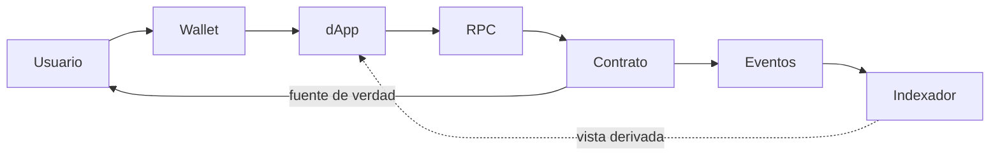

# Modelo de amenazas · Community Funding

> [⬅️ Volver al programa](../README.md) · [📚 Currículo](../curriculum/README.md) · [🔐 Seguridad](../curriculum/09-seguridad/README.md)

Modelo de amenazas del proyecto integrador **Community Funding** (financiamiento
colectivo on-chain). Estructura los activos, actores, superficie de ataque, amenazas con
impacto y mitigación, el flujo de confianza y las invariantes de seguridad. Metodología
alineada con [09 · Seguridad](../curriculum/09-seguridad/README.md); el proyecto se
describe en [Capstone](../capstone/README.md).

## Activos

| Activo | Por qué importa |
|---|---|
| Fondos aportados | Valor real bajo custodia del contrato |
| Derecho a reembolso | El contribuyente recupera si la campaña falla |
| Derecho de retiro del creador | El creador cobra solo si se cumplen las condiciones |
| Integridad de eventos | El indexador y la UI dependen de logs correctos |
| Disponibilidad del servicio | Sin acceso, los usuarios no operan |
| Confianza del usuario | Un incidente la destruye y no se recupera fácil |

## Actores

| Actor | Motivación | Confianza asumida |
|---|---|---|
| Contribuyente | Financiar una campaña y poder reembolsarse | Ninguna especial |
| Creador | Recaudar y retirar fondos | Limitada; el contrato lo restringe |
| Operador de interfaz | Servir la dApp | La UI puede mentir; no es la verdad |
| Atacante externo | Robar o bloquear fondos | Hostil |
| Insider / operador | Acceso privilegiado a claves o infraestructura | Mínimo privilegio |
| Minero / secuenciador | Ordenar transacciones | Puede reordenar y censurar |

## Superficie de ataque por componente

| Componente | Superficie | Riesgo principal |
|---|---|---|
| Contrato | Funciones públicas, control de acceso, manejo de valor | Reentrancia, doble retiro, escalada de privilegios |
| dApp | Frontend, dependencias, dominio | Phishing, código malicioso, suplantación |
| RPC | Endpoint de lectura/envío | Censura, respuestas engañosas, indisponibilidad |
| Claves | Custodia del creador/operador | Robo, pérdida, firma no autorizada |
| Oráculo / datos externos | Feeds y datos off-chain | Dato obsoleto o manipulado |
| Indexador | Derivación de estado desde logs | Pérdida o reordenamiento por reorganizaciones |

## Flujo de confianza

Solo el **contrato** determina el estado. La wallet firma, la UI presenta, el RPC
transporta y el indexador deriva: todos pueden equivocarse o mentir y deben verificarse
contra la cadena.

## Amenazas (impacto · probabilidad · mitigación)

Clasificación por categoría inspirada en STRIDE.

| Categoría | Amenaza | Impacto | Prob. | Mitigación | Riesgo residual |
|---|---|---|---|---|---|
| Elevación | Reentrancia en retiro/reembolso | Alto | Baja | CEI + reentrancy guard | Llamadas cruzadas futuras |
| Manipulación | Doble retiro | Alto | Baja | Flag y estado antes de interacción | Error en upgrade futuro |
| Manipulación | Aporte fuera de plazo | Medio | Media | Validación temporal | Manipulación acotada de timestamp |
| Suplantación | Phishing de contrato/red | Alto | Media | UI muestra chain y dirección | Usuario ignora la advertencia |
| Denegación | RPC censura o engaña | Medio | Media | Redundancia y verificación on-chain | Disponibilidad |
| Repudio | Indexador pierde/reordena logs | Medio | Media | Checkpoint, orden y replay | Reorganizaciones profundas |
| Divulgación | Pérdida o robo de claves | Alto | Baja | Wallet/multisig según riesgo | Recuperación y gobernanza |
| Fuera de alcance | Creador incumple promesa off-chain | Medio | Media | Reglas y comunicación | El contrato no valida el mundo real |

## Invariantes de seguridad

Propiedades que **nunca** deben romperse. Se codifican como pruebas de invariante en
Foundry y guían tanto el diseño como la auditoría.

- Cada aporte se reclama o reembolsa **como máximo una vez**.
- El creador **no retira** antes del plazo y de alcanzar la meta.
- Una campaña fallida **no puede** ser reclamada por el creador.
- La contabilidad por contribuyente no aumenta sin recibir valor.
- La suma de saldos por contribuyente nunca excede el balance del contrato.

## Cómo se prueba este modelo

| Amenaza | Prueba que la cubre |
|---|---|
| Reentrancia | Test con contrato atacante que reingresa en el retiro |
| Doble retiro / doble reembolso | Test de invariante sobre el estado de cada aporte |
| Aporte fuera de plazo | Test que avanza el tiempo con `vm.warp` |
| Contabilidad | Invariante de suma de saldos vs. balance |

El modelo de amenazas no es un documento estático: cada amenaza mitigada debe tener una
prueba que falle si la mitigación se rompe en un cambio futuro.

## Recursos relacionados

- [09 · Seguridad y auditoría](../curriculum/09-seguridad/README.md)
- [Capstone](../capstone/README.md) · [Mejores prácticas](mejores-practicas.md)
- [Operación e incidentes](operacion-incidentes.md)
