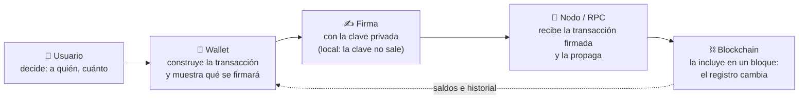

# 👛 Wallets desde cero: uso, seguridad y recuperación

> **Nivel:** Inicial · ⏱️ **Duración estimada:** 120 min · **Fuente:** BIP-32/39/44, documentación oficial de Ethereum (ethereum.org), EIP-1193/6963/712/2612 y ERC-4337
> [⬅️ Volver al programa](../README.md) · [📚 Currículo](../curriculum/README.md) · [📚 Bibliografía](bibliografia.md)
> 🧭 **Unidad transversal** — se estudia después del [módulo 04 · Bitcoin](../curriculum/04-bitcoin/README.md) y antes del [módulo 05 · Ethereum y EVM](../curriculum/05-ethereum-evm/README.md). No altera la numeración 00–27.
> 📖 [Glosario de términos](glosario.md) · 🌱 [¿Nuevo en esto? Empieza aquí](empieza-aqui.md)

---

## 🎯 Para quién es esta unidad y qué necesitas antes

Esta unidad es la **puerta de entrada práctica** al uso de una wallet (billetera o
cartera digital) para una persona sin experiencia. Enseña qué es, cómo se usa con
seguridad y qué hacer cuando algo sale mal: perder el teléfono, exponer una
credencial o firmar algo que no debías.

**Prerrequisitos:** haber leído los módulos [01 · Criptografía](../curriculum/01-criptografia/README.md)
(qué es una clave y una firma) y [04 · Bitcoin](../curriculum/04-bitcoin/README.md)
(qué es una transacción y una dirección). No hace falta conocer Ethereum: esta unidad
se puede recorrer completa antes del [módulo 05](../curriculum/05-ethereum-evm/README.md).

> ⚠️ **Regla innegociable de toda la unidad:** ningún ejercicio usa fondos reales,
> ninguna actividad te pedirá una seed phrase real ni una clave privada, y ningún
> material de este repositorio debe contener secretos. Una testnet reduce el riesgo
> económico, pero **no es un entorno libre de riesgos**: el phishing, el malware y
> los malos hábitos funcionan igual en red de prueba.

## 🎯 Objetivos

- Explicar qué administra realmente una wallet (claves, cuentas y autorizaciones) y por qué los activos no "están dentro".
- Distinguir clave privada, clave pública, dirección, cuenta, seed phrase (frase semilla) y ruta de derivación.
- Comparar tipos de wallet (custodial, autocustodia; caliente, templada, fría; software, hardware, watch-only, multisig, MPC, cuenta inteligente) y elegir según el uso.
- Ejecutar el ciclo completo: crear, respaldar, verificar la recuperación, recibir, enviar, conectar con una dApp, revisar una firma, desconectar y revocar permisos.
- Diferenciar conectar, iniciar sesión con firma, firmar un mensaje, firmar datos estructurados (EIP-712), aprobar tokens (`approve`/`permit`) y enviar una transacción.
- Detectar las estafas y errores más comunes (phishing, drainers, blind signing, approvals ilimitados, address poisoning) y aplicar prevención, detección y respuesta.
- Diseñar un respaldo y un procedimiento de recuperación, y ensayarlo como simulación de escritorio.
- Explicar las diferencias básicas entre una wallet Bitcoin y una wallet EVM.

## ✅ Resultados de aprendizaje

Al terminar puedes, con evidencia:

1. Dibujar el flujo `usuario → wallet → firma → nodo/RPC → blockchain` y explicar qué viaja en cada tramo.
2. Ejecutar `pnpm lab:wallet-segura` y justificar el veredicto de cada escenario, control por control.
3. Redactar tu propia matriz de emergencia (¿perdí el teléfono?, ¿revelé la seed?) con acciones concretas.
4. Superar la autoevaluación de la unidad con al menos un 80 %.

## 🧠 Modelo mental: la wallet es un llavero, no un monedero

Una wallet **no guarda monedas**. Los activos son anotaciones en el registro
compartido (la blockchain); lo que la wallet guarda y administra son las **claves**
que autorizan moverlos. La analogía útil no es un monedero: es un **llavero con un
dispositivo de firma**.

- La **blockchain** es el registro de la propiedad (como el conservador de bienes raíces).
- La **dirección** es tu identificador en ese registro (como el rol de la propiedad).
- La **clave privada** es la llave que autoriza cambios en tu asiento del registro.
- La **wallet** es el llavero que guarda las llaves, te muestra el registro y construye y firma las órdenes.

**Límites de la analogía:** un llavero perdido se repone en una cerrajería; una clave
privada perdida sin respaldo **no se repone**, y una llave copiada por un tercero le
da control total sin que la cerradura "se dé cuenta". Además, la wallet también
**muestra** información (saldos, historial) que obtiene preguntando a un nodo: si el
nodo miente o la interfaz está comprometida, lo que ves puede no ser lo que firmas.

## 🧩 Esquema visual: qué pasa cuando "envías"



La clave privada **nunca viaja**: lo que viaja es la transacción firmada. Y el punto
donde el usuario puede evitar casi todos los desastres es uno solo: **la pantalla de
revisión antes de firmar**. A entrenar esa revisión se dedica el laboratorio.

## 🔬 Anatomía de una wallet

| Pieza | Qué es | Lo que hay que saber |
|---|---|---|
| **Clave privada** | Número secreto que autoriza firmas | Quien la conoce controla los fondos. No se comparte jamás, con nadie, por ningún canal |
| **Clave pública** | Se deriva de la privada; verifica firmas | Compartirla no da control; de ella se deriva la dirección |
| **Dirección** | Identificador público abreviado (hash o codificación de la clave pública) | Es lo que compartes para recibir. Una persona puede tener miles |
| **Cuenta** | La unidad que la wallet muestra: dirección + saldo + historial | En EVM la cuenta tiene también un `nonce` (contador de transacciones) |
| **Seed phrase (frase semilla)** | 12–24 palabras ([BIP-39](https://github.com/bitcoin/bips/blob/master/bip-0039.mediawiki)) de las que se derivan todas las claves | Es el respaldo maestro: quien la tiene, tiene todo. No todas las wallets la usan (MPC y algunas cuentas inteligentes no) |
| **Ruta de derivación** | Camino jerárquico ([BIP-32](https://github.com/bitcoin/bips/blob/master/bip-0032.mediawiki)/[BIP-44](https://github.com/bitcoin/bips/blob/master/bip-0044.mediawiki), p. ej. `m/44'/0'/0'/0/0`) que genera cada clave desde la semilla | Explica por qué una misma semilla produce "las mismas cuentas" en otra wallet compatible |
| **Red** | La cadena concreta en la que operas (Bitcoin, una EVM, una testnet) | La misma dirección EVM existe en muchas redes; **enviar en la red equivocada es un error frecuente y a veces irreversible** |
| **Saldo nativo** | El activo propio de la red (BTC, ETH), necesario para pagar comisiones | Sin saldo nativo no puedes mover ni siquiera tus tokens |
| **Tokens** | Activos creados por contratos sobre la red | La wallet los muestra solo si conoce el contrato; que "no aparezcan" no significa que no estén |
| **Historial** | Las transacciones de la cuenta según un nodo/explorador | Es una lectura del registro, no un extracto emitido por la wallet |

## ⚖️ Custodia frente a autocustodia

- **Custodial:** un tercero (por ejemplo, un exchange) guarda las claves; tú tienes
  una cuenta de usuario y un derecho contractual contra ese tercero. Recuperar la
  contraseña es fácil; el riesgo es la insolvencia, el bloqueo o el fraude del
  custodio (caso real: [FTX y la custodia](casos-reales/ftx-custodia.md)).
- **Autocustodia:** tú guardas las claves. Nadie puede bloquearte ni "prestarse" tus
  fondos, y nadie puede rescatarte si pierdes el respaldo. La responsabilidad
  operacional completa es tuya.

Ninguna es "la buena": son perfiles de riesgo distintos. La versión institucional de
esta decisión (multisig, MPC, HSM, segregación, gobierno de claves) es el
[módulo 26](../curriculum/26-custodia-identidad/README.md).

## 🌡️ Caliente, templada y fría

| Grado | Conectividad | Uso típico | Riesgo dominante |
|---|---|---|---|
| **Caliente** | Claves en un dispositivo conectado a internet (extensión, móvil) | Gasto diario, interacción con dApps | Malware, phishing, drainers |
| **Templada** | Claves en hardware dedicado que se conecta solo para firmar | Ahorro que se mueve de vez en cuando | Manipulación física, blind signing en pantallas pequeñas |
| **Fría** | Claves generadas y guardadas sin contacto con internet | Reserva de largo plazo | Pérdida o destrucción del respaldo; ceremonia de firma incómoda |

## 🗂️ Tabla comparativa de tipos de wallet

Sin marcas: lo que importa es el **modelo de control de la clave**. Si algún material
externo usa productos concretos, son solo ejemplos; verifica su documentación oficial.

| Tipo | Quién controla la clave | Conectividad | Recuperación | Exposición | Uso habitual | Principal riesgo | Nivel recomendado |
|---|---|---|---|---|---|---|---|
| **Custodial** | El proveedor | La del proveedor | Fácil (usuario/contraseña, soporte) | Riesgo de contraparte | Entrada al ecosistema, trading | Insolvencia o bloqueo del custodio | Inicial, con montos que aceptas arriesgar |
| **Extensión de navegador** | El usuario | Caliente | Seed phrase | Alta: convive con toda la web | dApps y pruebas | Phishing, extensiones falsas, drainers | Inicial–intermedio, en testnet primero |
| **Móvil** | El usuario | Caliente | Seed phrase | Media-alta: robo o pérdida del teléfono | Uso cotidiano | Malware, SIM swapping sobre cuentas asociadas | Inicial–intermedio |
| **Escritorio** | El usuario | Caliente | Seed phrase | Media-alta | Gestión desde un equipo dedicado | Malware del equipo | Intermedio |
| **Hardware** | El usuario | Templada/fría | Seed phrase | Baja: la clave no sale del dispositivo | Ahorro | Comprar unidades manipuladas; confirmar sin leer la pantalla | Intermedio |
| **Watch-only (solo lectura)** | Nadie: no hay clave privada en el dispositivo | Cualquiera | No aplica (no firma) | Mínima | Vigilar saldos, conciliar | Creer que puede firmar; exponer qué direcciones son tuyas | Todos |
| **Multisig** | Varias partes (M-de-N firmas) | Variable | Requiere M llaves; tolera perder N−M | Baja por diseño | Tesorerías, familias, DAO | Mal diseño del cuórum; perder demasiadas llaves | Avanzado ([lab 69](../labs/26-custodia/politica-cuorum.mjs)) |
| **MPC** | Fragmentos repartidos; la clave completa nunca existe | Variable | Según el esquema del proveedor | Baja | Custodia institucional | Dependencia del protocolo/proveedor; sin seed estándar | Avanzado |
| **Cuenta inteligente (ERC-4337)** | Un contrato con reglas programables | Caliente (el contrato vive on-chain) | Programable: recuperación social, passkeys | Depende de las reglas | UX sin seed, límites de gasto | Errores en el contrato o en los guardianes | Intermedio–avanzado |

> Nota: no todas las wallets usan una seed phrase tradicional. Las MPC y varias
> cuentas inteligentes se respaldan con otros mecanismos (fragmentos, guardianes,
> passkeys). Antes de usar una, entiende **cuál es su respaldo real**.

## 🔶 Wallet Bitcoin frente a wallet EVM

| Aspecto | Bitcoin | EVM (Ethereum y compatibles) |
|---|---|---|
| Modelo de fondos | [UTXO](../curriculum/04-bitcoin/README.md): monedas discretas que se gastan enteras y generan cambio | Cuentas con saldo y `nonce` |
| Direcciones | Varios formatos (legacy, SegWit, Taproot); se recomienda **una nueva por cobro** | Una dirección `0x…` reutilizada; la misma existe en todas las redes EVM |
| Comisión | sat/vB según el tamaño en bytes de la transacción | Gas: unidades de cómputo × precio del gas |
| Qué se firma | La transacción que gasta UTXO concretos | Transacciones, mensajes y datos estructurados (EIP-712); también aprobaciones de tokens |
| Tokens y contratos | No hay contratos de propósito general en la capa base | Tokens y dApps: por eso existen `approve`, `permit` y los riesgos asociados |
| Estándares de derivación | BIP-32/39/44 (y sucesores por tipo de dirección) | Los mismos BIP con la ruta de Ethereum (`m/44'/60'/…`) |

La consecuencia práctica: en Bitcoin el error típico es de **comisiones o de formato
de dirección**; en EVM se suman los errores de **red equivocada, token falso y
aprobaciones**, porque la wallet firma cosas más expresivas.

## 🔁 Ciclo completo de utilización

El orden importa: **el respaldo se verifica antes de recibir nada**.

1. **Elegir** el tipo según la tabla anterior y el monto en juego. Para este programa: una wallet de navegador **solo para testnet**.
2. **Crear** la wallet en el dispositivo, sin nadie mirando la pantalla (tampoco en videollamada).
3. **Respaldar** la seed phrase en papel o metal, a mano. Nunca: foto, captura, correo, nube, gestor de notas, chat.
4. **Verificar la recuperación**: restaura la wallet desde el respaldo en un entorno limpio **antes** de que custodie nada. Un respaldo no verificado es una esperanza, no un respaldo.
5. **Recibir**: comparte tu dirección, verifica con una cantidad pequeña, confirma que llegó.
6. **Enviar**: aplica el [prevuelo](#-laboratorio-guiado-prevuelo-de-una-transacción) completo antes de firmar.
7. **Conectar una dApp**: conectar ≠ autorizar movimientos; revisa qué cuenta y qué red expones. El detalle técnico ([EIP-1193](https://eips.ethereum.org/EIPS/eip-1193), [EIP-6963](https://eips.ethereum.org/EIPS/eip-6963), viem) es el [módulo 07](../curriculum/07-dapps/README.md).
8. **Revisar cada firma**: qué tipo de solicitud es (sección siguiente) y qué efecto puede tener.
9. **Desconectar** la dApp al terminar la sesión.
10. **Revocar permisos** periódicamente: las aprobaciones de tokens sobreviven a la desconexión y siguen vigentes hasta que las revocas con otra transacción.
11. **Rotar o retirar** una wallet: si sospechas exposición, crea una nueva y migra los fondos; una seed comprometida no "se limpia".

## ⛽ Gas, comisiones y redes

- Toda transacción paga una **comisión** al procesador (minero/validador): en Bitcoin
  proporcional al tamaño en bytes; en EVM, `gas usado × precio del gas`.
- La comisión se paga **siempre en el activo nativo** de la red. Es el motivo por el
  que puedes "tener tokens" y aun así no poder moverlos.
- El **nonce** (EVM) ordena tus transacciones: una atascada por comisión baja bloquea
  a las siguientes; se reemplaza reenviando el mismo nonce con más comisión.
- **La red es parte de la dirección en la práctica**: la misma `0x…` en otra red EVM
  es otra cuenta a efectos de saldo. Enviar por la red equivocada puede ser
  recuperable (si controlas la clave en la otra red) o no serlo (si el destino es un
  contrato o un custodio que no opera esa red).

## ✍️ Firmas y autorizaciones: qué te puede pedir una dApp

De menor a mayor capacidad de hacer daño:

| Solicitud | Qué es | Puede mover fondos |
|---|---|---|
| **Conectar la wallet** | Exponer tu dirección a la dApp | No |
| **Iniciar sesión mediante firma** | Firmar un texto de login para probar que controlas la dirección | No, si el texto es realmente un login legible |
| **Firmar un mensaje simple** | Firma de un texto arbitrario | Indirectamente: algunos protocolos aceptan firmas como órdenes |
| **Firmar datos estructurados ([EIP-712](https://eips.ethereum.org/EIPS/eip-712))** | Firma tipada y legible por la wallet | **Sí puede**: órdenes de mercado, permisos y votos se firman así |
| **`approve` (ERC-20)** | Transacción que autoriza a un contrato a gastar hasta X de tus tokens | Sí: habilita movimientos futuros sin nueva firma |
| **`permit` ([EIP-2612](https://eips.ethereum.org/EIPS/eip-2612))** | La misma autorización pero como **firma off-chain** sin gas | Sí: una firma "gratis" puede ceder tus tokens |
| **Enviar una transacción** | Orden firmada que cambia el estado ya | Sí |

La trampa recurrente: **una "simple firma" puede tener efectos económicos**. Si la
wallet no puede mostrarte en claro qué autoriza una firma (blind signing), la
respuesta segura es no firmar.

## 💾 Respaldo y recuperación

- El respaldo maestro (seed phrase o equivalente) va **fuera de línea**, en al menos
  dos ubicaciones físicas separadas, protegido de agua y fuego.
- Nadie legítimo te pedirá jamás la seed: ni "soporte técnico", ni una dApp, ni este
  programa, ni una IA. Quien la pide, roba.
- **Verifica** la recuperación con un ensayo real (restaurar en limpio) mientras la
  wallet aún no custodia nada, y **ensaya en seco** (tabletop) los escenarios de la
  matriz de emergencia: qué harías, en qué orden, con qué a mano.
- Al heredar o compartir custodia, considera multisig antes que fotocopiar semillas.

## 🧭 Separación recomendada de wallets

| Wallet | Contenido | Regla |
|---|---|---|
| **De aprendizaje** | Solo activos de testnet | La única que conectas a dApps desconocidas. Se asume desechable |
| **De uso cotidiano** | Montos pequeños | Solo dApps que ya conoces; revisas aprobaciones cada mes |
| **De ahorro / fría** | El resto | No se conecta a ninguna dApp. Idealmente hardware o multisig |

Una firma comprometida en la wallet de aprendizaje no debe poder tocar el ahorro:
eso solo se cumple si son **claves distintas**, no cuentas de la misma semilla.

## 🛡️ Matriz de amenazas y controles

Para cada amenaza: cómo se **previene**, cómo se **detecta**, cómo se **responde**.

| Amenaza | Prevención | Detección | Respuesta |
|---|---|---|---|
| Falso soporte pide la seed | Saber que nadie legítimo la pide | Cualquier petición de seed ES el ataque | Cortar contacto; si la diste, migrar todo ya (ver [emergencias](#-matriz-de-emergencia)) |
| Sitio o extensión falsa | Guardar en favoritos el sitio oficial; instalar extensiones solo de la fuente oficial | URL con caracteres cambiados; permisos excesivos | Desinstalar; rotar la wallet si llegó a ver una firma |
| Wallet drainer (dApp que vacía) | Conectar dApps nuevas solo con la wallet de aprendizaje | Solicitudes de firma que no corresponden a lo que hacías | Rechazar; revocar aprobaciones; migrar |
| Blind signing | Preferir wallets que muestran datos legibles; no firmar lo ilegible | La wallet muestra solo un hash opaco | No firmar. Sin excepción |
| `approve` ilimitado | Aprobar el monto necesario, no el máximo | El campo de cantidad en la revisión (el lab lo entrena) | Editar el monto o rechazar; revocar los históricos |
| `permit` malicioso | Tratar toda firma EIP-712 como una transacción | Campos `spender`/`value`/`deadline` que no reconoces | Rechazar; si firmaste, revocar/agotar el permiso antes que el atacante lo use |
| Address poisoning | Verificar dirección **completa**, no el prefijo y el final; no copiar del historial | Transferencias de 0 o polvo de direcciones parecidas en tu historial | Borrar el hábito de copiar del historial; usar libreta de direcciones verificadas |
| Malware de portapapeles | Verificar tras pegar, carácter a carácter o por comparación completa | Lo pegado no coincide con lo copiado | Limpiar el equipo antes de volver a operar |
| Red equivocada | Verificar red en el prevuelo; enviar primero un monto de prueba | El activo "no llega" al destino | Ver [emergencias](#-matriz-de-emergencia): depende de quién controle la clave destino |
| Token o contrato falso | Verificar el contrato en fuente oficial del emisor, no en el buscador | Mismo nombre y símbolo, otro contrato | No interactuar; ocultarlo de la vista de la wallet |
| Pérdida o robo del dispositivo | PIN/biometría en el dispositivo Y en la app; respaldo verificado | — | Restaurar desde respaldo y migrar si el PIN pudo caer |
| Respaldo fotografiado o en la nube | Papel/metal, jamás cámara ni nube | Repasar dónde existe cada copia | Tratar la seed como expuesta: migrar |
| Pantalla expuesta en videollamada | No abrir la wallet compartiendo pantalla | Grabaciones, capturas de la reunión | Si la seed o un QR privado se vio: migrar |
| SIM swapping | No usar SMS como segundo factor de nada asociado a fondos | El teléfono pierde señal sin motivo | Contactar al operador; rotar cuentas que dependían del número |
| dApp comprometida (frontend hackeado) | Firmar leyendo, no por costumbre; montos limitados en la wallet conectada | La solicitud difiere de la acción pedida | Rechazar; avisar al proyecto por canal oficial |
| Firma con contrato/red/monto distinto | El prevuelo completo, siempre | Es exactamente lo que entrena `pnpm lab:wallet-segura` | Rechazar y empezar de nuevo desde el sitio oficial |

## 🚨 Matriz de emergencia

Qué hacer en los primeros minutos. Honestidad primero: **hay casos sin recuperación
posible**; prometer otra cosa sería engañar.

| Situación | Riesgo inmediato | Acción inicial | Recuperación | Qué NO hacer |
|---|---|---|---|---|
| Perdí el teléfono | Quien lo encuentre puede intentar abrir la wallet | Desde otro dispositivo: restaurar con el respaldo y **mover los fondos a claves nuevas** si el acceso al teléfono era débil | Total, si el respaldo estaba verificado | Esperar "a ver si aparece" con fondos en riesgo |
| Robaron el dispositivo | Igual que arriba, pero con intención | Restaurar y migrar de inmediato; revocar aprobaciones de la cuenta antigua | Total con respaldo; sin respaldo, solo lo custodial | Confiar en que el PIN aguantará indefinidamente |
| Revelé mi seed phrase | Pérdida total en cualquier momento; suele automatizarse en segundos | Crear una wallet nueva (semilla nueva) y transferir todo, empezando por lo más valioso | Solo lo que alcances a mover antes que el atacante | "Vigilar la cuenta": el atacante es un bot más rápido que tú |
| Firmé una aprobación sospechosa | El contrato aprobado puede vaciar ese token cuando quiera | Revocar la aprobación (transacción `approve` de 0 o herramienta de revocación) cuanto antes | Total si revocas antes de que la usen | Asumir que "no pasó nada" porque el saldo sigue igual |
| Envié a la red equivocada | El activo está en otra red, en la misma dirección | Identificar quién controla la clave del destino en esa red | **Posible** si el destino es tuyo o de un custodio que opere esa red; **imposible** en muchos otros casos | Pagar a "servicios de recuperación" que piden tu seed |
| Copié una dirección alterada | Fondos enviados al atacante | Verificar en el explorador; asumir la pérdida de lo enviado | En general **irreversible**: no hay botón de deshacer | Enviar "una segunda prueba" a la misma dirección |
| La wallet no muestra mis tokens | Casi siempre es visualización, no pérdida | Verificar el saldo en un explorador de la red correcta; añadir el contrato del token a mano (desde fuente oficial) | Total: los tokens están en el registro | Importar contratos que sugiera un desconocido "para que aparezcan" |
| El saldo visible no coincide | Nodo desincronizado, red equivocada o interfaz comprometida | Contrastar con un explorador independiente y revisar en qué red estás | Según la causa; el registro manda | Firmar "una transacción de verificación" que alguien te ofrezca |

## 🧪 Laboratorio guiado: prevuelo de una transacción

Como un piloto antes de despegar, no firmas nada sin recorrer la lista completa.
El laboratorio te entrega **tres solicitudes de firma simuladas** (datos
deterministas, direcciones ficticias, cero red) y las contrasta contra lo que el
usuario esperaba firmar:

```bash
pnpm lab:wallet-segura
```

La lista de controles que ejecuta —y que debes poder aplicar a mano— es:

1. **Red** — ¿es la red en la que crees estar?
2. **Origen** — ¿firma la cuenta que corresponde (la de aprendizaje, no la de ahorro)?
3. **Destino** — ¿coincide la dirección **completa** con la verificada?
4. **Contrato** — ¿es el contrato oficial del protocolo/token?
5. **Función y argumentos** — ¿`transfer`? ¿`approve`? ¿a quién y cuánto?
6. **Token, monto y decimales** — ¿el monto humano coincide, con los decimales correctos?
7. **Gas / comisión** — ¿la comisión máxima está dentro de tu tope?
8. **Aprobación** — si la hay, ¿es acotada al monto necesario o ilimitada?
9. **Efecto esperado** — ¿puedes describir en una frase qué pasará si firmas?

- **Escenario 1** es una transferencia legítima: todos los controles en verde → `FIRMAR`.
- **Escenario 2** es un `approve` **ilimitado** hacia un contrato desconocido → `NO FIRMAR`.
- **Escenario 3** es una dirección **envenenada** (mismo principio y final, otro cuerpo) → `NO FIRMAR`.

**Criterio de aceptación:** las pruebas automatizadas pasan
(`node --test labs/00-wallets/prevuelo-transaccion.test.mjs`) y puedes explicar,
para los escenarios 2 y 3, **qué control falló y qué ataque representa**.
La resolución explicada está en el [cuaderno de laboratorios](../labs/guides/02-consensus-bitcoin.md#71--prevuelo-de-una-transacción).

### Ejercicio de recuperación (simulación de escritorio)

Sin wallet real y sin secretos: es un **tabletop exercise**. Toma la matriz de
emergencia y, para dos escenarios que elijas, escribe tu procedimiento personal:
qué harías en los primeros 10 minutos, qué necesitas tener preparado desde antes
(respaldo verificado, lista de aprobaciones, dirección de la wallet nueva) y qué
es irrecuperable en tu plan actual. Si necesitas material de ejemplo, usa
exclusivamente los **vectores de prueba oficiales de BIP-39**
([trezor/python-mnemonic](https://github.com/trezor/python-mnemonic/blob/master/vectors.json)),
que son públicos y no custodian nada — jamás una semilla tuya.

## 🏁 Reto verificable

Extiende `labs/00-wallets/prevuelo-transaccion.mjs` con un **cuarto escenario**: una
firma `permit` (EIP-2612) donde el `spender` no es el contrato que el usuario cree y
el plazo (`deadline`) es de años. Añade el control que lo detecte y su prueba en
`prevuelo-transaccion.test.mjs`.

**Criterio de aceptación:** `pnpm test` sigue en verde con tu prueba nueva incluida,
y el escenario 4 termina en `NO FIRMAR` con un detalle que explique el riesgo.

## ⚠️ Errores frecuentes

| Síntoma | Causa real |
|---|---|
| "Mandé el token y no llega" | Red equivocada, o el destinatario no tiene añadido el contrato del token |
| "Me hackearon sin firmar nada" | Sí firmaste: un `permit` o un EIP-712 semanas atrás |
| "Aparecen tokens que no compré" | Tokens basura de marketing o cebo de estafa: no los toques |
| "Restauré la semilla y no están mis cuentas" | Ruta de derivación o tipo de dirección distintos, no pérdida de fondos |
| "La wallet dice saldo 0 tras reinstalar" | Está en otra red o aún sincronizando; el registro no cambió |
| "Aprobé una vez, ¿por qué pueden seguir gastando?" | Un `approve` queda vigente hasta que lo revocas |
| "Tengo el respaldo en fotos por seguridad" | Eso no es un respaldo: es una exposición esperando su momento |
| "Es testnet, da igual" | Los hábitos que entrenas en testnet son los que ejecutarás con fondos reales |

## 🛡️ Seguridad y ética

- Nunca pidas, aceptes ni custodies la seed o clave de otra persona "para ayudar".
- No atribuyas identidad real a una dirección: una dirección no es una persona.
- Los ejercicios ofensivos de este programa (phishing, drainers) se estudian para
  **defender**, en material propio y simulado; probarlos contra terceros es delito.
- Esta unidad no es asesoría financiera y no recomienda productos ni proveedores.

## 🧠 Autoevaluación

Aprobación: **80 %** (12 de 15). Cada respuesta está plegada con su explicación:
puntúa 1 por acierto, 0 por fallo; multiplica tu total por 100/15 para la nota 0–100.
Las preguntas 12–15 son escenarios: valen igual, pero si fallas una, vuelve a la
matriz de amenazas antes de seguir.

1. ¿Qué guarda realmente una wallet?
   <details><summary>Respuesta</summary>Claves (y los metadatos para usarlas: cuentas, direcciones, historial). Los activos viven en el registro de la blockchain; la wallet administra la capacidad de autorizarlos. Si respondiste "las monedas", relee el modelo mental.</details>
2. ¿Cuál es la diferencia entre dirección y clave pública?
   <details><summary>Respuesta</summary>La dirección se deriva de la clave pública (por hash o codificación) y es el identificador que compartes; la clave pública verifica firmas. Ninguna de las dos permite gastar.</details>
3. ¿Qué diferencia a una wallet custodial de una de autocustodia?
   <details><summary>Respuesta</summary>Quién controla la clave. En la custodial tienes un derecho contra un tercero (y su riesgo de contraparte); en autocustodia tienes la clave y toda la responsabilidad del respaldo.</details>
4. ¿Toda wallet tiene una seed phrase?
   <details><summary>Respuesta</summary>No. MPC reparte fragmentos sin que la clave completa exista; varias cuentas inteligentes usan passkeys o guardianes. Antes de usar una wallet, identifica cuál es su mecanismo real de respaldo.</details>
5. ¿Por qué la comisión se paga en el activo nativo aunque muevas un token?
   <details><summary>Respuesta</summary>Porque la comisión remunera a quien procesa el bloque en la unidad de la red (gas en EVM, sat/vB en Bitcoin). Tener tokens sin saldo nativo te deja sin poder moverlos.</details>
6. Conectar la wallet a una dApp, ¿autoriza mover fondos?
   <details><summary>Respuesta</summary>No: expone tu dirección y permite a la dApp proponerte firmas. Mover fondos exige una firma posterior (transacción, approve o permit). Pero conectar sí filtra información: qué dirección eres.</details>
7. ¿Qué hace `approve` y por qué un valor ilimitado es un riesgo?
   <details><summary>Respuesta</summary>Autoriza a un contrato a gastar hasta X de tus tokens sin nuevas firmas. Ilimitado significa que si ese contrato es (o se vuelve) malicioso o vulnerable, puede vaciar el token completo, hoy o en un año.</details>
8. ¿Por qué un `permit` "gratis y sin gas" puede ser más peligroso que una transacción?
   <details><summary>Respuesta</summary>Porque es una firma off-chain: no ves gas, no ves transacción, y aun así cede una autorización de gasto que el atacante ejecutará después. Toda firma EIP-712 se revisa como si fuera una transacción.</details>
9. ¿Qué es el address poisoning y cuál es la defensa?
   <details><summary>Respuesta</summary>Sembrar en tu historial direcciones que imitan el principio y el final de las tuyas habituales, esperando que copies la impostora. Defensa: nunca copiar del historial y verificar la dirección completa, no la abreviatura.</details>
10. ¿Qué diferencia práctica hay entre una wallet Bitcoin y una EVM al recibir?
    <details><summary>Respuesta</summary>En Bitcoin se recomienda una dirección nueva por cobro (privacidad, modelo UTXO); en EVM se reutiliza la misma `0x…`, que además existe en todas las redes EVM: verificar la red pasa a ser parte de verificar el destino.</details>
11. ¿Cuándo se verifica un respaldo?
    <details><summary>Respuesta</summary>Antes de que la wallet custodie nada: restaurando desde el respaldo en un entorno limpio. Después, cada escenario de emergencia se ensaya en seco. Un respaldo sin ensayo de restauración no está verificado.</details>
12. **Escenario:** una dApp de intercambio te pide `approve` ilimitado "para ahorrar gas en el futuro". ¿Qué haces?
    <details><summary>Respuesta</summary>Editar la aprobación al monto de la operación (o rechazarla si la interfaz no lo permite y no confías). El ahorro de gas futuro no compensa ceder el token completo a un contrato. Si ya aprobaste sin límite antes, revócalo.</details>
13. **Escenario:** perdiste el teléfono, pero tienes un respaldo verificado en papel. ¿Orden correcto?
    <details><summary>Respuesta</summary>Restaurar en un dispositivo limpio desde el respaldo → evaluar si el acceso del teléfono era débil (sin PIN de app, por ejemplo) → si lo era, crear semilla nueva y migrar fondos → revocar aprobaciones de la cuenta antigua si migras. Bloquear la SIM y las cuentas asociadas en paralelo.</details>
14. **Escenario:** "soporte técnico" del proyecto te escribe por privado y pide tu seed para "resincronizar el nodo". ¿Qué es esto?
    <details><summary>Respuesta</summary>Un robo en curso. Ningún soporte legítimo pide la seed, jamás, bajo ningún pretexto técnico. Se corta el contacto y se reporta por el canal oficial. Si la diste: migración inmediata de todo a una semilla nueva.</details>
15. **Escenario:** pegaste una dirección y, antes de firmar, notas que el centro no coincide con la que copiaste. ¿Qué pasó y qué haces?
    <details><summary>Respuesta</summary>Probable malware de portapapeles (o copiaste una envenenada del historial). No firmas, verificas la fuente de la dirección, y no vuelves a operar desde ese equipo hasta limpiarlo: el reemplazo se repetirá.</details>

**Checkpoint práctico:** enseña a alguien (o grábate) el prevuelo completo sobre el
escenario 2 del laboratorio, explicando cada control. Si no puedes explicarlo sin
leer, la unidad no está cerrada.

## 📖 Glosario de la unidad

- **Wallet (billetera/cartera digital):** software o hardware que administra claves y firma; no contiene los activos.
- **Seed phrase (frase semilla):** palabras BIP-39 de las que se derivan todas las claves; el respaldo maestro.
- **Derivación HD:** generación jerárquica y determinista de claves desde una semilla (BIP-32/44).
- **Aprobación (approval/allowance):** permiso a un contrato para gastar hasta X de un token tuyo.
- **Blind signing (firma a ciegas):** firmar datos que la wallet no puede mostrar en claro.
- **Wallet drainer:** contrato o dApp maliciosa diseñada para obtener firmas que vacían una wallet.
- **Address poisoning (envenenamiento de direcciones):** sembrar direcciones parecidas a las tuyas para que copies la impostora.
- **Watch-only (solo lectura):** wallet sin clave privada; observa, no firma.
- **Cuenta inteligente:** cuenta implementada como contrato (ERC-4337) con reglas programables de firma y recuperación.

El resto del vocabulario, en el [glosario general](glosario.md).

## 📚 Referencias

Fuentes primarias, consultadas el 2026-08-24:

- [BIP-32 — Hierarchical Deterministic Wallets](https://github.com/bitcoin/bips/blob/master/bip-0032.mediawiki)
- [BIP-39 — Mnemonic code for generating deterministic keys](https://github.com/bitcoin/bips/blob/master/bip-0039.mediawiki)
- [BIP-44 — Multi-Account Hierarchy for Deterministic Wallets](https://github.com/bitcoin/bips/blob/master/bip-0044.mediawiki)
- [Bitcoin Core — documentación](https://bitcoincore.org/en/doc/)
- [ethereum.org — Wallets](https://ethereum.org/en/wallets/) y [Security](https://ethereum.org/en/security/)
- [EIP-1193 — Ethereum Provider JavaScript API](https://eips.ethereum.org/EIPS/eip-1193)
- [EIP-6963 — Multi Injected Provider Discovery](https://eips.ethereum.org/EIPS/eip-6963)
- [EIP-712 — Typed structured data hashing and signing](https://eips.ethereum.org/EIPS/eip-712)
- [EIP-2612 — Permit: firma de aprobaciones ERC-20](https://eips.ethereum.org/EIPS/eip-2612)
- [ERC-4337 — Account Abstraction](https://eips.ethereum.org/EIPS/eip-4337)
- [viem — documentación oficial](https://viem.sh/)
- [OWASP Smart Contract Top 10](https://owasp.org/www-project-smart-contract-top-10/) y [OWASP Key Management Cheat Sheet](https://cheatsheetseries.owasp.org/cheatsheets/Key_Management_Cheat_Sheet.html)

<details>
<summary>🎓 Si ya dominas esto</summary>

- **Cuentas inteligentes (ERC-4337):** la cuenta es un contrato; la "wallet" firma
  `UserOperations` que un bundler lleva a la cadena. Cambia qué significa "clave":
  la lógica de validación es programable. Profundiza en el [módulo 15](../curriculum/15-arquitectura-avanzada/README.md).
- **Passkeys:** firmas WebAuthn (curva P-256) como autenticador de una cuenta
  inteligente; el respaldo pasa a depender del ecosistema de passkeys del usuario.
- **Recuperación social:** guardianes (personas o dispositivos) que pueden rotar la
  clave de la cuenta; el diseño de quórum y de plazos es lo que la hace segura o inútil.
- **Multisig:** política M-de-N explícita on-chain; simúlala con `pnpm lab:quorum`
  y estudia la versión institucional en el [módulo 26](../curriculum/26-custodia-identidad/README.md).
- **MPC:** firma por cómputo multiparte; sin seed estándar, la clave completa nunca
  existe. Comparación con HSM y multisig en el [módulo 26](../curriculum/26-custodia-identidad/README.md).
- **Hardware:** el valor no es la caja, es el **canal de confirmación**: una pantalla
  independiente del equipo comprometido. Su límite: lo que esa pantalla no puede mostrar.
- **Derivación HD fina:** gap limit, cuentas endurecidas (`'`), xpub/xprv y por qué
  exponer un xpub filtra todo tu árbol de direcciones.
- **Riesgos de firmas off-chain:** órdenes de mercado firmadas, `permit2`, replay
  entre cadenas y por qué un `deadline` largo convierte una firma en una bomba de tiempo.

</details>

---

## 🧭 Navegación

Vienes de: ⬅️ [Módulo 04 · Bitcoin](../curriculum/04-bitcoin/README.md) · Sigue con: ➡️ [Módulo 05 · Ethereum y EVM](../curriculum/05-ethereum-evm/README.md)

Profundiza después: [07 · dApps](../curriculum/07-dapps/README.md) (conexión wallet-dApp con viem) ·
[09 · Seguridad](../curriculum/09-seguridad/README.md) (cómo piensa un atacante) ·
[26 · Custodia institucional e identidad](../curriculum/26-custodia-identidad/README.md) (multisig, MPC, HSM, ERC-4337)

[📚 Índice del currículo](../curriculum/README.md) · [🧪 Catálogo de prácticas](../labs/CATALOG.md) · [🏠 Programa](../README.md)
