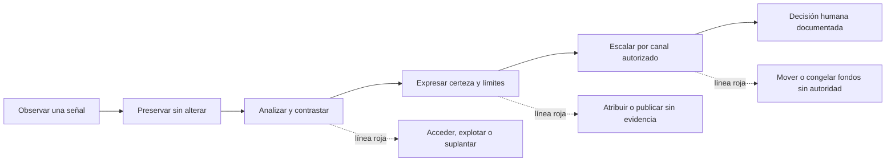
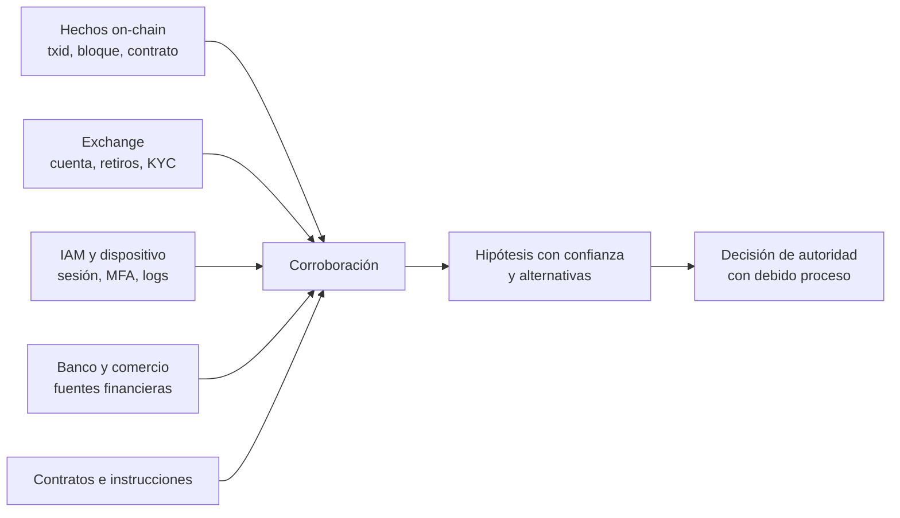
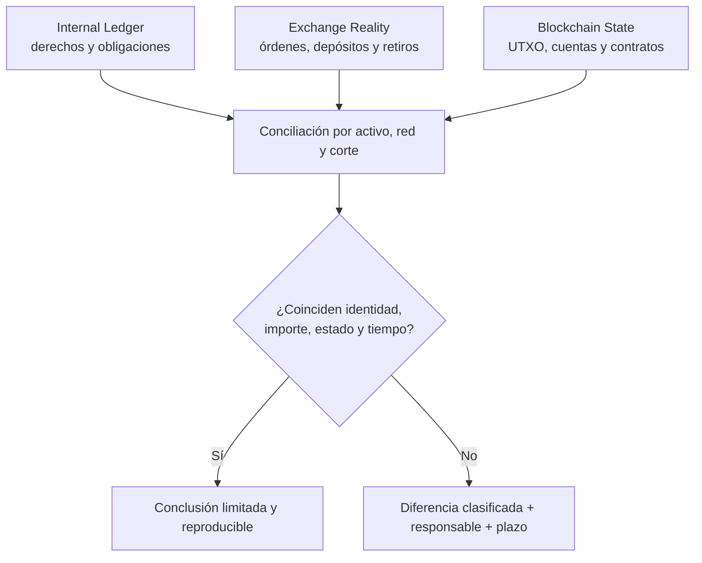

# ¿Y si cruzas la línea? · Límites éticos y legales en blockchain

> [🏠 Programa](../README.md) · [📚 Currículo](../curriculum/README.md) ·
> [📁 Casos reales](casos-reales/README.md) · [📖 Glosario](glosario.md)

Una blockchain puede mostrar movimientos, pero no explica por sí sola **quién actuó,
por qué lo hizo ni si estaba autorizado**. Esta guía enseña a investigar incidentes de
activos digitales sin convertir una señal técnica en una acusación ni una investigación
defensiva en una intervención ilegítima.

No es asesoría jurídica. La organización debe determinar la jurisdicción, el contrato,
la autoridad competente y las obligaciones aplicables con sus responsables legales y de
cumplimiento. En el aula se trabaja exclusivamente con datos ficticios, redes locales,
regtest, signet o fuentes públicas de solo lectura; nunca con fondos reales.

> **Revisión documental:** 8 de septiembre de 2026. Las normas cambian y los casos
> judiciales avanzan. Comprueba siempre la fuente oficial y distingue acusación,
> condena y sentencia.

## La línea que no se cruza

Investigar significa preservar y analizar evidencia dentro de una autorización. No
autoriza a entrar en cuentas, obtener secretos, hacerse pasar por otra persona, explotar
un sistema, mover activos, «devolver el golpe», congelar fondos ni publicar identidades.
Que una acción parezca técnicamente posible o moralmente intuitiva no la vuelve legítima.

La regla de trabajo es sencilla: **observar no es intervenir; inferir no es atribuir;
reportar no es condenar**. Ante una duda sobre autoridad o alcance, se detiene la acción,
se conserva lo ya obtenido legítimamente y se escala.

## El espejo de capacidades: la misma técnica, otra intención

Una capacidad no es buena o mala por sí sola. Lo decisivo es **quién autoriza, qué
alcance existe, qué datos se usan, qué acción se ejecuta y cómo se rinde cuenta**. Este
mapa ayuda a reconocer cuándo una práctica profesional empieza a cruzar la línea.

| Capacidad aprendida | Uso profesional autorizado | Uso que cruza la línea | Entregable seguro |
|---|---|---|---|
| Crear y firmar transacciones | Operar fondos de prueba o una wallet propia bajo política | Obtener una seed, firmar por otra persona o mover fondos sin mandato | Prevuelo en red local, txid y autorización registrada |
| Leer RPC, exploradores y grafos | Reconstruir hechos públicos y contrastar un incidente | Convertir una heurística en identidad, acosar o publicar datos personales | Línea de tiempo con confianza, alternativas y límites |
| Revisar contratos inteligentes | Auditar código propio o dentro de un acuerdo de divulgación | Explotar una falla en producción porque «el código lo permite» | Prueba mínima local y reporte coordinado |
| Administrar MPC, multisig o HSM | Ejecutar una ceremonia con quórum y segregación de funciones | Evadir el quórum, compartir fragmentos o usar acceso residual | Acta de ceremonia, evidencia de aprobación y logs |
| Conciliar ledger, exchange y cadena | Detectar errores, pérdidas o abuso con un corte común | Alterar exports, retrofechar asientos u ocultar diferencias | Matriz de conciliación reproducible y excepciones abiertas |
| Construir PoR/PoL | Permitir que clientes comprueben inclusión y explicar alcance | Omitir pasivos, pedir activos para el corte o venderlo como auditoría | Raíz reproducible, pasivos definidos, control probado y limitaciones |
| Automatizar monitoreo o IA | Priorizar alertas con revisión humana | Autorizar bloqueos, acusaciones o transferencias solo por una puntuación | Regla explicable, falsos positivos medidos y aprobador humano |
| Investigar exchanges y bridges | Comprender rutas, riesgos y controles | Suplantar soporte, probar credenciales o forzar retiros | Consulta de solo lectura y solicitud formal al tercero |

**Prueba de los cinco permisos.** Antes de actuar, el equipo debe contestar por escrito:
(1) quién autorizó, (2) qué sistema y datos cubre, (3) durante qué periodo, (4) qué
acciones permite y (5) cómo se detiene y reporta. Una respuesta vaga no amplía el
permiso: obliga a detenerse.

## Conductas y daños que el equipo debe saber reconocer

Esta sección describe **qué proteger y por qué**, no cómo ejecutar un delito. Se estudia
con escenarios ficticios, evidencia ya provista y redes de prueba.

### Apropiación de claves o fondos

Una private key, seed phrase, sesión de firma o fragmento MPC permite ejercer control
técnico, pero no demuestra propiedad ni autorización. Extraerla mediante engaño, acceso
indebido o abuso interno puede causar pérdida irreversible, exposición de clientes y una
investigación penal. El profesional protege secretos, aplica doble control y preserva
logs; nunca «prueba» una clave moviendo fondos ajenos.

### Phishing, suplantación y aprobaciones engañosas

Una firma válida puede haber sido obtenida con una interfaz falsa, una dirección
envenenada o una autorización que la persona no comprendió. La cadena prueba la firma y
el cambio de estado, no el consentimiento informado. La prevención revisa dominio,
contrato, red, destinatario, monto y allowance antes de aprobar.

### Explotación no autorizada de contratos

Encontrar una vulnerabilidad no concede permiso para explotarla. La ruta profesional es
reproducir el defecto localmente, reducir la prueba al mínimo, conservar evidencia y usar
el canal de divulgación o bug bounty aplicable. «Code is law» no reemplaza contratos,
deberes ni legislación.

### Abuso de custodia y falsificación de registros

Un operador puede tener acceso legítimo y aun así actuar fuera de su mandato. Cambiar un
ledger, omitir retiros, aprobarse a sí mismo o usar activos de clientes para trading
transforma un fallo de control en daño patrimonial y posible evidencia de fraude o
administración desleal, según la jurisdicción y los hechos. Acceso no equivale a autoridad.

### PoR engañoso y pasivos incompletos

Una raíz Merkle correcta solo prueba la relación matemática con el dataset entregado.
No prueba que todos los pasivos estén incluidos, que las wallets pertenezcan a la entidad,
que los activos no estén gravados ni que existan después del corte. Ocultar cuentas,
duplicar activos o presentar PoR como auditoría completa induce a decisiones erróneas.

### Fraude de inversión y manipulación

Prometer retornos, ocultar conflictos, usar información falsa o simular actividad de
mercado no se vuelve legítimo por usar un token, una DAO o una blockchain. El equipo debe
separar diseño económico, divulgación verificable, custodia y autorización de cada
comunicación.

### Extorsión, lavado y evasión de controles

Mixers, swaps, bridges, monedas de privacidad y P2P tienen usos legítimos. Su presencia
es un **indicador contextual**, no una condena. Importa la conducta completa: origen y
destino, control, propósito, conocimiento, jurisdicción y evidencia corroborada. El
analista no enseña a ocultar trazas ni evade controles; documenta riesgos y escala.

### Destrucción o fabricación de evidencia

Borrar logs, reconstruir exports después del hecho o inventar una captura impide conocer
lo ocurrido y puede agravar responsabilidades. Se preserva el original, se calcula su
hash, se trabaja sobre copias y se registra cada transformación. Una tabla sin procedencia
no es evidencia confiable.

## Cinco niveles que no deben mezclarse

| Nivel | Ejemplo | Qué permite afirmar | Qué todavía no permite afirmar |
|---|---|---|---|
| **Hecho on-chain** | El txid confirmado mueve 20 unidades de A a B en un bloque concreto | Que ese cambio de estado está registrado en esa red y corte | Quién controlaba A o B, el propósito o la legitimidad |
| **Hecho off-chain** | Un export autenticado registra un retiro y su aprobador | Que el sistema registró ese evento | Que el registro sea completo, correcto o coincida con la cadena |
| **Indicador** | Un grafo muestra fan-out inmediato | Que existe un patrón medible | Que sea lavado, robo o intención delictiva |
| **Inferencia** | El patrón es compatible con dispersión de fondos | Una explicación razonada con confianza y alternativas | Una identidad o culpabilidad |
| **Alegación** | Una parte acusa a una persona de controlar una wallet | Que la acusación existe y quién la formuló | Que sea verdadera |

Esta separación es crucial en casos como
[Orionx](casos-reales/orionx-descalce-custodia.md): una diferencia entre libros y
blockchain merece investigación, pero el informe debe distinguir cifras verificadas,
afirmaciones de las partes, hipótesis y conclusiones de una autoridad.

## El ruido de los instrumentos digitales

Una alerta puede tener explicaciones incompatibles entre sí. Un retiro no reconocido
podría provenir de phishing, abuso interno, una integración defectuosa, una clave
comprometida o una conciliación tardía. Una dirección compartida podría pertenecer a un
exchange; una ruta indirecta podría ser cambio UTXO, un bridge o un contrato; un saldo
contable «compensado» podría ocultar una salida real aunque el neto del libro sea cero.

Antes de elevar la gravedad, plantea al menos una explicación benigna y otra adversarial,
y escribe qué evidencia distinguiría ambas. La calidad forense no se mide por cuántas
direcciones colorea un grafo, sino por cuánto reduce la incertidumbre sin ocultar lo que
no puede saberse.

## Ocho mitos que hacen daño

| Mito | Realidad profesional |
|---|---|
| «Blockchain es anónima» | Normalmente es seudónima: los movimientos son observables y pueden cruzarse legalmente con fuentes off-chain. |
| «Un mixer borra la historia» | Cambia la calidad de las inferencias; no garantiza anonimato ni prueba por sí solo intención delictiva. |
| «Si controlo la clave, el activo es mío» | Control técnico, titularidad económica y autorización son preguntas distintas. |
| «Si el contrato lo acepta, está permitido» | Una ejecución válida puede seguir siendo no autorizada, engañosa o contraria a obligaciones aplicables. |
| «El ledger quedó en cero, así que no hubo pérdida» | Un asiento compensatorio no devuelve los activos que salieron on-chain. |
| «La DAO votó, entonces todo es legal» | La gobernanza técnica no elimina contratos, deberes ni protección al consumidor. |
| «La IA decidió» | La organización conserva responsabilidad por alcance, datos, controles y decisiones con impacto. |
| «Borrar el archivo borra la evidencia» | Persisten copias, logs, metadatos, registros de terceros y hechos on-chain. |

## ¿De verdad nadie podrá relacionar la operación contigo?

La atribución seria no nace de una flecha en un explorador. Surge al correlacionar fuentes
obtenidas legítimamente y someterlas a contradicción.

Una dirección reutilizada, un retiro hacia un servicio regulado, el horario de una sesión,
un dispositivo o una instrucción interna pueden adquirir significado al combinarse. Aun
así, correlación no es sentencia: la adquisición debe ser lícita, la cadena de custodia
íntegra y la interpretación revisable.

## Consecuencias: no termina cuando termina la transacción

Según la conducta y la jurisdicción, pueden coexistir investigación penal, incautación o
comiso, restitución, multas, prisión, demandas civiles, despido, pérdida de licencias,
inhabilitaciones y daño profesional. El carácter transfronterizo tampoco crea inmunidad:
exchanges, bancos, proveedores cloud y autoridades pueden conservar registros y cooperar
mediante los procedimientos legales aplicables.

En Chile, la [Ley 21.459](https://www.bcn.cl/leychile/Navegar?idNorma=1177743)
tipifica, entre otras conductas, ataques a sistemas y datos, acceso ilícito, falsificación
informática y fraude informático. Que un hecho involucre criptoactivos no reemplaza el
análisis de elementos, prueba, competencia y garantías; el equipo técnico describe hechos
y preserva evidencia, no improvisa conclusiones jurídicas.

### Casos documentados para estudiar decisiones, no para celebrar el daño

| Caso y estado | Qué ocurrió según la fuente oficial | Lección para el aula |
|---|---|---|
| **FTX / Samuel Bankman-Fried** · condenado y sentenciado en 2024 | Un tribunal federal estadounidense impuso 25 años de prisión por fraudes vinculados con la apropiación indebida de miles de millones de dólares de clientes. | Un balance en pantalla no sustituye segregación, gobierno, libros confiables ni activos disponibles. |
| **Bitfinex / Ilya Lichtenstein** · culpable y sentenciado | El caso conectó el hack de 2016 con posteriores movimientos y lavado de los activos sustraídos. | La distancia temporal y la fragmentación no eliminan la necesidad de explicar origen, control y destino. |
| **SafeMoon / Braden John Karony** · condenado y sentenciado en 2026 | El CEO recibió 100 meses de prisión por fraude y lavado relacionados con liquidez presentada como bloqueada. | Marketing y tokenomics deben comprobarse contra contratos, wallets, gobierno y uso real de fondos. |
| **GothFerrari** · condenado y sentenciado en 2026 | Una sentencia de 78 meses abordó ingeniería social y robo de hardware wallets, además de restitución. | Identidad, soporte, dispositivos y procedimientos humanos también custodian valor. |

El estado procesal importa. Una denuncia o acusación contiene alegaciones; una declaración
de culpabilidad, un veredicto y una sentencia son actos diferentes. Citar un caso exige
fecha, tribunal, fuente y estado, y nunca autoriza a extrapolar culpabilidad a otra
persona por similitud de patrón.

### Casos que exigen respuestas diferentes

| Señal inicial | Pregunta profesional | Evidencia prioritaria | Riesgo de cruzar la línea |
|---|---|---|---|
| Activos robados o aprobación maliciosa | ¿Qué transacción cambió el control y qué autorización existía? | txid, calldata, allowance, logs, hora y registros de acceso | Intentar recuperar fondos accediendo o atacando cuentas ajenas |
| Movimiento interno «falso» | ¿Cambió solo el ledger o también el estado de la red? | asiento, evento de negocio, aprobaciones, wallet y corte on-chain | Editar registros para hacerlos coincidir después del incidente |
| Diferencia de custodia | ¿Qué parte pertenece a tiempo, red, comisión, cambio o error real? | snapshot coherente por activo/red y conciliación partida a partida | Acusar antes de descartar alcance, duplicados y desfases |
| Ruido de trading | ¿La pérdida fue autorizada, registrada y dentro de límites? | órdenes, fills, transferencias, cuentas internas y política de riesgo | Confundir mal resultado, abuso y delito sin criterios separados |
| PoR aparentemente correcto | ¿La prueba cubre pasivos, control, corte y restricciones? | árbol reproducible, pasivos completos, firmas y hechos posteriores | Presentarlo como auditoría o solvencia completa |
| Etiqueta de proveedor | ¿Cuál es su procedencia, fecha, confianza y corroboración? | fuente de etiqueta y evidencia independiente | Doxxing, congelación o denuncia automática por una heurística |

## Respuesta a un incidente sin contaminar la evidencia

### 1. Contener mediante controles ya autorizados

Activa el plan de respuesta aprobado: rotación o pausa solo sobre sistemas propios y por
las personas facultadas, doble control, preservación previa cuando sea viable y registro
de cada cambio. Contener no significa perseguir fondos ni operar infraestructura de
terceros.

### 2. Fijar el corte

Anota fecha, hora, zona temporal, red, altura y hash de bloque, versión del software y
alcance. Conserva exports originales del ledger, exchange, IAM, MPC/HSM y monitoreo;
calcula sus hashes y trabaja sobre copias. Sin un corte común, dos saldos correctos pueden
parecer una discrepancia.

### 3. Reconstruir las tres realidades

`Internal Ledger ≠ Exchange Reality ≠ Blockchain State`. Ninguna fuente sustituye a
las otras. El trabajo profesional demuestra cómo se relacionan mediante identificadores,
timestamps, activos, redes, estados y evidencia de autorización.

### 4. Trazar solo con fuentes legítimas

Empieza con nodo propio o una API pública de solo lectura, conserva consultas y
respuestas, y contrasta resultados relevantes. Una visualización es un derivado: debe
poder reconstruirse desde la evidencia preservada. No recopiles datos personales que no
sean necesarios para la pregunta autorizada.

### 5. Comunicar con lenguaje calibrado

Cada hallazgo debe indicar criterio, evidencia, procedimiento, resultado, limitaciones y
nivel de confianza. Usa «observamos», «es compatible con» o «no pudimos corroborar»
cuando corresponda. No reemplaces una laguna con una historia convincente.

### 6. Escalar por canales formales

Legal, cumplimiento, dirección, aseguradora, proveedor custodial o autoridad reciben lo
que corresponda según el plan y la jurisdicción. La entidad decide si procede solicitar
preservación, bloqueo o recuperación por los canales habilitados. El analista no inventa
autoridad operativa a partir de su acceso técnico.

## Control de falsa atribución y privacidad

Las direcciones son identificadores técnicos, no nombres civiles. CoinJoin, wallets de
servicio, cambio UTXO, contratos, proxies, bridges, account abstraction y direcciones de
depósito compartidas debilitan inferencias simples. Incluso una etiqueta correcta puede
describir al proveedor que custodia la dirección, no al beneficiario económico.

Antes de asociar una identidad, documenta:

1. procedencia y fecha de cada fuente;
2. vínculo exacto entre la fuente off-chain y el identificador on-chain;
3. explicaciones alternativas examinadas;
4. confianza y evidencia que podría refutar la hipótesis;
5. necesidad, acceso, retención y destinatarios de los datos personales.

Una decisión con impacto —bloqueo, reporte, despido o comunicación pública— requiere
revisión humana autorizada y evidencia proporcional. El grafo ayuda a preguntar; no dicta
la sanción.

## Práctica segura · El expediente de la transferencia imposible

Trabaja con el dataset ficticio de
[Aurora Custody](../capstone/empresa-custodial/README.md), nunca con personas o fondos
reales.

1. Selecciona una diferencia entre ledger, export de exchange y blockchain.
2. Fija el corte y crea un inventario de archivos con SHA-256.
3. Redacta por separado un hecho, un indicador, una inferencia y una hipótesis descartada.
4. Dibuja el flujo sin nombres personales y marca los saltos que no puedes demostrar.
5. Propón una acción de contención autorizada y una acción que quedaría fuera de alcance.
6. Entrega un hallazgo reproducible y un registro de decisiones.

**Criterio de aprobación:** otra persona reconstruye el resultado con las mismas fuentes;
el texto no atribuye identidad o intención sin corroboración; declara límites y corte; y
ninguna acción propuesta supone acceso, explotación, suplantación o movimiento de fondos
sin autoridad.

## Ejercicio de equipo · Detener, preservar, escalar

El instructor entrega tres tarjetas ficticias: una alerta on-chain, un export interno y
un mensaje urgente de dirección que pide «recuperar ahora» los fondos. Cada participante
asume un rol: operaciones de custodia, seguridad, cumplimiento/legal, auditoría interna o
dirección de incidente.

1. Cada rol escribe qué sabe, qué supone y qué no está autorizado a hacer.
2. El equipo construye una línea de tiempo común y marca conflictos entre fuentes.
3. Antes de cualquier acción, completa la prueba de los cinco permisos.
4. Clasifica propuestas en **permitida**, **requiere autorización** o **prohibida**.
5. Redacta un parte de una página que proteja a clientes y preserve debido proceso.

Se reprueba si la rapidez justifica acceder a terceros, mover fondos, ocultar una pérdida
o acusar a una persona. Se aprueba si el equipo sabe detenerse, conservar evidencia,
contener dentro de sistemas propios y pedir una decisión a quien tiene autoridad.

## Salidas profesionales: usar la capacidad para proteger

| Ruta | Pregunta central | Evidencia de competencia legítima |
|---|---|---|
| Seguridad de wallets y contratos | ¿Cómo evitamos pérdida o ejecución no autorizada? | Threat model, prueba local, remediación y divulgación responsable |
| Operaciones de custodia | ¿Cada firma respeta política, quórum y segregación? | Ceremonia documentada, logs y revisión de excepciones |
| Auditoría y conciliación | ¿Los tres sistemas cuentan la misma historia al mismo corte? | Workpapers reproducibles y diferencias con responsable y plazo |
| Forensics blockchain | ¿Qué hechos pueden demostrarse y con qué confianza? | Timeline, grafo trazable, procedencia y alternativas examinadas |
| Cumplimiento y riesgo | ¿Qué alerta requiere revisión proporcional? | Evaluación basada en riesgo, privacidad y decisión humana |
| Respuesta a incidentes | ¿Cómo contenemos sin destruir evidencia ni exceder autoridad? | Playbook, cadena de custodia y registro de decisiones |

La madurez no se demuestra mostrando hasta dónde puedes entrar, sino sabiendo **por qué,
cuándo y ante quién debes detenerte**.

## Preguntas para comprobar criterio

1. ¿Qué diferencia hay entre controlar una clave y estar autorizado a usarla?
2. ¿Qué dato convertiría una etiqueta de wallet en una atribución más sólida? ¿Qué
   explicación alternativa seguiría abierta?
3. ¿Por qué una raíz Merkle correcta puede acompañar una representación engañosa?
4. ¿Qué cambia entre detectar una vulnerabilidad, demostrarla localmente y explotarla?
5. Si el ledger registra saldo cero pero la cadena muestra una salida, ¿qué preservas
   antes de corregir y quién autoriza el ajuste?
6. ¿Qué consecuencias humanas sufren clientes y compañeros cuando fallan custodia,
   gobierno o comunicación?

Una respuesta competente menciona autorización, evidencia, límites, afectados y canal de
escalamiento; no se limita a describir tecnología.

## Cómo se integra en las 66 clases

Esta guía no añade una clase 67. Es una lente transversal para
[seguridad y auditoría (19–20)](../curriculum/09-seguridad/README.md),
[cumplimiento (55–56)](../curriculum/27-regulacion-cumplimiento/README.md),
[analítica y atribución (57–58)](../curriculum/28-data-analytics-onchain/README.md) y
[custodia, conciliación, PoR y forensics (59–66)](../curriculum/29-exchanges-operaciones-custodia/README.md).
Vuelve a ella cuando una práctica pase de comprender un sistema a investigar conductas o
proponer una respuesta.

## Fuentes primarias y de referencia

- [NIST SP 800-86 · Guide to Integrating Forensic Techniques into Incident Response](https://csrc.nist.gov/pubs/sp/800/86/final) — proceso de colección, examen, análisis y reporte; exige coordinar con responsables legales y de gestión.
- [FATF/GAFI · Virtual Assets](https://www.fatf-gafi.org/en/topics/virtual-assets.html) — enfoque basado en riesgo, diligencia debida, registros, reportes y Regla de Viaje.
- [FATF/GAFI · Guidance for a Risk-Based Approach to Virtual Assets and VASPs](https://www.fatf-gafi.org/en/publications/Fatfrecommendations/Guidance-rba-virtual-assets.html) — guía que debe leerse junto con sus actualizaciones posteriores.
- [FATF/GAFI · Quick guide on assessing ML risks of virtual assets and VASPs](https://www.fatf-gafi.org/en/publications/Methodsandtrends/quick-guide-on-assessing-ML-risks-of-VA-and-VASPs.html) — estructura para identificar, analizar y comprender riesgo sin automatizar conclusiones.
- [Europol · The race against time](https://www.europol.europa.eu/publications-events/publications/race-against-time) — cooperación, capacidad y prevención frente al uso delictivo de activos digitales.
- [FBI IC3 · 2024 Internet Crime Report](https://www.ic3.gov/AnnualReport/Reports/2024_IC3AnnualReport.pdf) — tipologías y datos de denuncias; una denuncia es una señal reportada, no una sentencia.
- [Biblioteca del Congreso Nacional de Chile · Ley 21.459](https://www.bcn.cl/leychile/Navegar?idNorma=1177743) — texto oficial de delitos informáticos; debe comprobarse su versión vigente y aplicación al caso.
- [FATF/GAFI · Virtual Assets Red Flag Indicators](https://www.fatf-gafi.org/en/publications/Methodsandtrends/Virtual-assets-red-flag-indicators.html) — indicadores para análisis basado en riesgo; no son atribución automática.
- [U.S. Department of Justice · sentencia en el caso FTX](https://www.justice.gov/usao-sdny/pr/samuel-bankman-fried-sentenced-25-years-prison) — comunicado oficial sobre condena y sentencia.
- [U.S. Department of Justice · caso Bitfinex](https://www.justice.gov/usao-dc/case/united-states-v-ilya-lichtenstein-and-heather-morgan) — cronología y documentos oficiales del caso.
- [U.S. Department of Justice · sentencia SafeMoon](https://www.justice.gov/usao-edny/pr/ceo-digital-asset-company-safemoon-sentenced-100-months-prison-multi-million-dollar) — comunicado oficial sobre fraude, lavado y sentencia.
- [U.S. Department of Justice · sentencia GothFerrari](https://www.justice.gov/usao-dc/pr/gothferrari-sentenced-78-months-prison-role-massive-cryptocurrency-heist) — comunicado oficial sobre ingeniería social, robo de wallets y restitución.

---

## Navegación

[⬅️ Casos reales](casos-reales/README.md) ·
[Clase 58 · límites de atribución](../curriculum/28-data-analytics-onchain/clase-58-grafo-anomalias-y-limites-de-atribucion.md) ·
[Clase 65 · evidencia reproducible](../curriculum/32-forensics-auditoria-gobernanza/clase-65-forensics-con-evidencia-reproducible.md) ·
[Clase 66 · gobierno custodial](../curriculum/32-forensics-auditoria-gobernanza/clase-66-auditoria-cumplimiento-y-gobierno-custodial.md)
