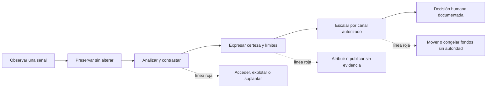
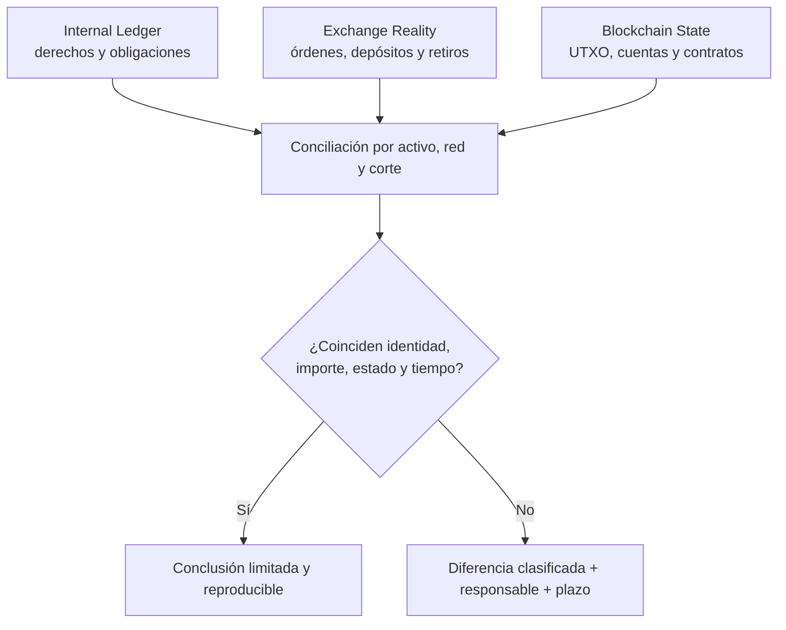

# ¿Y si cruzas la línea? · Límites éticos y legales en blockchain

> [🏠 Programa](../README.md) · [📚 Currículo](../curriculum/README.md) ·
> [📁 Casos reales](casos-reales/README.md) · [📖 Glosario](glosario.md)

Una blockchain puede mostrar movimientos, pero no explica por sí sola **quién actuó,
por qué lo hizo ni si estaba autorizado**. Esta guía enseña a investigar incidentes de
activos digitales sin convertir una señal técnica en una acusación ni una investigación
defensiva en una intervención ilegítima.

No es asesoría jurídica. La organización debe determinar la jurisdicción, el contrato,
la autoridad competente y las obligaciones aplicables con sus responsables legales y de
cumplimiento. En el aula se trabaja exclusivamente con datos ficticios, redes locales,
regtest, signet o fuentes públicas de solo lectura; nunca con fondos reales.

## La línea que no se cruza

Investigar significa preservar y analizar evidencia dentro de una autorización. No
autoriza a entrar en cuentas, obtener secretos, hacerse pasar por otra persona, explotar
un sistema, mover activos, «devolver el golpe», congelar fondos ni publicar identidades.
Que una acción parezca técnicamente posible o moralmente intuitiva no la vuelve legítima.

La regla de trabajo es sencilla: **observar no es intervenir; inferir no es atribuir;
reportar no es condenar**. Ante una duda sobre autoridad o alcance, se detiene la acción,
se conserva lo ya obtenido legítimamente y se escala.

## Cinco niveles que no deben mezclarse

| Nivel | Ejemplo | Qué permite afirmar | Qué todavía no permite afirmar |
|---|---|---|---|
| **Hecho on-chain** | El txid confirmado mueve 20 unidades de A a B en un bloque concreto | Que ese cambio de estado está registrado en esa red y corte | Quién controlaba A o B, el propósito o la legitimidad |
| **Hecho off-chain** | Un export autenticado registra un retiro y su aprobador | Que el sistema registró ese evento | Que el registro sea completo, correcto o coincida con la cadena |
| **Indicador** | Un grafo muestra fan-out inmediato | Que existe un patrón medible | Que sea lavado, robo o intención delictiva |
| **Inferencia** | El patrón es compatible con dispersión de fondos | Una explicación razonada con confianza y alternativas | Una identidad o culpabilidad |
| **Alegación** | Una parte acusa a una persona de controlar una wallet | Que la acusación existe y quién la formuló | Que sea verdadera |

Esta separación es crucial en casos como
[Orionx](casos-reales/orionx-descalce-custodia.md): una diferencia entre libros y
blockchain merece investigación, pero el informe debe distinguir cifras verificadas,
afirmaciones de las partes, hipótesis y conclusiones de una autoridad.

## El ruido de los instrumentos digitales

Una alerta puede tener explicaciones incompatibles entre sí. Un retiro no reconocido
podría provenir de phishing, abuso interno, una integración defectuosa, una clave
comprometida o una conciliación tardía. Una dirección compartida podría pertenecer a un
exchange; una ruta indirecta podría ser cambio UTXO, un bridge o un contrato; un saldo
contable «compensado» podría ocultar una salida real aunque el neto del libro sea cero.

Antes de elevar la gravedad, plantea al menos una explicación benigna y otra adversarial,
y escribe qué evidencia distinguiría ambas. La calidad forense no se mide por cuántas
direcciones colorea un grafo, sino por cuánto reduce la incertidumbre sin ocultar lo que
no puede saberse.

### Casos que exigen respuestas diferentes

| Señal inicial | Pregunta profesional | Evidencia prioritaria | Riesgo de cruzar la línea |
|---|---|---|---|
| Activos robados o aprobación maliciosa | ¿Qué transacción cambió el control y qué autorización existía? | txid, calldata, allowance, logs, hora y registros de acceso | Intentar recuperar fondos accediendo o atacando cuentas ajenas |
| Movimiento interno «falso» | ¿Cambió solo el ledger o también el estado de la red? | asiento, evento de negocio, aprobaciones, wallet y corte on-chain | Editar registros para hacerlos coincidir después del incidente |
| Diferencia de custodia | ¿Qué parte pertenece a tiempo, red, comisión, cambio o error real? | snapshot coherente por activo/red y conciliación partida a partida | Acusar antes de descartar alcance, duplicados y desfases |
| Ruido de trading | ¿La pérdida fue autorizada, registrada y dentro de límites? | órdenes, fills, transferencias, cuentas internas y política de riesgo | Confundir mal resultado, abuso y delito sin criterios separados |
| PoR aparentemente correcto | ¿La prueba cubre pasivos, control, corte y restricciones? | árbol reproducible, pasivos completos, firmas y hechos posteriores | Presentarlo como auditoría o solvencia completa |
| Etiqueta de proveedor | ¿Cuál es su procedencia, fecha, confianza y corroboración? | fuente de etiqueta y evidencia independiente | Doxxing, congelación o denuncia automática por una heurística |

## Respuesta a un incidente sin contaminar la evidencia

### 1. Contener mediante controles ya autorizados

Activa el plan de respuesta aprobado: rotación o pausa solo sobre sistemas propios y por
las personas facultadas, doble control, preservación previa cuando sea viable y registro
de cada cambio. Contener no significa perseguir fondos ni operar infraestructura de
terceros.

### 2. Fijar el corte

Anota fecha, hora, zona temporal, red, altura y hash de bloque, versión del software y
alcance. Conserva exports originales del ledger, exchange, IAM, MPC/HSM y monitoreo;
calcula sus hashes y trabaja sobre copias. Sin un corte común, dos saldos correctos pueden
parecer una discrepancia.

### 3. Reconstruir las tres realidades

`Internal Ledger ≠ Exchange Reality ≠ Blockchain State`. Ninguna fuente sustituye a
las otras. El trabajo profesional demuestra cómo se relacionan mediante identificadores,
timestamps, activos, redes, estados y evidencia de autorización.

### 4. Trazar solo con fuentes legítimas

Empieza con nodo propio o una API pública de solo lectura, conserva consultas y
respuestas, y contrasta resultados relevantes. Una visualización es un derivado: debe
poder reconstruirse desde la evidencia preservada. No recopiles datos personales que no
sean necesarios para la pregunta autorizada.

### 5. Comunicar con lenguaje calibrado

Cada hallazgo debe indicar criterio, evidencia, procedimiento, resultado, limitaciones y
nivel de confianza. Usa «observamos», «es compatible con» o «no pudimos corroborar»
cuando corresponda. No reemplaces una laguna con una historia convincente.

### 6. Escalar por canales formales

Legal, cumplimiento, dirección, aseguradora, proveedor custodial o autoridad reciben lo
que corresponda según el plan y la jurisdicción. La entidad decide si procede solicitar
preservación, bloqueo o recuperación por los canales habilitados. El analista no inventa
autoridad operativa a partir de su acceso técnico.

## Control de falsa atribución y privacidad

Las direcciones son identificadores técnicos, no nombres civiles. CoinJoin, wallets de
servicio, cambio UTXO, contratos, proxies, bridges, account abstraction y direcciones de
depósito compartidas debilitan inferencias simples. Incluso una etiqueta correcta puede
describir al proveedor que custodia la dirección, no al beneficiario económico.

Antes de asociar una identidad, documenta:

1. procedencia y fecha de cada fuente;
2. vínculo exacto entre la fuente off-chain y el identificador on-chain;
3. explicaciones alternativas examinadas;
4. confianza y evidencia que podría refutar la hipótesis;
5. necesidad, acceso, retención y destinatarios de los datos personales.

Una decisión con impacto —bloqueo, reporte, despido o comunicación pública— requiere
revisión humana autorizada y evidencia proporcional. El grafo ayuda a preguntar; no dicta
la sanción.

## Práctica segura · El expediente de la transferencia imposible

Trabaja con el dataset ficticio de
[Aurora Custody](../capstone/empresa-custodial/README.md), nunca con personas o fondos
reales.

1. Selecciona una diferencia entre ledger, export de exchange y blockchain.
2. Fija el corte y crea un inventario de archivos con SHA-256.
3. Redacta por separado un hecho, un indicador, una inferencia y una hipótesis descartada.
4. Dibuja el flujo sin nombres personales y marca los saltos que no puedes demostrar.
5. Propón una acción de contención autorizada y una acción que quedaría fuera de alcance.
6. Entrega un hallazgo reproducible y un registro de decisiones.

**Criterio de aprobación:** otra persona reconstruye el resultado con las mismas fuentes;
el texto no atribuye identidad o intención sin corroboración; declara límites y corte; y
ninguna acción propuesta supone acceso, explotación, suplantación o movimiento de fondos
sin autoridad.

## Cómo se integra en las 66 clases

Esta guía no añade una clase 67. Es una lente transversal para
[seguridad y auditoría (19–20)](../curriculum/09-seguridad/README.md),
[cumplimiento (55–56)](../curriculum/27-regulacion-cumplimiento/README.md),
[analítica y atribución (57–58)](../curriculum/28-data-analytics-onchain/README.md) y
[custodia, conciliación, PoR y forensics (59–66)](../curriculum/29-exchanges-operaciones-custodia/README.md).
Vuelve a ella cuando una práctica pase de comprender un sistema a investigar conductas o
proponer una respuesta.

## Fuentes primarias y de referencia

- [NIST SP 800-86 · Guide to Integrating Forensic Techniques into Incident Response](https://csrc.nist.gov/pubs/sp/800/86/final) — proceso de colección, examen, análisis y reporte; exige coordinar con responsables legales y de gestión.
- [FATF/GAFI · Virtual Assets](https://www.fatf-gafi.org/en/topics/virtual-assets.html) — enfoque basado en riesgo, diligencia debida, registros, reportes y Regla de Viaje.
- [FATF/GAFI · Guidance for a Risk-Based Approach to Virtual Assets and VASPs](https://www.fatf-gafi.org/en/publications/Fatfrecommendations/Guidance-rba-virtual-assets.html) — guía que debe leerse junto con sus actualizaciones posteriores.
- [FATF/GAFI · Quick guide on assessing ML risks of virtual assets and VASPs](https://www.fatf-gafi.org/en/publications/Methodsandtrends/quick-guide-on-assessing-ML-risks-of-VA-and-VASPs.html) — estructura para identificar, analizar y comprender riesgo sin automatizar conclusiones.
- [Europol · The race against time](https://www.europol.europa.eu/publications-events/publications/race-against-time) — cooperación, capacidad y prevención frente al uso delictivo de activos digitales.
- [FBI IC3 · 2024 Internet Crime Report](https://www.ic3.gov/AnnualReport/Reports/2024_IC3AnnualReport.pdf) — tipologías y datos de denuncias; una denuncia es una señal reportada, no una sentencia.

---

## Navegación

[⬅️ Casos reales](casos-reales/README.md) ·
[Clase 58 · límites de atribución](../curriculum/28-data-analytics-onchain/clase-58-grafo-anomalias-y-limites-de-atribucion.md) ·
[Clase 65 · evidencia reproducible](../curriculum/32-forensics-auditoria-gobernanza/clase-65-forensics-con-evidencia-reproducible.md) ·
[Clase 66 · gobierno custodial](../curriculum/32-forensics-auditoria-gobernanza/clase-66-auditoria-cumplimiento-y-gobierno-custodial.md)
