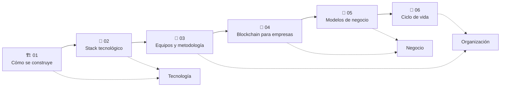

# 🏭 Industria: blockchain como profesión y negocio

> [🏠 Volver al programa](../README.md) · [📚 Currículo](../curriculum/README.md) · [📖 Bibliografía](../docs/bibliografia.md)

El currículo enseña **cómo funciona** la tecnología; esta sección enseña **cómo funciona
la industria**: cómo se construye una blockchain en la práctica, con qué stack, cómo se
organizan y comunican los equipos, qué valor real aporta a las empresas, cómo se gana
dinero en el ecosistema y cómo se lleva un proyecto de la idea a producción.

Los seis documentos son de nivel profesional: casos reales verificables —incluidos los
**fracasos instructivos**—, cifras marcadas para consultar en vivo y fuentes primarias.

## Mapa de la sección

## Documentos

| # | Documento | Pregunta que responde | Audiencia |
|---|---|---|---|
| 01 | [Cómo se construye una blockchain](01-como-se-construye-una-blockchain.md) | ¿Qué hay dentro de un nodo y qué vías existen para lanzar una red? | Ingeniería y arquitectura |
| 02 | [Stack tecnológico](02-stack-tecnologico.md) | ¿Qué tecnologías usa el ecosistema en cada capa y cómo elegirlas? | Desarrollo y CTO |
| 03 | [Equipos, roles y metodología](03-equipos-roles-y-metodologia.md) | ¿Quién hace qué y cómo se coordinan los equipos del sector? | Líderes técnicos, PM y empleo |
| 04 | [Blockchain para empresas](04-blockchain-para-empresas.md) | ¿Qué beneficios reales aporta y qué casos funcionaron o fracasaron? | Decisores y consultores |
| 05 | [Modelos de negocio](05-modelos-de-negocio.md) | ¿Cómo se gana dinero de verdad en este ecosistema? | Fundadores y analistas |
| 06 | [Ciclo de vida de un proyecto](06-ciclo-de-vida-de-un-proyecto.md) | ¿Cómo se va de la idea a mainnet y a la operación responsable? | Equipos de producto |

## Cómo usar esta sección

Esta sección es la **lectura profesional extendida** del programa. La versión con
laboratorios y retos verificables vive en el currículo: los módulos
[16 · Infraestructura y nodos](../curriculum/16-infraestructura-nodos/README.md),
[17 · Blockchain en la empresa](../curriculum/17-blockchain-en-la-empresa/README.md) y
[18 · Implementación empresarial](../curriculum/18-implementacion-empresarial/README.md).

- **Si vienes del currículo:** léela tras el módulo 09 (Seguridad); da contexto de industria a los módulos avanzados.
- **Si eres decisor o consultor:** empieza por [04 · Blockchain para empresas](04-blockchain-para-empresas.md) y [05 · Modelos de negocio](05-modelos-de-negocio.md).
- **Si buscas empleo en el sector:** [03 · Equipos y roles](03-equipos-roles-y-metodologia.md) mapea los puestos y sus habilidades; el [currículo](../curriculum/README.md) te da la ruta técnica.
- **Si vas a lanzar un protocolo:** [06 · Ciclo de vida](06-ciclo-de-vida-de-un-proyecto.md) es tu checklist, junto al [capstone](../capstone/README.md).
- **Si tienes que vender o explicar la idea:** la [guía para explicar blockchain a personas no técnicas](../docs/explicar-blockchain-a-no-tecnicos.md) te da el discurso, la traducción de jerga y el manejo de objeciones.

---

## 🧭 Navegación

[🏠 Programa](../README.md) · [📚 Currículo](../curriculum/README.md) · ➡️ [01 · Cómo se construye una blockchain](01-como-se-construye-una-blockchain.md)
