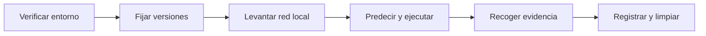

# Checklist de laboratorio

> Navegación: [Inicio](../README.md) · [Kit del instructor](README.md) · [Programa](syllabus.md) · [Catálogo de labs](../labs/CATALOG.md) · [Despliegue local](../docs/despliegue-local.md)

Lista operativa para cada sesión de laboratorio. El objetivo es que toda práctica sea reproducible, segura y deje evidencia revisable. Recorre las tres fases en orden.

## Antes de la sesión

- [ ] Entorno verificado: `pnpm check` sin errores.
- [ ] Versiones registradas (Node, pnpm, Foundry, Docker) y anotadas en la bitácora.
- [ ] Red local Anvil disponible (`anvil`) o Bitcoin Core en `regtest`.
- [ ] Wallet exclusiva de laboratorio, sin fondos reales.
- [ ] Hipótesis escrita antes de ejecutar cada práctica.

## Durante la sesión

- [ ] El estudiante predice el resultado antes de correr el comando.
- [ ] **Seguridad:** nunca se usan claves, seeds ni fondos reales.
- [ ] **Seguridad:** todo el trabajo ocurre en local o testnet; jamás en mainnet ni contra sistemas de terceros.
- [ ] Comandos reproducibles copiados a la bitácora.
- [ ] Resultado esperado y obtenido, con pruebas positivas y negativas.
- [ ] Amenaza o limitación identificada por práctica.

## Después de la sesión

- [ ] Evidencia recogida (ruta a código, prueba, txid local, ADR o informe) sin secretos ni datos personales.
- [ ] Progreso registrado con `pnpm course:status ruta/progress.json`.
- [ ] Servicios detenidos y entorno limpio (Anvil, nodos, contenedores).

## Comandos por familia de laboratorio

| Familia | Comando | Qué verificar |
|---|---|---|
| Criptografía | `pnpm lab:hash`, `pnpm lab:merkle` | Determinismo, resistencia a manipulación y prueba de inclusión correcta |
| Consenso | `pnpm lab:pow` | Ajuste de dificultad y relación trabajo/tiempo |
| Bitcoin / UTXO | `pnpm lab:utxo` | Conservación de valor; receptor, cambio y comisión distinguidos |
| EVM | `pnpm lab:abi` | Selector y codificación de calldata correctos |
| Solidity | `forge build`, `forge test` | Depósito/retiro, fuzzing e invariantes que no se rompen |
| Seguridad | `forge test` (en `security-challenges/`) | PoC demuestra impacto; el fix pasa la prueba de regresión |
| Tokenomics | `pnpm lab:tokenomics` | Emisión, oferta y supuestos de sostenibilidad |

El detalle de cada práctica y su evidencia esperada está en el [catálogo de 83 prácticas](../labs/CATALOG.md).

## Flujo de una sesión

## Errores comunes de setup y solución

| Síntoma | Causa probable | Solución |
|---|---|---|
| `command not found: forge` | Foundry no instalado o fuera del PATH | Instalar con `foundryup`; reabrir la terminal |
| `pnpm` no reconocido | Falta pnpm o Corepack deshabilitado | `corepack enable` o instalar pnpm globalmente |
| Anvil no responde en `127.0.0.1:8545` | Otro proceso ocupa el puerto | Cerrar el proceso o lanzar `anvil --port 8546` |
| Bitcoin Core no conecta en `regtest` | Contenedor detenido o config incorrecta | Revisar Docker y [despliegue local](../docs/despliegue-local.md) |
| `forge test` falla al compilar | Versión de Solidity o dependencias | Alinear `foundry.toml` y correr `forge install` |
| Tests intermitentes de fuzzing | Semilla o número de runs inestable | Fijar `--fuzz-runs` y registrar la semilla |
