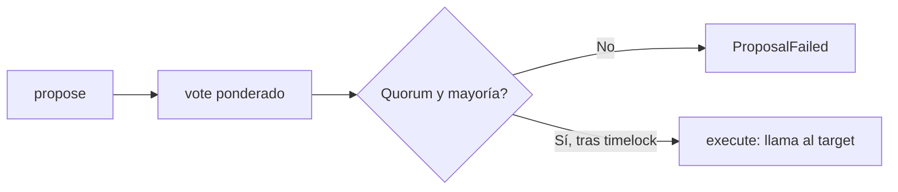

# Laboratorio · Protocolos profesionales

> Navegación: [Inicio](../../README.md) · [Currículo](../../curriculum/README.md) · [Módulo 08 · Tokens](../../curriculum/08-tokens/README.md) · [Catálogo de laboratorios](../CATALOG.md)

Tres componentes pequeños y comprobables que aparecen en casi todo protocolo real: un **token**, un **oráculo** y un **gobernador con timelock**. El objetivo no es reemplazar bibliotecas auditadas, sino poder **leer toda la lógica** de cada patrón antes de compararlo con una implementación de producción como OpenZeppelin.

## Qué contiene cada contrato

| Contrato | Archivo | Rol | Piezas clave |
|---|---|---|---|
| `CourseToken` | `src/CourseToken.sol` | ERC-20 educativo con tope de emisión | `cap`, `mint` solo `owner`, transferencia de propiedad en dos pasos (`proposeOwner`/`acceptOwnership`) |
| `FreshOracle` | `src/FreshOracle.sol` | Feed de precio con autorización y rechazo de datos obsoletos | `updater` autorizado, `maxAge`, `read` revierte con `StalePrice` |
| `SimpleGovernor` | `src/SimpleGovernor.sol` | Gobernador con voto ponderado, quorum y timelock | `propose` → `vote` → `execute` tras `executableAt` |

## Invariantes por contrato

| Contrato | Invariante | Cómo se sostiene |
|---|---|---|
| `CourseToken` | `totalSupply <= cap` siempre | `mint` revierte con `CapExceeded` si lo supera |
| `CourseToken` | Solo el `owner` acuña; el cambio de dueño requiere aceptación | `Unauthorized` + patrón propose/accept |
| `FreshOracle` | Nunca devuelve un precio más viejo que `maxAge` | `read` compara `block.timestamp` con `updatedAt + maxAge` |
| `FreshOracle` | Solo el `updater` publica precios no nulos | `Unauthorized` / `InvalidPrice` |
| `SimpleGovernor` | Una propuesta se ejecuta solo con quorum y mayoría a favor, tras el timelock | `execute` valida `forVotes >= quorum`, `> againstVotes` y `executableAt` |
| `SimpleGovernor` | Un votante no vota dos veces la misma propuesta | `hasVoted` + `AlreadyVoted` |

## Ciclo de una propuesta en SimpleGovernor



El timelock entre la aprobación y la ejecución da margen para reaccionar si una propuesta maliciosa alcanza el quorum: nada se ejecuta hasta pasado `executableAt`.

## Cómo probar

Requiere [Foundry](https://book.getfoundry.sh/):

```bash
forge install foundry-rs/forge-std --no-commit
forge build
forge test -vv
```

Salida esperada:

```text
Ran 3 tests for test/Protocols.t.sol:ProtocolsTest
[PASS] testTokenCapAndTransfer() (gas: …)
[PASS] testOracleRejectsStalePrice() (gas: …)
[PASS] testGovernorVotesWaitsAndExecutes() (gas: …)
Suite result: ok. 3 passed; 0 failed; 0 skipped
```

## Casos de prueba

| Prueba | Contrato | Qué verifica |
|---|---|---|
| `testTokenCapAndTransfer` | `CourseToken` | Acuñar, transferir y que exceder el `cap` revierta |
| `testOracleRejectsStalePrice` | `FreshOracle` | Lee un precio fresco; tras `maxAge` la lectura revierte |
| `testGovernorVotesWaitsAndExecutes` | `SimpleGovernor` | Propuesta con quorum se ejecuta solo tras el timelock |

## Relación con los módulos

Cada contrato es la versión mínima de un tema del programa:

- `CourseToken` → [módulo 08 · Tokens](../../curriculum/08-tokens/README.md): estándar ERC-20, tope de emisión y administración segura.
- `FreshOracle` → [módulo 10 · Oráculos e indexación](../../curriculum/10-oraculos-indexacion/README.md): *freshness*, autorización y por qué un precio obsoleto es un riesgo.
- `SimpleGovernor` → [módulo 11 · DAO y gobernanza](../../curriculum/11-dao-gobernanza/README.md): ciclo propuesta-voto-ejecución y el rol del timelock.

## Reto

Compara cada contrato con un estándar o biblioteca de producción (por ejemplo OpenZeppelin `ERC20`, Chainlink `AggregatorV3Interface`, `Governor` + `TimelockController`). Enumera las funciones, validaciones y amenazas que este laboratorio **omite** deliberadamente. Estos contratos no son reemplazo de implementaciones auditadas.
