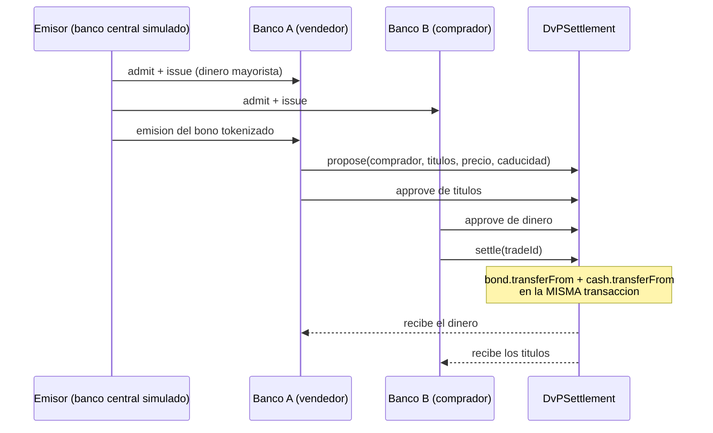

# Laboratorio · Mercado tokenizado con dinero mayorista simulado

> Navegación: [Inicio](../../README.md) · [Currículo](../../curriculum/README.md) · [Módulo 22 · Depósitos tokenizados y CBDC/MDBC](../../curriculum/22-deposito-tokenizado-cbdc/README.md) · [Módulo 25 · Mercados de capitales](../../curriculum/25-mercados-capitales-onchain/README.md) · [Catálogo de laboratorios](../CATALOG.md)

⚠️ **USO EDUCATIVO EXCLUSIVAMENTE.** Estos contratos **no son, no reproducen ni pretenden
reproducir** ningún sistema real: ni una moneda digital de banco central de Chile o de
cualquier otro país, ni una infraestructura de mercado, ni una emisión de valores. Son una
**simulación docente** escrita para estudiar mecánica de liquidación, y no son aptos para
producción. No constituyen oferta, recomendación ni asesoría de ningún tipo. Se ejecutan en
local (Anvil) con cuentas de prueba. **Nunca** los despliegues en una red con fondos reales.

Tres contratos pequeños y legibles de principio a fin que, juntos, reproducen el problema
central de los módulos 20 a 25: **entregar un activo y su pago a la vez, sin que ninguna
parte quede expuesta**.

## Qué contiene cada contrato

| Contrato | Archivo | Rol | Piezas clave |
|---|---|---|---|
| `WholesaleCash` | `src/WholesaleCash.sol` | Dinero mayorista **simulado**: la pata de dinero de la liquidación | Emisión y redención solo del emisor · lista de participantes admitidos · la transferencia comprueba **ambos** extremos |
| `TokenizedBond` | `src/TokenizedBond.sol` | Bono tokenizado con transferencia restringida | Elegibilidad del inversor · cupón por **patrón de reclamación** · fecha de registro · amortización al vencimiento |
| `DvPSettlement` | `src/DvPSettlement.sol` | Entrega contra pago atómica (modelo 1 de DvP) | `propose` → `settle` en una sola transacción · caducidad · cancelación |

## Qué demuestra, afirmación por afirmación

| Afirmación del currículo | Prueba que la sostiene |
|---|---|
| El dinero mayorista **no circula al público** | `testWholesaleCashOnlyCirculatesAmongParticipants` |
| Solo el emisor crea dinero de banco central | `testOnlyIssuerCanIssueWholesaleCash` |
| La redención **destruye** el saldo, no lo transfiere | `testRedemptionDestroysSupply` |
| Un valor con inversores elegibles **no puede** usar transferencia libre | `testBondRejectsTransferToNonEligibleInvestor` |
| DvP atómico: ambas patas o ninguna | `testDvPSettlesBothLegsAtomically` |
| **Si falta el dinero, los títulos no se mueven** | `testDvPRevertsEntirelyWhenCashLegFails` |
| **Si faltan los títulos, el dinero no se mueve** (fallo de entrega) | `testDvPRevertsEntirelyWhenSecuritiesLegFails` |
| El cupón se reparte por reclamación, no iterando titulares | `testCouponUsesClaimPatternAndPaysRecordHolders` |
| La **fecha de registro** fija quién cobra, aunque venda después | `testCouponFollowsRecordDateNotCurrentHolding` |
| La liquidación atómica **conserva** títulos y dinero (invariante) | `testFuzzSettlementConservesTotals` (1 000 ejecuciones) |

## Cómo ejecutarlo

```bash
cd labs/22-cbdc-mercado-tokenizado
forge install foundry-rs/forge-std
forge test -vv
```

Salida esperada: **18 pruebas en verde**, incluida la de fuzzing con 1 000 ejecuciones.

Si no tienes Foundry, instálalo con [`foundryup`](https://book.getfoundry.sh/getting-started/installation)
o abre el repositorio en [Codespaces](../../.devcontainer/devcontainer.json), que ya lo trae.

## El flujo completo



## Lo que este laboratorio **no** resuelve

Es tan importante como lo que sí hace, y es materia de examen:

1. **Firmeza jurídica.** La atomicidad es técnica. Que la transferencia sea oponible a un
   tercero —o en un concurso— lo determina la norma del sistema, no el contrato
   ([módulo 20](../../curriculum/20-dinero-banca-liquidacion/README.md)).
2. **Liquidez.** El modelo 1 de DvP **suprime el neteo**: exige el importe íntegro en cada
   operación. El coste está calculado en `pnpm lab:dvp`.
3. **Retención fiscal.** El cupón se paga bruto. La retención depende de la residencia del
   titular, que no está en la cadena.
4. **Identidad.** La elegibilidad es una lista en el contrato. En un sistema real sería una
   credencial verificable ([módulo 26](../../curriculum/26-custodia-identidad/README.md)).
5. **Gobernanza y actualización.** No hay timelock ni multifirma sobre el emisor: en
   producción, quien puede emitir y excluir participantes es el mayor riesgo del sistema.
6. **Préstamo de valores.** Sin él, un vendedor sin títulos produce fallo de entrega — como
   en el mercado tradicional.

## Ejercicios propuestos

1. Añade un **retardo temporal** entre `propose` y `settle` y razona qué riesgo introduce
   (exposición entre pacto y liquidación) y cuál mitiga (detección de error).
2. Implementa la **retención** en `claimCoupon` con un tipo por titular y comprueba que el
   bruto sigue cuadrando con lo fondeado.
3. Sustituye la lista `isEligible` por la verificación de una credencial firmada por un
   emisor externo. ¿Qué cambia en el modelo de amenazas?
4. Escribe una prueba que demuestre que **excluir a un participante inmoviliza su saldo**, y
   discute si eso es una propiedad deseable o un punto único de confianza.

---

## 🧭 Navegación

[🧪 Catálogo de laboratorios](../CATALOG.md) · [📚 Módulo 22](../../curriculum/22-deposito-tokenizado-cbdc/README.md) · [📚 Módulo 25](../../curriculum/25-mercados-capitales-onchain/README.md) · [🏠 Programa](../../README.md)
