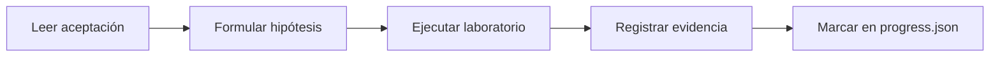

# Cuaderno de prácticas

El cuaderno de laboratorios reúne las **91 prácticas** del programa, organizadas en **8 cuadernos por etapa** que acompañan los 66 documentos de clase. [Wallets desde cero](../../docs/wallets-desde-cero.md) apoya transversalmente las clases que usan claves, direcciones o firmas, sin añadir clases. Cada guía especifica objetivo, evidencia y aceptación; el detalle operativo de cada laboratorio (comandos, archivos, dependencias) está en el [catálogo](../CATALOG.md).

## Los ocho cuadernos

| Cuaderno | Prácticas | Clases que acompaña |
|---|---|---|
| [Fundamentos](01-foundations.md) | 01–10 | 1–8 (orientación, criptografía, distribuidos, consenso) |
| [Consenso y Bitcoin](02-consensus-bitcoin.md) | 11–20 | 7–10 (consenso aplicado y Bitcoin) |
| [EVM y desarrollo](03-evm-development.md) | 21–30 | 11–16 (EVM, Solidity/Foundry, dApps) |
| [Profesional y seguridad](04-professional-security.md) | 31–40 | 17–24 (tokens, seguridad, oráculos, DAO) |
| [Avanzado y capstone](05-advanced-capstone.md) | 41–50 | 25–38 y proyecto final |
| [Finanzas on-chain](06-finanzas-onchain.md) | 51–70 | 39–56 (DeFi, dinero, stablecoins, MDBC, pagos, tokenización, mercados, custodia, regulación) |
| [Data analytics on-chain](07-data-analytics.md) | 72–83 | 57–58 (minería de datos blockchain, grafos, patrones, anomalías y proyecto final) |
| [Custodia, auditoría y forensics](08-custodia-auditoria.md) | 84–91 | 59–66 y caso final custodial |

## Qué contiene cada guía

Cada práctica dentro de un cuaderno sigue la misma estructura:

- **Objetivo:** qué concepto o habilidad demuestra la práctica.
- **Comando o procedimiento:** cómo ejecutarla, con el laboratorio correspondiente del catálogo.
- **Evidencia:** qué debes registrar en tu bitácora.
- **Aceptación:** el criterio binario que decide si la práctica está completa.

## Cómo trabajar una práctica

1. **Lee primero los criterios de aceptación** de la guía: definen qué evidencia se espera antes de que ejecutes nada.
2. **Formula una hipótesis** de lo que va a ocurrir; ejecutar sin predicción es mirar, no experimentar.
3. **Ejecuta** el laboratorio siguiendo el comando indicado en la guía o en el catálogo.
4. **Registra la evidencia en tu bitácora**: comando exacto, resultado resumido, qué te sorprendió y qué pregunta te queda abierta.
5. Marca la práctica en tu `progress.json` solo cuando la evidencia sea reproducible.

## Convención de evidencia

- Cada práctica exige una entrada de bitácora con hipótesis, procedimiento, resultado, explicación y límite de lo demostrado.
- La evidencia debe ser verificable por otra persona: rutas a código, salidas de pruebas, txid locales o documentos, nunca capturas sin contexto.
- Nunca incluyas claves, seeds ni endpoints privados en la evidencia, ni siquiera de testnet.

## Evaluación

El instructor evalúa con los criterios de `docs/evaluacion.md`; las respuestas conceptuales orientativas están en `solutions/conceptual-guide.md`, que da criterios de revisión, no soluciones para copiar. Las prácticas se articulan con las clases del [currículo](../../curriculum/README.md).

## Navegación

- [Catálogo de laboratorios](../CATALOG.md)
- [Currículo completo](../../curriculum/README.md)
- [Inicio del programa](../../README.md)
