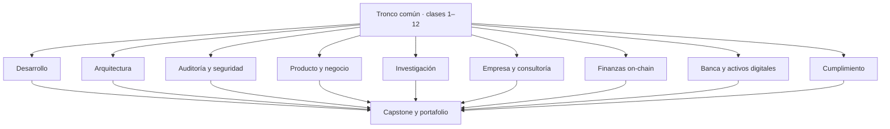

# Rutas por perfil profesional

Todas las rutas parten del tronco común 1–12 (orientación, criptografía, sistemas distribuidos, consenso, Bitcoin y EVM), que incluye la unidad transversal [Wallets desde cero](../docs/wallets-desde-cero.md) entre las clases 10 y 11 — obligatoria para quien nunca ha usado una wallet. A partir de ahí, cada perfil prioriza clases, laboratorios y un entregable de portafolio distinto. Elige la ruta que mejor describa el rol al que apuntas; puedes cambiar de ruta sin perder avance, porque el registro de progreso es el mismo. Comprueba tu nivel en cada competencia con la [matriz de competencias](../docs/skills-matrix.md), que exige **evidencia reproducible** para cada casilla.

## Resumen de las diez rutas

| Perfil | Clases prioritarias | Laboratorios clave | Entregable de portafolio | Salida laboral típica |
|---|---|---|---|---|
| Desarrollo | 13–22, 25–26 | 21–30, 31–35 | dApp integral probada con Foundry | Smart contract / full-stack Web3 developer |
| Arquitectura | 5–12, 21–34 | 01–10, 41–46 | ADR de plataforma con trade-offs | Arquitecto de soluciones blockchain |
| Auditoría y seguridad | 11–20, 23–24, 31–32 | 31–40, 41–45 | Informe de seguridad estilo auditoría | Auditor de contratos / security researcher |
| Producto y negocio | 1–2, 9–10, 15–18, 23–32, 35–38 | 01–05, 11–15 | Validación de caso y tokenomics | Product manager / analista Web3 |
| Investigación | 3–8, 25–32 | 01–10, 41–48 | Réplica comentada de un paper | Investigador / protocol engineer junior |
| Empresa y consultoría | 1–2, 5–6, 21–28, 31–38 | 01–10, 46–50 | Diseño de red permisionada con ADR | Consultor / líder técnico enterprise |
| Finanzas on-chain (DeFi) | 13–22, 39–40, 43–44, 47–48 | 51–54, 58, 61–62 | Ficha de riesgo de un protocolo con cálculos | Ingeniero DeFi / analista de riesgo on-chain |
| Banca y activos digitales | 17–18, 37–38, 41–54 | 55–57, 60, 64–69 | Arquitectura de un mercado de bonos tokenizados | Especialista en tokenización / blockchain bancario |
| Cumplimiento y regulación | 1–2, 19–20, 41–46, 53–56 | 59, 63, 69–70 | Análisis regulatorio en dos jurisdicciones | Compliance officer de activos digitales |
| Custodia, auditoría y forensics | 9–12, 19–20, 41–44, 53–66 | 69–71, 72–91 | Caso Aurora Custody | Auditor de activos digitales / analista forense |

## Desarrollo

- **A quién le sirve:** programadores que quieren construir contratos y aplicaciones descentralizadas de nivel profesional.
- **Secuencia recomendada:** clases 1–12 completas → énfasis fuerte en [13–14 · Solidity](../curriculum/06-solidity-foundry/README.md), [15–16 · dApps](../curriculum/07-dapps/README.md), [17–18 · Tokens](../curriculum/08-tokens/README.md), [19–20 · Seguridad](../curriculum/09-seguridad/README.md) y [21–22 · Oráculos](../curriculum/10-oraculos-indexacion/README.md) → [25–26 · Escalabilidad](../curriculum/12-escalabilidad/README.md) para desplegar en L2.
- **Puede aligerar:** clases 29–30 (ZK) y 35–38 (empresa) a lectura de síntesis.
- **Laboratorios clave:** prácticas 21–30 (EVM y desarrollo) al completo y 31–35 del bloque profesional; consulta el [catálogo](../labs/CATALOG.md).
- **Entregable de portafolio:** una dApp integral — contratos con pruebas unitarias, fuzzing e invariantes, interfaz y despliegue reproducible en testnet.
- **Salida laboral:** smart contract developer, full-stack Web3 developer, integrador de protocolos DeFi.

## Arquitectura

- **A quién le sirve:** ingenieros con experiencia que decidirán qué cadena, capa y modelo de confianza usa un sistema.
- **Secuencia recomendada:** profundiza las clases 5–8 (distribuidos y consenso) y 11–12 (EVM); después [21–22 · Oráculos](../curriculum/10-oraculos-indexacion/README.md), [25–26 · Escalabilidad](../curriculum/12-escalabilidad/README.md), [27–28 · Interoperabilidad](../curriculum/13-interoperabilidad/README.md), [31–32 · Arquitectura](../curriculum/15-arquitectura-avanzada/README.md) y [33–34 · Infraestructura](../curriculum/16-infraestructura-nodos/README.md).
- **Puede aligerar:** clases 17–18 (tokens) y hacer 13–16 solo hasta poder leer contratos.
- **Laboratorios clave:** prácticas 01–10 (modelado de sistemas) y 41–46 (rollups, puentes, MEV).
- **Entregable de portafolio:** un ADR de plataforma que compare al menos dos alternativas (L1 vs. L2, pública vs. permisionada) con trade-offs medibles.
- **Salida laboral:** arquitecto de soluciones blockchain, staff engineer de infraestructura Web3.

## Auditoría y seguridad

- **A quién le sirve:** quienes quieren encontrar y explicar vulnerabilidades antes de que cuesten dinero.
- **Secuencia recomendada:** clases 11–14 a fondo (no se audita lo que no se sabe escribir), énfasis máximo en [19–20 · Seguridad](../curriculum/09-seguridad/README.md); complementa con 15–18 (superficies de ataque de dApps y tokens), [23–24 · Gobernanza](../curriculum/11-dao-gobernanza/README.md) y 31–32 (arquitectura).
- **Puede aligerar:** clases 27–28 y 35–38.
- **Laboratorios clave:** prácticas 31–40 (seguridad profesional) completas y 41–45 (front-running, storage collision y afines).
- **Entregable de portafolio:** un informe de seguridad con formato de auditoría real — hallazgos clasificados por severidad, prueba de concepto y recomendación; usa la plantilla de `assessments/audit-report-template.md` y los [checkpoints](../assessments/checkpoints.md).
- **Salida laboral:** auditor de smart contracts, security researcher, participante de concursos de auditoría (Code4rena, Sherlock).

## Producto y negocio

- **A quién le sirve:** perfiles de producto, negocio o emprendimiento que deben decidir si blockchain aporta valor y cómo se monetiza.
- **Secuencia recomendada:** clases 1–2 y 9–10 con calma; 15–18 para entender qué se puede construir; [23–24 · Gobernanza](../curriculum/11-dao-gobernanza/README.md) a [31–32 · Arquitectura](../curriculum/15-arquitectura-avanzada/README.md) en modo conceptual; y con énfasis fuerte [35–36 · Empresa](../curriculum/17-blockchain-en-la-empresa/README.md) y [37–38 · Implementación](../curriculum/18-implementacion-empresarial/README.md), junto con toda la [sección de industria](../industria/README.md) (modelos de negocio, equipos y ciclo de vida).
- **Puede aligerar:** clases 13–14 y 19–20 a nivel de vocabulario.
- **Laboratorios clave:** prácticas 01–05 (fundamentos con criterio) y 11–15 (economía de Bitcoin y consenso).
- **Entregable de portafolio:** una validación de caso de uso con ADR "¿por qué blockchain?" y un análisis de tokenomics (derechos, emisión, demanda y gobernanza).
- **Salida laboral:** product manager Web3, analista de negocio blockchain, fundador o responsable de innovación.

## Investigación

- **A quién le sirve:** perfiles académicos o muy técnicos interesados en los fundamentos y en las fronteras del área.
- **Secuencia recomendada:** máxima profundidad en 3–8 (criptografía, distribuidos, consenso); después [25–26 · Escalabilidad](../curriculum/12-escalabilidad/README.md), [27–28 · Interoperabilidad](../curriculum/13-interoperabilidad/README.md), [29–30 · Privacidad y ZK](../curriculum/14-privacidad-zk/README.md) y 31–32, apoyándose en la [bibliografía](../docs/bibliografia.md).
- **Puede aligerar:** clases 15–18 y 35–38.
- **Laboratorios clave:** prácticas 01–10 (implementar primitivas desde cero) y 41–48 (rollups, ZK, MEV).
- **Entregable de portafolio:** la réplica comentada de un paper relevante (por ejemplo, un mecanismo de consenso o una construcción ZK) con implementación mínima y análisis crítico.
- **Salida laboral:** investigador en criptografía aplicada, protocol engineer junior, estudiante de posgrado con base sólida.

## Empresa y consultoría

- **A quién le sirve:** consultores e ingenieros que integran blockchain en organizaciones existentes, con requisitos de cumplimiento y privacidad.
- **Secuencia recomendada:** clases 1–2 y 5–6 para el modelo mental; 21–28 para datos, escalado e interoperabilidad; 31–34 para arquitectura e infraestructura de nodos; y como núcleo [35–36 · Empresa](../curriculum/17-blockchain-en-la-empresa/README.md) y [37–38 · Implementación](../curriculum/18-implementacion-empresarial/README.md), complementados con la [sección de industria](../industria/README.md) completa (cómo se construye una blockchain, stack, roles y ciclo de vida de un proyecto).
- **Puede aligerar:** clases 13–14 (escritura de contratos) y 29–30.
- **Laboratorios clave:** prácticas 01–10 y 46–50 (arquitectura avanzada y cierre de capstone).
- **Entregable de portafolio:** el diseño de una red permisionada o híbrida con ADR, modelo de gobernanza, plan de operación y análisis de cumplimiento estilo clases 37–38.
- **Salida laboral:** consultor blockchain, líder técnico de proyectos enterprise, arquitecto de integraciones.

## Finanzas on-chain (DeFi)

- **A quién le sirve:** quien va a construir o analizar protocolos financieros descentralizados y necesita entender el riesgo, no solo el código.
- **Secuencia recomendada:** tronco común → [clases 13–22](../curriculum/06-solidity-foundry/README.md) → [39–40 · DeFi](../curriculum/19-defi/README.md) a fondo → [43–44 · Stablecoins](../curriculum/21-stablecoins/README.md) y [47–48 · Pagos y FX](../curriculum/23-pagos-fx-onchain/README.md) para el contexto monetario.
- **Puede aligerar:** clases 33–38 (infraestructura y empresa) y 49–52 a lectura de síntesis.
- **Laboratorios clave:** 51–54 (AMM, pérdida impermanente, factor de salud, ficha de riesgo), 58 (paridad) y 61–62 (coste real y PvP).
- **Entregable de portafolio:** la ficha de riesgo de un protocolo real con los seis riesgos estructurales, su evidencia observable y el cálculo del precio de liquidación de una posición.
- **Salida laboral:** ingeniero DeFi, analista de riesgo on-chain, integrador de protocolos.
- **Advertencia de la ruta:** nada de este material es asesoría de inversión, y el criterio de evaluación penaliza presentar rendimientos como esperables.

## Banca y activos digitales

- **A quién le sirve:** perfiles del sector financiero —o que quieren entrar en él— que necesitan el puente completo entre las finanzas tradicionales y las on-chain.
- **Secuencia recomendada:** tronco común → [17–18 · Tokens](../curriculum/08-tokens/README.md) → [37–38 · Implementación](../curriculum/18-implementacion-empresarial/README.md) → **[41–42 · Dinero y liquidación](../curriculum/20-dinero-banca-liquidacion/README.md) sin saltárselas** → [43–44 · Stablecoins](../curriculum/21-stablecoins/README.md), [45–46 · MDBC](../curriculum/22-deposito-tokenizado-cbdc/README.md), [49–50 · RWA](../curriculum/24-tokenizacion-rwa/README.md), [51–52 · Mercados](../curriculum/25-mercados-capitales-onchain/README.md) y [53–54 · Custodia](../curriculum/26-custodia-identidad/README.md).
- **Puede aligerar:** clases 25–30 (L2, interoperabilidad y ZK) a lectura de síntesis.
- **Laboratorios clave:** 55–57 (neteo, circuito del pago, formas de dinero), 60 (diseño de MDBC), 64–68 (junta, memorando, DvP, bono, mercado en contratos) y 69 (custodia).
- **Entregable de portafolio:** la arquitectura de un mercado de bonos tokenizados con modelo DvP justificado por liquidez y **ninguna función tradicional huérfana**.
- **Salida laboral:** especialista en tokenización, blockchain bancario, infraestructura de mercado.
- **Advertencia de la ruta:** las clases 41–42 son la bisagra. Saltárselas convierte las seis siguientes en vocabulario memorizado.

## Cumplimiento y regulación

- **A quién le sirve:** quien tiene que responder «¿esto se puede hacer y bajo qué condiciones?» y necesita saber leer una norma, no memorizarla.
- **Secuencia recomendada:** [clases 1–2 · Orientación](../curriculum/00-orientacion/README.md) → [19–20 · Seguridad](../curriculum/09-seguridad/README.md) para el vocabulario de riesgo → [41–46 · Dinero, stablecoins y MDBC](../curriculum/20-dinero-banca-liquidacion/README.md) → [53–54 · Custodia](../curriculum/26-custodia-identidad/README.md) y [55–56 · Regulación](../curriculum/27-regulacion-cumplimiento/README.md) a fondo, con la carpeta [`regulation/`](../regulation/README.md).
- **Puede aligerar:** clases 13–16 hasta poder leer un contrato y entender qué hace; no hace falta escribirlos.
- **Laboratorios clave:** 59 (ficha comparada), 63 (corredor de pagos), 69–70 (custodia y cribado con Regla de Viaje).

## Custodia, auditoría y forensics

- **Secuencia recomendada:** tronco 1–12 → seguridad 19–20 → dinero y stablecoins 41–44 → custodia y cumplimiento 53–56 → analítica 57–58 → especialización 59–66.
- **Laboratorios clave:** 69–71 para claves y uso seguro; 72–83 para lectura de cadena; 84–91 para exchanges, conciliación, PoR/PoL, forensics y el caso final.
- **Entregable de portafolio:** informe de [Aurora Custody](../capstone/empresa-custodial/README.md) con fuentes, conciliación, root Merkle, grafo, hallazgos, controles y limitaciones.
- **Salida laboral:** operaciones de custodia, auditoría de activos digitales, conciliación, compliance analytics y blockchain forensics.
- **Entregable de portafolio:** el análisis regulatorio de un producto en **dos jurisdicciones** (una de ellas Chile), con fuente oficial y fecha en cada afirmación y una sección de incertidumbres que no esté vacía.
- **Salida laboral:** compliance officer de activos digitales, analista regulatorio fintech.
- **Advertencia de la ruta:** el objetivo es saber preguntar y dónde buscar. Nada de esto sustituye asesoría legal profesional.

## Nivelación

- Sin programación previa: completa ejercicios de terminal y JavaScript básico antes de las clases 11–12.
- Con experiencia general: realiza `assessments/diagnostic.json`; si alcanzas 80 %, usa la ruta rápida descrita en la documentación del programa.
- Con experiencia EVM: comienza por seguridad, pero entrega igualmente el ADR "¿por qué blockchain?".

## Navegación

- [Inicio del programa](../README.md)
- [Currículo completo (66 clases)](../curriculum/README.md)
- [Catálogo de laboratorios](../labs/CATALOG.md)
- [Evaluación](../docs/evaluacion.md) · [Checkpoints](../assessments/checkpoints.md)
- [Sección de industria](../industria/README.md) · [Roadmap](../ROADMAP.md)
