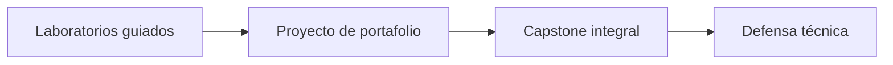

# Proyectos de portafolio

> Navegación: [Inicio](../README.md) · [Currículo](../curriculum/README.md) · [Proyecto final (capstone)](../capstone/README.md) · [Catálogo de laboratorios](../labs/CATALOG.md)

Los proyectos de portafolio son piezas de trabajo **reproducibles y defendibles** que demuestran criterio de ingeniería, no solo código que compila. A diferencia de los [laboratorios](../labs/CATALOG.md) —cerrados y guiados—, un proyecto tiene alcance propio, decisiones documentadas y un README que permite a un tercero levantarlo y evaluarlo.

## Cómo se relacionan con el capstone

Estos proyectos son el ensayo del [proyecto final](../capstone/README.md). Cada uno ejercita una parte de lo que el capstone exige de forma integral: contratos probados con Foundry, una interfaz utilizable, una estrategia de datos y una defensa técnica honesta. Puedes usar uno de ellos como base del capstone si lo amplías hasta cumplir sus [requisitos mínimos](../capstone/README.md#requisitos-mínimos).

Un laboratorio te enseña una técnica; un proyecto te obliga a tomar decisiones y documentarlas; el capstone reúne todo y lo defiende ante un evaluador escéptico.

## Proyecto disponible en el repositorio

| Proyecto | Módulos | Qué demuestra | Estado |
|---|---|---|---|
| [Community Funding](community-funding/README.md) | 06–11 | Contrato con reembolsos, invariantes, pruebas fuzz, eventos indexables e interfaz | Base del hilo conductor |

`community-funding` es el proyecto transversal del programa: crece a lo largo de los módulos 06 a 11 y conecta con la [interfaz web](../apps/community-funding-web/README.md) y el [indexador de eventos](../apps/event-indexer/README.md).

## Otras ideas de portafolio

Puedes construir cualquiera de estas como proyecto adicional. No están implementadas en el repositorio: son alcances propuestos.

| Idea | Qué entrega | Habilidades que ejercita |
|---|---|---|
| Explorador conceptual | Analiza bloques y transacciones de una red pública por RPC | Caché, manejo de errores, límites del proveedor |
| Vault seguro | Amplía el [laboratorio del vault](../labs/06-solidity-vault/README.md) con roles, pausa e invariantes | Fuzzing, análisis estático, informe de auditoría |
| DAO comunitaria | Propuesta, voto, quorum, timelock y tesorería multisig | Gobernanza, amenazas de captura |
| Trazabilidad responsable | Almacena hashes y eventos, nunca datos personales | Diseño on-chain/off-chain, comparación con base tradicional firmada |

## Criterios de calidad de portafolio

Cada proyecto debe incluir, como mínimo:

1. **README propio** con el problema, cómo reproducirlo y las decisiones clave.
2. **ADR de arquitectura**: por qué blockchain y qué alternativa se descartó.
3. **Threat model**: actores, superficies de ataque y privilegios administrativos declarados.
4. **Pruebas** unitarias, de integración y —cuando aplique— fuzzing e invariantes.
5. **Costos estimados** de gas y de operación.
6. **Demo reproducible** que un tercero pueda levantar con instrucciones de un solo documento.

Regla práctica de alcance: si no puedes enumerar las invariantes críticas del proyecto en cinco líneas, es demasiado grande. Un portafolio pequeño y verificable pesa más que uno grande que solo funciona en tu máquina.
