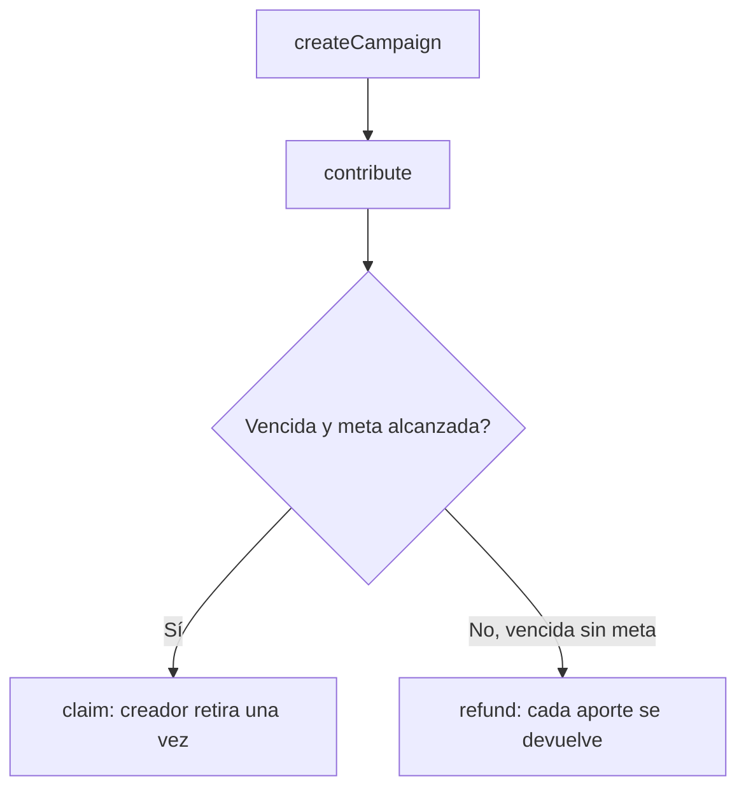

# Proyecto transversal · Community Funding

> Navegación: [Inicio](../../README.md) · [Currículo](../../curriculum/README.md) · [Módulo 06 · Solidity y Foundry](../../curriculum/06-solidity-foundry/README.md) · [Despliegue local](../../docs/despliegue-local.md)

Protocolo de **financiamiento comunitario con reembolsos**: un creador abre una campaña con una meta y una fecha límite; si se alcanza la meta puede retirar los fondos una sola vez; si vence sin alcanzarla, cada participante recupera exactamente su aporte. Es el hilo conductor del programa y crece durante los módulos 06–11 conectando contrato, pruebas, [interfaz](../../apps/community-funding-web/README.md), [indexación](../../apps/event-indexer/README.md), seguridad y gobernanza.

## Reglas del protocolo

- Un creador abre una campaña con meta (`goal`) y fecha límite (`deadline`).
- Las contribuciones quedan asociadas a cada participante en `contributions[id][contribuyente]`.
- Si `pledged >= goal` tras la fecha límite, el creador puede retirar **una vez** (`claim`).
- Si vence sin alcanzar la meta, cada participante recupera su aporte (`refund`).
- El contrato sigue **checks-effects-interactions** y una guarda `nonReentrant`; emite eventos indexables.

## Invariantes

Son las propiedades que las pruebas fuzz e invariantes deben proteger:

| # | Invariante | Cómo se sostiene |
|---|---|---|
| 1 | Una campaña no paga más de lo aportado | `claim` transfiere exactamente `pledged` una sola vez |
| 2 | Una contribución no se retira y se reembolsa a la vez | `claimed` bloquea `claim` duplicado; `refund` solo tras fracaso |
| 3 | Los reembolsos solo existen tras el fracaso | `refund` exige `block.timestamp >= deadline` y `pledged < goal` |
| 4 | El creador no retira antes de alcanzar la meta | `claim` exige `deadline` vencida y `pledged >= goal` |

## Estructura de contratos

| Elemento | Ubicación | Rol |
|---|---|---|
| `CommunityFunding` | `src/CommunityFunding.sol` | Contrato principal: campañas, contribuciones, `claim` y `refund` |
| `struct Campaign` | `src/CommunityFunding.sol` | `creator`, `deadline`, `goal`, `pledged`, `claimed` empaquetados |
| `modifier nonReentrant` | `src/CommunityFunding.sol` | Guarda de reentrancia sobre `claim` y `refund` |
| `DeployCommunityFunding` | `script/Deploy.s.sol` | Script de despliegue que lee `PRIVATE_KEY` del entorno |
| Suite de pruebas | `test/CommunityFunding.t.sol` | Éxito, reembolso y fuzz de contabilidad |

## Funciones principales

| Función | Precondiciones | Efecto |
|---|---|---|
| `createCampaign(goal, deadline)` | `goal > 0`, `deadline` en el futuro | Crea campaña, emite `CampaignCreated` |
| `contribute(id)` `payable` | Campaña vigente, `msg.value > 0` | Suma al aporte, emite `Contributed` |
| `claim(id)` | Solo creador, vencida, meta alcanzada, no reclamada | Transfiere `pledged`, emite `Claimed` |
| `refund(id)` | Vencida, meta no alcanzada, con aporte | Devuelve el aporte, emite `Refunded` |

## Compilar, probar y desplegar

Requiere [Foundry](https://book.getfoundry.sh/). Instala primero la dependencia estándar:

```bash
forge install foundry-rs/forge-std --no-commit
forge build
forge test -vv
forge test --fuzz-runs 1000
```

Salida esperada de `forge test`:

```text
Ran 3 tests for test/CommunityFunding.t.sol:CommunityFundingTest
[PASS] testSuccessfulCampaign() (gas: …)
[PASS] testRefundsWhenCampaignFails() (gas: …)
[PASS] testFuzzContributionAccounting(uint96) (runs: 1000, …)
Suite result: ok. 3 passed; 0 failed; 0 skipped
```

Despliegue en un nodo local (Anvil). Usa una clave de prueba, **nunca una real**:

```bash
# terminal 1
anvil --chain-id 31337

# terminal 2
export RPC_URL=http://127.0.0.1:8545
export PRIVATE_KEY=0xac09…   # clave de prueba de Anvil
forge script script/Deploy.s.sol:DeployCommunityFunding \
  --rpc-url "$RPC_URL" --broadcast
```

El `Makefile` incluye atajos equivalentes: `make install`, `make test`, `make node` y `make deploy`. Detalles del entorno en la guía de [despliegue local](../../docs/despliegue-local.md).

## Amenazas y mitigaciones

| Amenaza | Vector | Mitigación en el contrato |
|---|---|---|
| Reentrancia | Callback del receptor durante `call` | CEI + `nonReentrant`; estado antes de la transferencia |
| Doble retiro | `claim` repetido | Flag `claimed`; `AlreadyClaimed` |
| Retiro sin meta | Creador retira campaña fallida | `GoalNotReached` valida `pledged >= goal` |
| Reembolso indebido | Participante reembolsa una campaña exitosa | `GoalReached` valida `pledged < goal` |
| Desbordamiento | `pledged` supera `uint128` | `ContributionTooLarge` acota el aporte |
| Transferencia fallida | El destino rechaza el ETH | `TransferFailed` revierte y preserva el estado |

Ninguna mitigación de código corrige por sí sola un problema económico o de gobernanza: eso se aborda en el threat model del proyecto.

## Flujo del ciclo de vida



## Evolución por módulo

1. **Solidity (06):** contrato y errores tipados.
2. **dApp (07):** lectura, simulación, firma y estados de transacción.
3. **Tokens (08):** comprobante opcional, justificando si es necesario.
4. **Seguridad (09):** invariantes, reentrancia, griefing y administración.
5. **Indexación (10):** listado de campañas desde eventos.
6. **DAO (11):** aprobación comunitaria de retiros extraordinarios.
7. **L2:** ADR de despliegue y puente.
