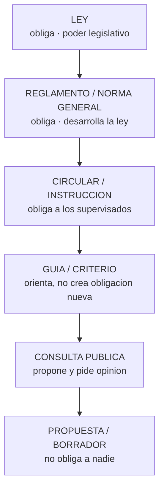

# ⚖️ Regulación de activos digitales

> [🏠 Programa](../README.md) · [📚 Currículo](../curriculum/README.md) · [📖 Módulo 27 · Regulación y cumplimiento](../curriculum/27-regulacion-cumplimiento/README.md)

Revisado: **2026-08-12**.

> **Descargo.** Material **educativo**, no asesoría legal, tributaria ni regulatoria. El
> régimen aplicable depende de la actividad concreta, del instrumento, de la residencia de
> las partes y de hechos que solo un profesional puede valorar. **Toda norma citada debe
> verificarse en su fuente oficial en el momento de usarla**: la regulación de activos
> digitales cambia con frecuencia y esta carpeta describe **mecanismos**, no umbrales.

## Cómo leer estos documentos

Cada página aplica la misma disciplina, que es lo que el
[módulo 27](../curriculum/27-regulacion-cumplimiento/README.md) enseña:

1. **Rango declarado siempre.** Ley, reglamento, circular, guía, consulta pública o
   propuesta. Nunca se presenta una propuesta como derecho vigente.
2. **Fuente primaria enlazada.** El texto oficial o el organismo que lo dicta. Los blogs no
   sostienen ninguna afirmación.
3. **Fecha de revisión** en cabecera, y regla de mantenimiento al pie.
4. **Mecanismo antes que dato.** Se explica *qué obliga* un régimen (autorización, reserva,
   segregación, información) por encima de cifras concretas, que envejecen.

| Documento | Alcance |
|---|---|
| [Chile](chile/README.md) | Ley 21.521, CMF, UAF, SII, Banco Central, Sistema de Finanzas Abiertas y MDBC |
| [Unión Europea](european-union/README.md) | MiCA: categorías, emisores y proveedores de servicios |
| [Estados Unidos](united-states/README.md) | Marco fragmentado: valores, materias primas, dinero y estados |
| [América Latina](latin-america/README.md) | Panorama por país y patrones comunes de la región |
| [Estándares internacionales](international/README.md) | GAFI, BIS/Basilea, IOSCO, FSB, FMI |
| [Comparación](comparison/README.md) | Los mismos siete ejes aplicados a cada marco |

## La jerarquía que ordena todo

Un estándar internacional (GAFI, Basilea, IOSCO) **no es derecho directamente aplicable**:
obliga a los Estados a incorporarlo, y lo que se aplica a una empresa es la norma nacional
resultante. Confundir ambas cosas es el error más frecuente en el material del sector.

## Las cinco preguntas

Antes de buscar en ninguna norma, respóndelas. Determinan qué régimen es siquiera relevante:

1. **¿Qué actividad realizas?** Custodiar, cambiar, emitir, intermediar, asesorar, operar
   una plataforma de negociación.
2. **¿Qué instrumento manejas?** Valor, dinero electrónico, u otro criptoactivo.
3. **¿A quién te diriges?** Público general o profesionales; en qué países.
4. **¿Dónde estás tú y dónde están tus clientes?** El régimen suele seguir al cliente.
5. **¿Qué riesgo generas?** Lavado, mercado, consumidor, sistémico.

## Regla de mantenimiento

Este material se revisa **al menos una vez al año** y siempre que se detecte un cambio
relevante. Al actualizarlo:

- Cambia la fecha de revisión de la cabecera.
- Verifica que cada enlace sigue vivo y apunta al documento vigente (el workflow
  [`links.yml`](../.github/workflows/links.yml) comprueba semanalmente que respondan).
- Si una propuesta se ha convertido en norma, **cambia su rango**; no basta con actualizar
  el texto.
- Si dudas de una afirmación y no encuentras fuente oficial, **elimínala**. Una afirmación
  regulatoria sin fuente no es utilizable ni siquiera si es correcta.

---

## 🧭 Navegación

[🏠 Programa](../README.md) · [📖 Módulo 27](../curriculum/27-regulacion-cumplimiento/README.md) · [🇨🇱 Chile](chile/README.md) · [🌍 Comparación](comparison/README.md)
