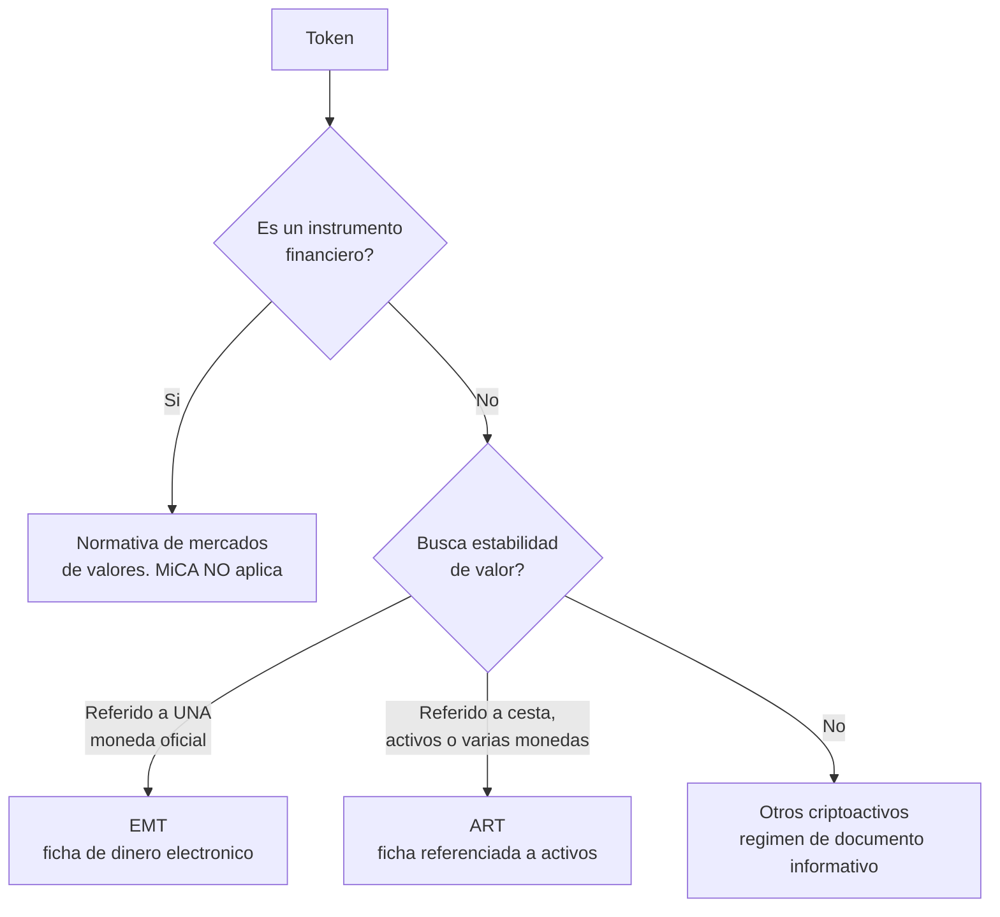

# 🇪🇺 Unión Europea · MiCA

> [⬅️ Regulación](../README.md) · [🏠 Programa](../../README.md) · [📖 Módulo 27](../../curriculum/27-regulacion-cumplimiento/README.md)

Revisado: **2026-08-12**. · **Rango: reglamento de la Unión Europea** (aplicable directamente
en los Estados miembros, sin necesidad de transposición).

> **Descargo.** Material educativo, no asesoría legal. Texto oficial y consolidado:
> [Reglamento (UE) 2023/1114 en EUR-Lex](https://eur-lex.europa.eu/legal-content/ES/TXT/?uri=CELEX%3A32023R1114).

MiCA (*Markets in Crypto-Assets*) se estudia aquí **como modelo de arquitectura
regulatoria**, no porque aplique universalmente. Es hoy el marco integral más desarrollado, y
su lógica —cuanto más se parece un producto a dinero o a un valor, más exigente el
régimen— se repite, con otro vestido, en casi todas las jurisdicciones.

## La primera pregunta no es MiCA

**Si el instrumento ya es un instrumento financiero** (un valor negociable, por ejemplo),
MiCA **no lo cubre**: aplica la normativa de mercados de valores. Preguntar "¿qué dice MiCA
de mi token?" antes de haber respondido "¿esto es un valor?" es empezar por el final.

## Las tres piezas del reglamento

### 1 · Otros criptoactivos — régimen ligero

Obligación central: publicar un **documento informativo** (*white paper*) con contenido
mínimo y **responsabilidad por su exactitud**, más normas de comercialización honesta. No
hay autorización previa del producto; la responsabilidad por lo que se afirma es el
mecanismo de control.

### 2 · ART y EMT — régimen exigente

Son los instrumentos que **funcionan como dinero para el usuario**, y por eso el régimen se
endurece:

| | **EMT** (ficha de dinero electrónico) | **ART** (ficha referenciada a activos) |
|---|---|---|
| Referencia de valor | **Una sola** moneda oficial | Cesta de monedas, activos o varias monedas |
| Emisor | Entidad de crédito o de dinero electrónico | Entidad autorizada específicamente |
| Reserva | Fondos recibidos, con salvaguarda y segregación | Reserva de activos separada y custodiada |
| Redención | **A la par**, derecho del tenedor | Derecho de redención con condiciones |
| Ejemplo de encaje | Una stablecoin referida al euro o al dólar | Una ficha referida a una cesta de monedas |

Los ejes que hay que retener: **autorización**, **composición y custodia de la reserva**,
**derecho de redención**, **información al público** y **régimen reforzado** para emisiones de
uso significativo.

### 3 · CASP — proveedores de servicios de criptoactivos

Quien preste profesionalmente custodia, intercambio, ejecución de órdenes, colocación,
recepción y transmisión, asesoramiento, gestión de cartera o explotación de una plataforma de
negociación necesita **autorización** y queda sujeto a requisitos de capital y organización,
**custodia segregada** de los activos de clientes, normas de conducta, gestión de conflictos
de interés y prevención del **abuso de mercado**.

La preocupación de fondo es la misma que señala [IOSCO](../international/README.md): en el
mercado tradicional, negociar, custodiar y liquidar están **separados por norma** para evitar
conflictos; muchas plataformas de criptoactivos los concentran en una sola entidad.

## Qué se lleva un ingeniero de aquí

1. **La categoría determina todo.** Antes de diseñar, clasifica: valor, EMT, ART u otro.
   El coste de equivocarse es rehacer el producto con clientes dentro.
2. **La redención a la par es una obligación, no una promesa comercial.** Si tu diseño no
   permite redimir, el instrumento no encaja donde crees que encaja.
3. **La segregación de activos de clientes se implementa**, no se declara: cuentas
   identificables, conciliación y evidencia.
4. **El pasaporte europeo es la recompensa.** Autorizarse en un Estado miembro permite
   operar en el mercado interior; ese es el incentivo que hace atractivo el régimen pese a
   su exigencia.

## Fuentes oficiales

- Reglamento (UE) 2023/1114 (MiCA) — EUR-Lex: <https://eur-lex.europa.eu/legal-content/ES/TXT/?uri=CELEX%3A32023R1114>
- ESMA — Autoridad Europea de Valores y Mercados: <https://www.esma.europa.eu/>
- EBA — Autoridad Bancaria Europea (emisores de EMT y ART): <https://www.eba.europa.eu/>
- Banco Central Europeo — euro digital: <https://www.ecb.europa.eu/euro/digital_euro/html/index.es.html>

## Regla de mantenimiento

MiCA se desarrolla mediante **normas técnicas** y **directrices** de ESMA y EBA que se
publican por etapas. Antes de afirmar qué obligación concreta aplica hoy, verifica en la
autoridad correspondiente. Distingue siempre el reglamento (obliga) de una consulta o un
proyecto de norma técnica (todavía no).

---

## 🧭 Navegación

[⬅️ Regulación](../README.md) · [🌍 Comparación](../comparison/README.md) · [🇨🇱 Chile](../chile/README.md) · [📖 Módulo 27](../../curriculum/27-regulacion-cumplimiento/README.md)
