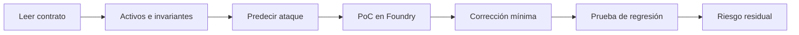

# Retos de seguridad

> Navegación: [Inicio](../README.md) · [Módulo 09 · Seguridad](../curriculum/09-seguridad/README.md) · [Rúbrica](../docs/evaluacion.md) · [Criterios de revisión](SOLUTIONS.md)

Colección de contratos **deliberadamente vulnerables** para estudiar cómo se rompen los sistemas y cómo se corrigen. Cada reto es un laboratorio controlado: lees el contrato, identificas la falla, escribes una prueba de concepto (PoC) que demuestra el impacto, propones una corrección mínima y verificas que la corrección la cierra.

## Regla ética

Estos contratos son material de aprendizaje. **Solo se ejecutan en entornos propios o explícitamente autorizados (red local Anvil o testnet).** Nunca los despliegues en mainnet, nunca los promociones y **nunca uses estas técnicas contra sistemas de terceros**. Aprender a atacar sirve para aprender a defender; usarlo fuera de un entorno autorizado es un delito.

## Familias de vulnerabilidad

- **Reentrancia:** un contrato externo vuelve a entrar antes de que el estado se actualice, drenando fondos.
- **Control de acceso:** operaciones privilegiadas sin la protección adecuada, ejecutables por cualquiera.
- **Manipulación de oráculo:** el precio se toma de una fuente que se puede mover puntualmente (por ejemplo, liquidez instantánea).
- **Overflow/underflow:** aritmética que desborda y produce valores imposibles (relevante en versiones o bloques `unchecked`).
- **Denegación de servicio (DoS):** una condición que bloquea funciones para todos los usuarios.
- **Repetición de firma (replay):** una firma válida se reutiliza por falta de dominio, nonce o expiración.
- **Front-running:** un observador se adelanta a una transacción pendiente para beneficiarse.
- **Storage collision:** en patrones de proxy, un layout de almacenamiento mal alineado corrompe variables.

## Cómo trabajar un reto

1. Lee el contrato vulnerable y escribe sus activos e invariantes.
2. Predice el ataque **antes** de ejecutarlo.
3. Escribe una prueba (PoC) en Foundry que demuestre el impacto.
4. Implementa una corrección mínima.
5. Añade una prueba de regresión que confirme que la falla quedó cerrada.
6. Explica el riesgo residual.



## Qué distingue un buen trabajo

| Señal de buen trabajo | Señal de trabajo pobre |
|---|---|
| El PoC falla antes del fix y prueba impacto concreto (fondos, control) | La prueba solo describe el patrón sin ejecutarlo |
| La corrección es mínima y justificada por la causa raíz | Se reescribe el contrato sin explicar qué cerró la falla |
| Hay prueba de regresión que se rompería si vuelve el bug | El fix no tiene prueba que lo respalde |
| Se distingue causa raíz, exploit, impacto, mitigación y riesgo residual | Se confunde el síntoma con la causa |
| Se reconoce lo que la corrección **no** resuelve | Se declara "seguro" sin matices |

## Catálogo de retos

| Reto | Vulnerabilidad | Dificultad | Objetivo |
|---:|---|---|---|
| 01 | Reentrancia | Inicial | Comprender CEI y guardas |
| 02 | Control de acceso | Inicial | Proteger operaciones privilegiadas |
| 03 | Oráculo manipulable | Intermedio | Separar precio de liquidez puntual |
| 04 | Repetición de firma | Intermedio | Dominio, nonce y expiración |
| 05 | Front-running | Avanzado | Usar commit-reveal y límites |
| 06 | Storage collision | Avanzado | Comprender proxies y layout |

## Cómo se corre

Desde este directorio, con Foundry instalado:

```bash
forge install foundry-rs/forge-std
forge test -vv
```

Cada reto trae una **suite de tests ejecutable** en `test/` que **demuestra el exploit**
sobre el contrato vulnerable y **verifica que la versión corregida lo resiste**. Estos
tests corren en la CI (job *Retos de seguridad (exploit + fix)*):

| Reto | Test | Qué demuestra |
|---:|---|---|
| 01 | `test/01-Reentrancy.t.sol` | Un atacante drena el vault vulnerable; el `FixedReentrancy` con guarda revierte |
| 02 | `test/02-AccessControl.t.sol` | Cualquiera toma la propiedad; `FixedAccess` exige dueño y transferencia en dos pasos |
| 03 | `test/03-Oracle.t.sol` | El precio spot se manipula sin límite; el consumidor con guardas rechaza precio obsoleto |
| 04 | `test/04-SignatureReplay.t.sol` | El digest sin dominio es reutilizable; el `boundedDigest` + `consume` lo impide |
| 05 | `test/05-FrontRunning.t.sol` | La respuesta en texto plano es robable; commit-reveal la ata al remitente |
| 06 | `test/06-StorageCollision.t.sol` | Un layout desplazado corrompe `owner`; agregar al final preserva los slots |

Ejecuta uno solo con `forge test --match-contract ReentrancyTest`. Registra la evidencia
(prueba que falla, causa raíz, corrección) en tu bitácora, sin claves ni secretos.

## Criterios de revisión

El archivo [SOLUTIONS.md](SOLUTIONS.md) contiene **criterios de revisión, no exploits para copiar**: describe qué hace correcto un PoC y una corrección, para que contrastes tu razonamiento. Intenta cada reto por tu cuenta antes de consultarlo; copiar no enseña a auditar. El fundamento conceptual está en el [módulo 09 · Seguridad](../curriculum/09-seguridad/README.md).
